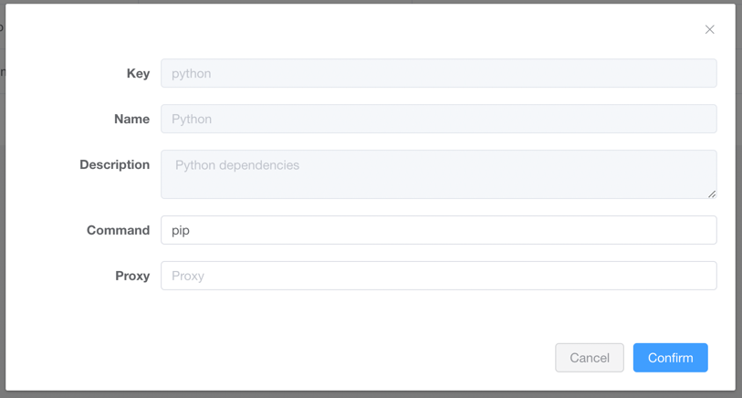

# Dependencies Management

Crawlab allows users to install and management dependencies for spiders and tasks.

## Page Menu

Expand `Dependencies` button on the left sidebar and click sub-menu items as below.

- **Settings**: Global dependencies settings
- **Python**: Python dependencies management
- **Node.js**: Node.js dependencies management

## Install Dependencies

1. Navigate to the dependencies management page (Python/Node.js)  
2. Click on `Installable` button  
3. Enter search keywords and click on `Search` button  
4. Click on `Install` button  
5. Select `Mode` (which nodes to install) and `Upgrade` (whether to upgrade) and click `Confirm`
   button  

## Uninstall Dependencies

1. Navigate to the dependencies management page (Python/Node.js)  
2. Click on `Uninstall` button to uninstall the dependency  
3. Select `Mode` (which nodes to install) and click `Confirm` button  

## Settings

1. Navigate to the dependencies management page (Settings)  
2. Click on `Configure` button  
3. Edit the configuration and click on `Confirm` button  

Settings description:

- **Command**: executable command for installing/uninstalling dependencies. E.g. `pip`, `/usr/local/bin/pip39`, `npm`
  , `yarn`
- **Proxy**: proxy for installing/uninstalling dependencies. E.g. `https://registry.npm.taobao.org`
  or `https://pypi.tuna.tsinghua.edu.cn/simple`

## Tasks

1. Navigate to the dependencies management page (Python/Node.js)
2. Click on `Tasks` button  
3. You can view install/uninstall tasks  
4. Click on `Logs` button to view logs  
5. You can view logs of given tasks  