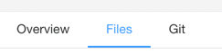

# File Editor

Crawlab allows users to edit files in the browser. This is useful for editing files such as `settings.py` and `items.py`
in the spider.

## Open File

1. Navigate to `Files` tab in spider detail page.  
2. Double-click the file you want to edit.  
3. The file should be opened in the editor.  

## Edit File

1. Make changes to the file.

## Save File

1. Press `Ctrl + S` or click `Save` button in the nav bar to save the file.  

## Move File

1. Drag and drop the file to the folder you want to move to.

## Rename File

1. Right-click the file and select `Rename`.  

## Duplicate File

1. Right-click the file and select `Duplicate`.  

## Delete File

1. Right-click the file and click `Delete` in the context menu.  