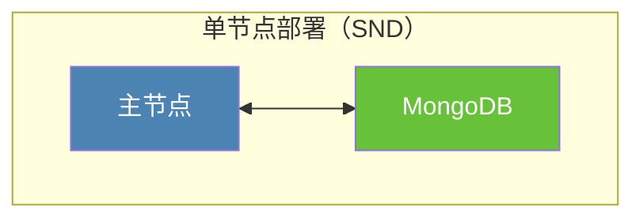
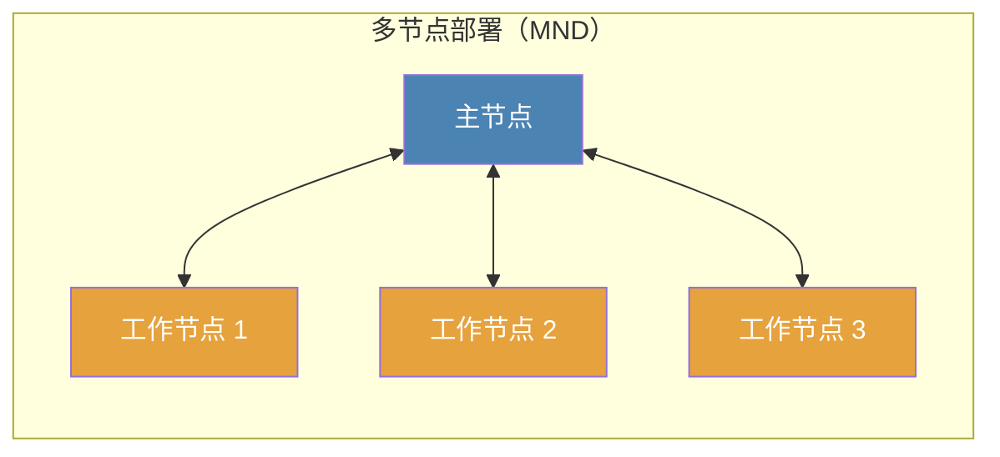
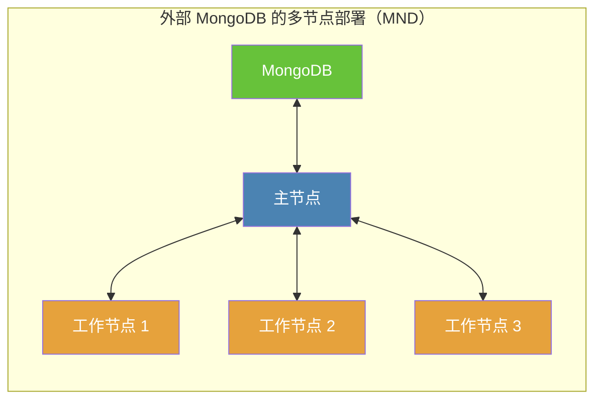

# 安装: Docker

Docker 是安装部署 Crawlab 最便捷的方式。如果您不熟悉 Docker，您可以参考 [Docker 官网](https://www.docker.com/)
并将其安装在本地。在进行任何操作前，请先保证您已安装好了
Docker。

## 主流程

Docker 部署有多种模式，不过其主流程是相似的。

1. 安装 [Docker](https://www.docker.com/) 和 [Docker-Compose](https://docs.docker.com/compose/)
2. 拉取 Crawlab Docker 镜像（如果没有 MongoDB，也需要拉取）
3. 创建 `docker-compose.yml` 并进行配置
4. 启动 Docker 容器

::: warning
在接下来的指南中，我们假设您已经安装了 Docker 和 Docker-Compose，并已经拉取了相应的 Docker 镜像。
:::

## 单节点部署



**单节点部署（SND）** 与 [快速开始](../quick-start) 中的配置类似，它通常用作演示或少量爬虫管理。在 SND 中，所有 Docker 容器 (
包括 Crawlab 和
MongoDB) 都在单独一台机器上，即主节点（如上图）。

创建 `docker-compose.yml` 并输入如下内容。

```yaml
version: '3.3'
services:
  master:
    image: crawlabteam/crawlab
    container_name: crawlab_master
    restart: always
    environment:
      CRAWLAB_NODE_MASTER: "Y"  # Y: 主节点
      CRAWLAB_MONGO_HOST: "mongo"  # mongo host address. 在 Docker-Compose 网络中，直接引用 service 名称
      CRAWLAB_MONGO_PORT: "27017"  # mongo port 
      CRAWLAB_MONGO_DB: "crawlab"  # mongo database 
      CRAWLAB_MONGO_USERNAME: "username"  # mongo username
      CRAWLAB_MONGO_PASSWORD: "password"  # mongo password 
      CRAWLAB_MONGO_AUTHSOURCE: "admin"  # mongo auth source 
    volumes:
      - "/opt/.crawlab/master:/root/.crawlab"  # 持久化 crawlab 元数据
      - "/opt/crawlab/master:/data"  # 持久化 crawlab 数据
      - "/var/crawlab/log:/var/log/crawlab" # 持久化 crawlab 任务日志
    ports:
      - "8080:8080"  # 开放 api 端口
    depends_on:
      - mongo

  mongo:
    image: mongo:4.2
    restart: always
    environment:
      MONGO_INITDB_ROOT_USERNAME: "username"  # mongo username
      MONGO_INITDB_ROOT_PASSWORD: "password"  # mongo password
    volumes:
      - "/opt/crawlab/mongo/data/db:/data/db"  # 持久化 mongo 数据
    ports:
      - "27017:27017"  # 开放 mongo 端口到宿主机
```

执行 `docker-compose up -d` 并在浏览器中导航至 `http://<your_ip>:8080`，然后开始使用 Crawlab。

## 多节点部署



**多节点部署（MND）** 通常用在由主节点和工作节点组成的生产环境。主节点于工作节点连接，并在集群中起中控的作用。

多节点部署（MND）配置比单节点部署（SND）要复杂一些，但您可以参考下面的教程来创建小型集群，整个过程非常直观。

### 搭建主节点

在 **主节点** 中创建 `docker-compose.yml`，并输入如下内容。 然后执行 `docker-compose up -d` 以启动容器。

```yaml
# 主节点
version: '3.3'
services:
  master:
    image: crawlabteam/crawlab
    container_name: crawlab_master
    restart: always
    environment:
      CRAWLAB_NODE_MASTER: "Y"  # Y: 主节点
      CRAWLAB_MONGO_HOST: "mongo"  # mongo host address. 在 Docker-Compose 网络中，直接引用 service 名称
      CRAWLAB_MONGO_PORT: "27017"  # mongo port 
      CRAWLAB_MONGO_DB: "crawlab"  # mongo database 
      CRAWLAB_MONGO_USERNAME: "username"  # mongo username
      CRAWLAB_MONGO_PASSWORD: "password"  # mongo password 
      CRAWLAB_MONGO_AUTHSOURCE: "admin"  # mongo auth source 
    volumes:
      - "/opt/.crawlab/master:/root/.crawlab"  # 持久化 crawlab 元数据
      - "/opt/crawlab/master:/data"  # 持久化 crawlab 数据
      - "/var/crawlab/log:/var/log/crawlab" # 持久化 crawlab 任务日志
    ports:
      - "8080:8080"  # 开放 api 端口
      - "9666:9666"  # 开放 grpc 端口
    depends_on:
      - mongo

  mongo:
    image: mongo:4.2
    restart: always
    environment:
      MONGO_INITDB_ROOT_USERNAME: "username"  # mongo username
      MONGO_INITDB_ROOT_PASSWORD: "password"  # mongo password
    volumes:
      - "/opt/crawlab/mongo/data/db:/data/db"  # 持久化 mongo 数据
    ports:
      - "27017:27017"  # 开放 mongo 端口到宿主机
```

### 搭建工作节点

在每个 **工作节点** 中创建 `docker-compose.yml`，并输入如下内容。 然后执行 `docker-compose up -d` 以启动容器。

```yaml
# 工作节点
version: '3.3'
services:
  worker:
    image: crawlabteam/crawlab
    container_name: crawlab_worker
    restart: always
    environment:
      CRAWLAB_NODE_MASTER: "N"  # N: 工作节点
      CRAWLAB_GRPC_ADDRESS: "<master_node_ip>:9666"  # grpc address
      CRAWLAB_FS_FILER_URL: "http://<master_node_ip>:8080/api/filer"  # seaweedfs api
    volumes:
      - "/opt/.crawlab/worker:/root/.crawlab"  # 持久化 crawlab 元数据
      - "/opt/crawlab/worker:/data"  # 持久化 crawlab 数据
```

请注意您需要将 `<master_node_ip>` 替换为主节点 IP 地址，并保证其能被工作节点访问。

主节点和工作节点都启动之后，您可以导航至 `http://<master_node_ip>:8080` 并开始使用 Crawlab.

::: warning

### 开放主节点端口

由于工作节点是通过端口 **8080** (API) 以及 **9666** (gRPC) 来连接主节点的，您需要保证它们都是处于开放状态，**没有**
被主节点防火墙所禁用。
:::

## 外部 MongoDB

在之前介绍的多节点部署（MND）中，您可能已经注意到 MongoDB 默认是部署在主节点上的。但出于性能考虑，这样的顺手部署配置将导致问题，因为
MongoDB 本身可能会成为瓶颈，尤其是在大规模分布式系统中。

所幸的是，这个问题能够通过部署外部 MongoDB 到其他节点或云数据库服务供应商（例如 AWS、Azure、Aliyun）来解决。通过这个方式，MongoDB
能够轻松的扩容，因此数据库的稳定性能够得到有效保证。请参考下图。



主节点配置文件 `docker-compose.与 [默认多节点部署（MND）](#multi-node-deployment) 稍微有些不同。请参考下面内容。

```yaml
# 外部 MongoDB 的主节点
version: '3.3'
services:
  master:
    image: crawlabteam/crawlab
    container_name: crawlab_master
    restart: always
    environment:
      CRAWLAB_NODE_MASTER: "Y"  # Y: 主节点
      CRAWLAB_MONGO_URI: "<mongo_uri>"  # mongo uri (单独设置)
      CRAWLAB_MONGO_HOST: "<mongo_host>"  # mongo host address
      CRAWLAB_MONGO_PORT: "<mongo_port>"  # mongo port 
      CRAWLAB_MONGO_DB: "<mongo_db>"  # mongo database 
      CRAWLAB_MONGO_USERNAME: "<mongo_username>"  # mongo username
      CRAWLAB_MONGO_PASSWORD: "<mongo_password>"  # mongo password 
      CRAWLAB_MONGO_AUTHSOURCE: "<mongo_auth_source>"  # mongo auth source 
      CRAWLAB_MONGO_AUTHMECHANISM: "<mongo_auth_mechanism>"  # mongo auth mechanism 
      CRAWLAB_MONGO_AUTHMECHANISMPROPERTIES: "<mongo_auth_mechanism_properties>"  # mongo auth mechanism properties
    volumes:
      - "/opt/.crawlab/master:/root/.crawlab"  # 持久化 crawlab 元数据
      - "/opt/crawlab/master:/data"  # 持久化 crawlab 数据
      - "/var/crawlab/log:/var/log/crawlab" # 持久化 crawlab 任务日志
    ports:
      - "8080:8080"  # 开放 api 端口
      - "9666:9666"  # 开放 grpc 端口
```

可以看到，服务 `mongo` 被移除了，MongoDB 连接相关的环境变量 (例如 `CRAWLAB_MONGO_HOST`, `CRAWLAB_MONGO_PORT`) 指向了外部
MongoDB。您可以将其中一些不需要设置的环境变量留空。
