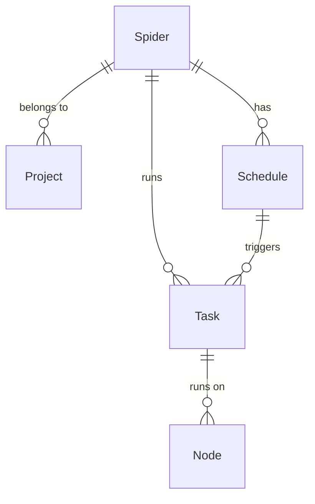

# 爬虫

在 Crawlab 中，爬虫是网络爬虫程序的基本单位。您可以将其看作一个爬虫软件项目，它由代码文件组成，例如 Scrapy
项目。请注意，这里提到的 *项目* 与 Crawlab
中的基础概念 [项目](../project/README.md) 是不同的。

::: warning
*爬虫* 这个概念在 Crawlab 非常重要，因此我们强烈推荐您仔细阅读这一章节。
:::

## 典型流程

以下是用户在 Crawlab 操作爬虫的典型流程。

## 创建爬虫

1. 导航到 `爬虫` 页面，再点击左上方的 `新建爬虫` 按钮
2. 输入 `名称`、`执行命令` 等相关信息
3. 点击 `确认`

`执行命令` 是爬虫运行时的基础命令，例如 `scrapy crawl myspider`，相当于在运行爬虫时执行的 bash/shell 命令。

`增量同步文件` 是指是在爬虫运行时，是否对爬虫程序的文件进行增量同步，而不是每次都下载全部文件。打开后，可以节省爬虫文件下载时间。

`自动安装依赖` 是指在爬虫运行时，是否自动安装爬虫所需的依赖包（例如 `requirements.txt` 中的依赖包）。（该功能仅限专业版）

## 上传爬虫

有几种上传爬虫文件的方式。

### 上传目录

1. 导航到爬虫详情页
2. 点击 `文件` 标签
3. 点击导航条上的 `上传文件` 按钮
4. 选择 `目录`
5. 点击 `点击选择目录上传`
6. 选择爬虫文件所在目录
7. 点击 `确认`

### 上传文件

1. 导航到爬虫详情页
2. 点击 `文件` 标签
3. 点击导航条上的 `上传文件` 按钮
4. 选择 `文件`
5. 拖拽爬虫文件到放置区，或直接点击放置区并选择爬虫文件
6. 点击 `确认`

### 上传文件 (拖拽)

1. 导航到爬虫详情页
2. 点击 `文件` 标签
3. 拖拽爬虫文件或目录到左侧导航栏的目录里

## 运行爬虫

您可以根据以下步骤来运行爬虫

1. 如果您在爬虫详情页，点击导航条上名为 `运行` 的播放按钮
2. 如果您在 `爬虫列表` 页面，点击右侧名为 `运行` 的播放按钮
3. 选择合适的爬虫运行设置
4. 点击 `确认`

之类是爬虫运行设置的解释。

- `执行命令`: 将被实际运行的 cmd/bash/shell 基础命令
- `执行参数`: 被传入 `执行命令` 的参数
- `模式`: 运行模式，默认为 `随机节点`.
- `优先级`: 任务优先级，默认为 5

## 实体关系

