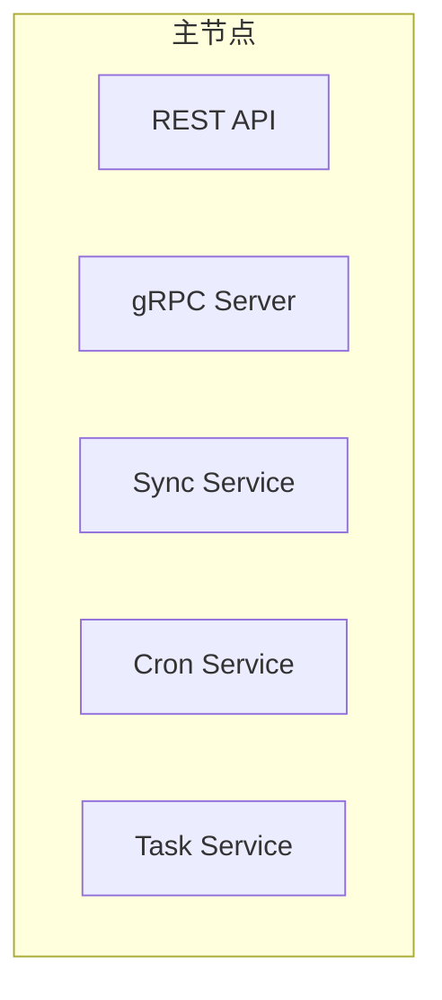

# 主节点

主节点是 Crawlab 分布式系统中的中心部分，主要负责管理[工作节点](worker-node.md)、派发爬虫任务、以及接受发送信息给工作节点。

主节点由很多自模块组成，相比于工作节点更为复杂。您可以参考下图查看主节点的自模块。

```mermaid
graph TB
    subgraph 主节点
      api[REST API]
      grpc[gRPC Server]
      sync[Sync Service]
      cron[Cron Service]
      task[Task Service]
    end
```
