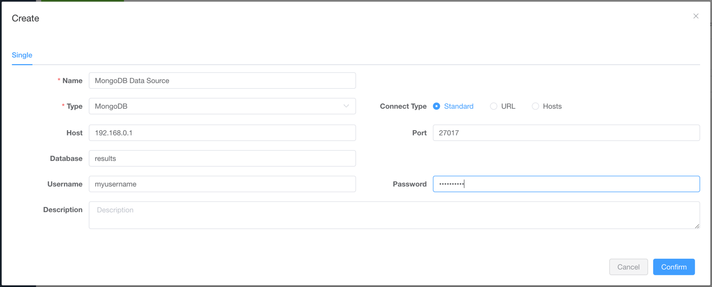
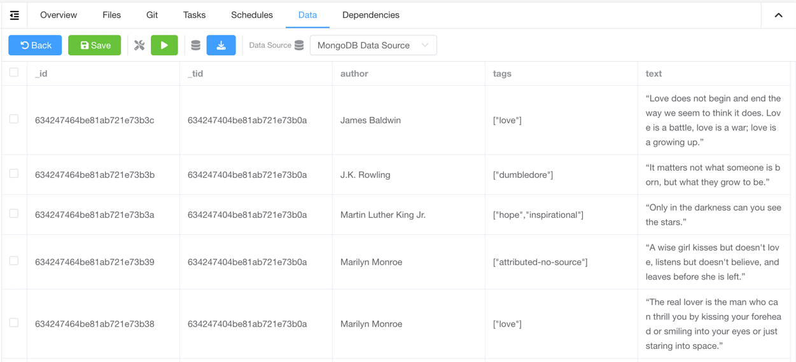

# Data Sources

Crawlab supports data sources integration, which means you can use Crawlab to manage your data
sources, such as MongoDB, MySQL, PostgreSQL, SQL Server, etc.

## Supported Data Sources

| Category       | Data Source                                                                   | Supported          |
|----------------|-------------------------------------------------------------------------------|--------------------|
| Non-Relational | [MongoDB](https://mongodb.com)                                                | :white_check_mark: |
| Non-Relational | [ElasticSearch](https://elastic.co)                                           | :white_check_mark: |
| Relational     | [MySQL](https://mysql.com)                                                    | :white_check_mark: |
| Relational     | [PostgreSQL](https://postgresql.org/)                                         | :white_check_mark: |
| Relational     | [SQL Server](https://www.microsoft.com/en-us/sql-server/sql-server-downloads) | :white_check_mark: |
| Relational     | [CockroachDB](https://www.cockroachlabs.com/)                                 | :white_check_mark: |
| Relational     | [Sqlite](https://www.sqlite.org)                                              | :white_check_mark: |
| Streaming      | [Kafka](https://kafka.apache.org/)                                            | :white_check_mark: |

## Add Data Source

1. Go to the `Data Sources` page <br>
2. Click `New Data Source` button <br>
3. Select `Type` as the data source type, and enter `Name` and connection
   fields <br>
4. Click `Confirm` button to save the data source

Now you should be able to see the data source in the `Data Sources` page.

## Use Data Source

1. Go to the `Spider Detail` page
2. Select the data source in the `Data Source` field <br>
3. Click on `Save` button to save the spider
4. Add related integration code in the code where saving results data (refer to the `Spider Code Examples` section
   below)
5. Run the spider, and you should see the results in the `Data` tab <br>

## Spider Code Examples

### General Python Spider

The method `save_item` in [crawlab-sdk](https://pypi.org/project/crawlab-sdk/) can be used to save data to designated
data source.

```python

```py
from crawlab import save_item

...
  save_item(result_item)
...
```

### Scrapy Spider

Add `crawlab.CrawlabPipeline` to `settings.py`.

```python
ITEM_PIPELINES = {
  'crawlab.CrawlabPipeline': 300,
}
```