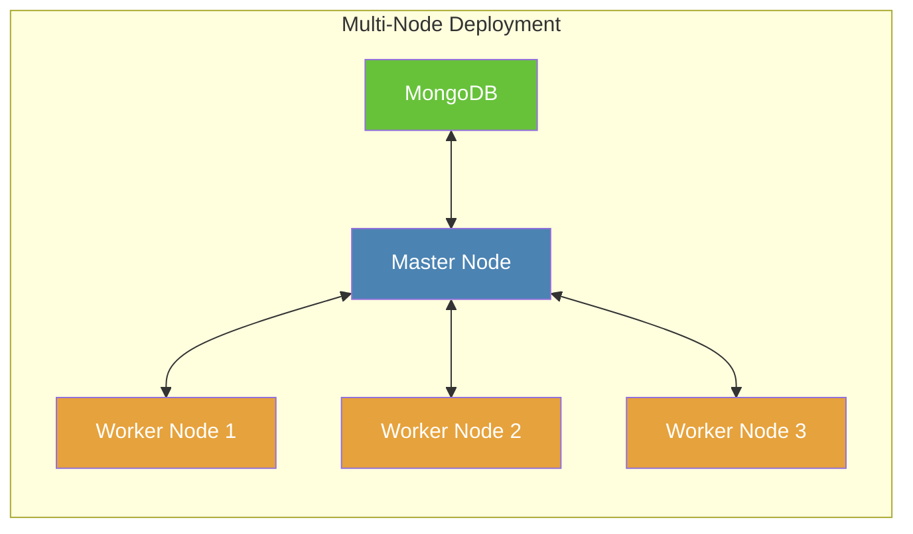

# Kubernetes

[Kubernetes](https://kubernetes.io/) is an open-source container orchestration platform that automates the deployment,
scaling, and management of containerized applications. It is widely used in the industry and has a large community. If
you are going to deploy a large-scale Crawlab cluster, Kubernetes is a good choice.

## Main Process

If you are familiar with Crawlab [Docker installation](./docker.md), you will find that the main process of Kubernetes
installation is similar. The only difference is that you need to create Kubernetes resources instead of Docker
containers.

1. Install [Kubernetes](https://kubernetes.io/).
2. Create Kubernetes resources including `Deployment`, `Service`, `PersistentVolumeClaim`, etc.
3. Start Crawlab.

::: warning
Before following below guidance, we will assume you have installed Kubernetes and already created the Kubernetes
cluster.
:::

## Multi-Node Deployment

Kubernetes is designed for large-scale deployment, and it is easy to scale Crawlab to multiple nodes. In the diagram
below, we have a Master Node and three Worker Nodes. The Master Node is connected to a MongoDB instance.



### Master Node PersistentVolumeClaim (PVC)

In Kubernetes, you need to create `PersistentVolume` and `PersistentVolumeClaim` to store Crawlab nodes data. Below is
an example for Master Node.

```yaml
kind: PersistentVolumeClaim
apiVersion: v1
metadata:
  name: crawlab-master-pvc
  namespace: crawlab
spec:
  resources:
    requests:
      storage: 10Gi
```

The above `PersistentVolumeClaim` requests 10Gi storage for the Master Node. Normally you only need to create
`PersistentVolumeClaim` for Master Node only, because Worker Nodes can be scaled up and down at any time.

### Master Node Deployment

Below is an example of `Deployment` for Master Node. Here we assume you are connecting to an external MongoDB instance.

```yaml
kind: Deployment
apiVersion: apps/v1
metadata:
  name: crawlab-master
  namespace: crawlab
spec:
  replicas: 1
  selector:
    matchLabels:
      app: crawlab-master
  template:
    metadata:
      labels:
        app: crawlab-master
    spec:
      volumes:
        - name: crawlab-master-storage
          persistentVolumeClaim:
            claimName: crawlab-master-pvc
      containers:
        - name: master
          image: crawlabteam/crawlab:latest
          env:
            - name: CRAWLAB_NODE_MASTER
              value: 'Y'
            - name: CRAWLAB_MONGO_URI
              value: '<mongo_uri>'
            - name: CRAWLAB_MONGO_HOST
              value: '<mongo_host>'
            - name: CRAWLAB_MONGO_PORT
              value: '<mongo_port>'
            - name: CRAWLAB_MONGO_DB
              value: '<mongo_db>'
            - name: CRAWLAB_MONGO_USERNAME
              value: '<mongo_username>'
            - name: CRAWLAB_MONGO_PASSWORD
              value: '<mongo_password>'
            - name: CRAWLAB_MONGO_AUTHSOURCE
              value: '<mongo_auth_source>'
            - name: CRAWLAB_MONGO_AUTHMECHANISM
              value: '<mongo_auth_mechanism>'
            - name: CRAWLAB_MONGO_AUTHMECHANISMPROPERTIES
              value: '<mongo_auth_mechanism_properties>'
          volumeMounts:
            - name: crawlab-master-storage
              mountPath: /root/.crawlab
            - name: crawlab-master-storage
              mountPath: /data
            - name: crawlab-master-storage
              mountPath: /var/log/crawlab
      restartPolicy: Always
```

### Master Node Service

The Master Node Service is used to expose the API and GRPC ports to the both internal and external environments. This is
essential for Worker Nodes to connect to the Master Node. Also, it is necessary for the Crawlab Web UI to connect to the
Master Node, so that you can visit the Crawlab Web UI from your browser.

Below is an example of `Service` for Master Node.

```yaml
kind: Service
apiVersion: v1
metadata:
  name: crawlab-master-service
  namespace: crawlab
spec:
  ports:
    - name: api
      port: 8080
      targetPort: 8080
    - name: grpc
      port: 9666
      targetPort: 9666
  selector:
    app: crawlab-master
```

::: tip
Normally a `Service` has a `ClusterIP` type, which means it is only accessible within the Kubernetes cluster. If you
want to expose the Master Node to the external environment, you can use `NodePort` or `LoadBalancer` type. For more
information, please refer to the [Kubernetes Service](https://kubernetes.io/docs/concepts/services-networking/service/).
:::

After creating the `Service`, you can access Crawlab Web UI by visiting `http://<service_ip>:8080` in your browser.

### Worker Node Deployment

The `Deployment` for Worker Node is similar to the Master Node. The only difference is that you need to set
`CRAWLAB_NODE_MASTER` to `N` and `CRAWLAB_GRPC_ADDRESS` to the Master Node Service address, which in this case is
`crawlab-master-service:9666`.

Below is an example of `Deployment` for Worker Node.

```yaml
kind: Deployment
apiVersion: apps/v1
metadata:
  name: crawlab-worker
  namespace: crawlab
spec:
  replicas: 3
  selector:
    matchLabels:
      app: crawlab-worker
  template:
    metadata:
      labels:
        app: crawlab-worker
    spec:
      containers:
        - name: worker
          image: crawlabteam/crawlab:latest
          env:
            - name: CRAWLAB_NODE_MASTER
              value: 'N'
            - name: CRAWLAB_GRPC_ADDRESS
              value: 'crawlab-master-service:9666'
            - name: CRAWLAB_FS_FILER_URL
              value: 'http://crawlab-master-service:8080/api/filer'
      restartPolicy: Always
```

In the above example, we will create 3 Worker Nodes. You can scale up or down the Worker Nodes by changing the
`replicas` field.