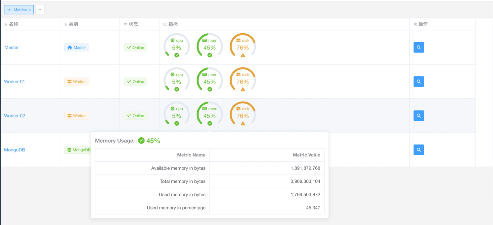
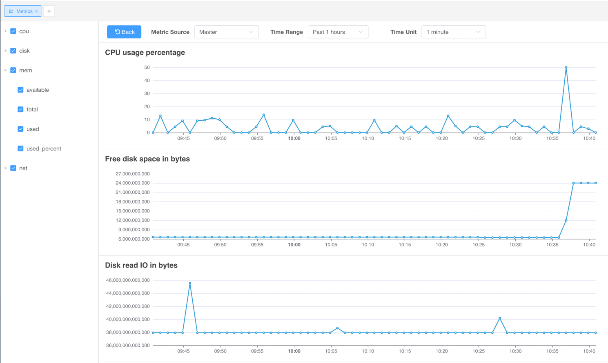
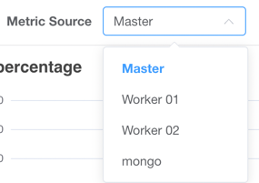
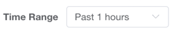
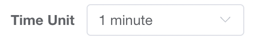
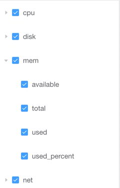

# Monitoring

::: info NOTE
This functionality is for [Pro Edition](https://www.crawlab.cn/en/prices) only.
:::

[Crawlab Pro](https://www.crawlab.cn/en/prices) supports performance monitoring, which means you can use Crawlab Pro to monitor the performance
of your nodes.

## Performance Metrics Overview

1. Go to the `Metrics` page  
2. You can see the snapshots of the performance metrics of all nodes  

## Performance Metrics Detail

1. Go to the `Metrics Deail` page by clicking on `View` button in the `Metrics`
   page  
2. You can see the performance metrics of the selected node  
3. You can switch the metrics source by selecting the `Metrics Source` dropdown
    
4. You can select the time range/unit by selecting the `Time Range` dropdown
      and `Time Unit`  
5. You can check or uncheck metrics on the left panel to show/hide them on the
   right panel  
