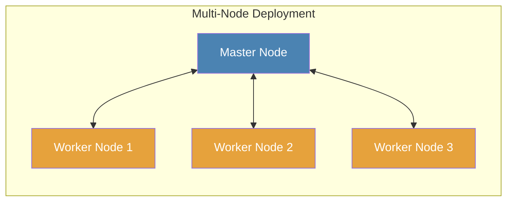

# Node

A node is a Crawlab instance that runs crawling [tasks](../task/README.md) or provides other functionalities. You can
basically regard a node as a server.

There are two types of nodes, each of which serves different functionalities.

1. [Master Node](#master-node)
2. [Worker Node](#worker-node)

::: warning
Of course you can set up multiple Crawlab instances (nodes) on a server, but that is **NOT** recommended as a single
instance (node) on a server normally suffices.
:::

## Master Node

Master Node is the control center of the whole distributed system in Crawlab. It acts like the brain of a human body.
Master Node assigns [tasks](../task/README.md) to [Worker Nodes](#worker-node) or itself, and manages them. It also
deploys and distributes [spider](../spider/README.md) files to other nodes. Furthermore, it provides APIs to the
frontend application and handles communication between each node.

::: warning
There is only **ONE** Master Node in Crawlab.
:::

## Worker Node

Worker Node is a Crawlab instance dedicated for running crawling [tasks](../task/README.md). Normally, a single node or
server can be limited to its computing power and resources including CPUs, memory and network IO. Therefore, the number
of Worker Nodes can be increased in order to scale up the throughput of data collection and improve the overall crawling
performance of the distributed system.

::: tip
There can be none (SND) or multiple Worker Nodes (MND) in Crawlab.
:::

## Topology

## Check Node Status

In `Nodes` page, you can view the status of a node whether it is online of offline.

## Enable/Disable

You can enable or disable nodes to run tasks by toggling the switch button of `Enabled` attribute in `Nodes` page and
node detail page.

## Set Max Runners

A node can run multiple tasks at the same time. The number of concurrent tasks is controlled by `Max Runners` of a node.
It can be configured in the node detail page.

## Set Basic Info

Basic info such as node name, IP, MAC address can be set in the node detail page.

## Add Node

You can refer to [Set up Worker Nodes](/en/guide/installation/docker.html#set-up-worker-nodes) in Multi-Node
Deployment (MND) of Docker Installation to add new nodes.
