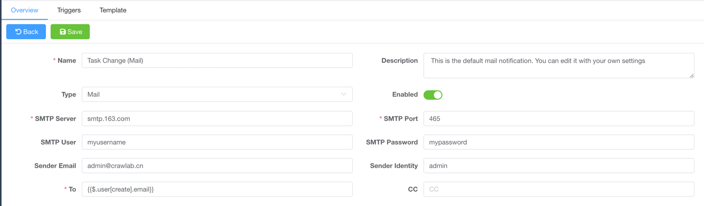
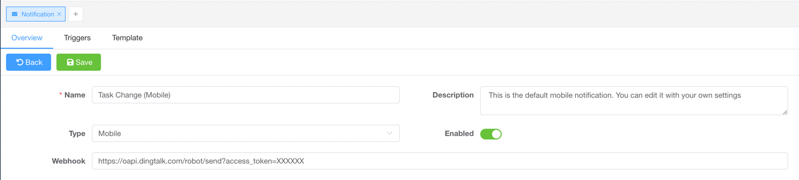
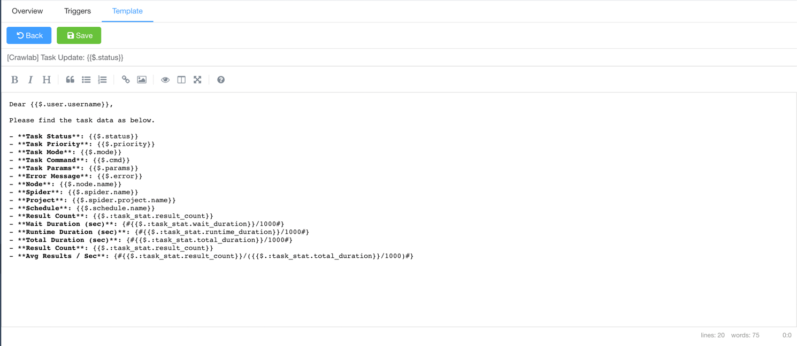

---
slides:
- title: Email
  content: Notification preview
  image: /assets/img/screenshots/screenshot-email-notifications.png
- title: Mobile
  content: Notification preview
  image: /assets/img/screenshots/screenshot-mobile-notifications.png
---

# Notifications

::: info NOTE
This functionality is for [Pro Edition](https://www.crawlab.cn/en/prices) only.
:::

Crawlab allows users to receive email or mobile notifications.

<SlideList :slides="$page.frontmatter.slides"></SlideList>

## Email

1. Navigate to `Notifications` page  
2. Click a notification config of `Email` type
3. Fill in the configuration form  
4. Click on `Save` button

SMTP configurations:

- **SMTP Server**: SMTP server address
- **SMTP Port**: SMTP server port
- **SMTP User**: SMTP server username
- **SMTP Password**: SMTP server password
- **Sender Email**: SMTP server sender email
- **Sender Identity**: SMTP server sender identity
- **To**: Recipient email
- **CC**: CC email

## Mobile

1. Navigate to `Notifications` page  
2. Click a notification config of `Mobile` type
3. Fill in the configuration form  
4. Click on `Save` button

::: tip
Please refer to related documentation for how to get webhook tokens.

- [DingTalk](https://open.dingtalk.com/document/robots/custom-robot-access)
- [Wechat Work](https://developer.work.weixin.qq.com/document/path/91770)

:::

## Trigger

1. Navigate to the `Notifications` page  
2. Click on the `Trigger` tab
3. Select the event types you want to trigger

## Template

1. Navigate to `Notifications` page  
2. Click a notification config of any type
3. Click on `Template` tab  

::: tip
To understand the syntax and variables of templates, please refer
to [template-parser](https://github.com/crawlab-team/template-parser)
:::
