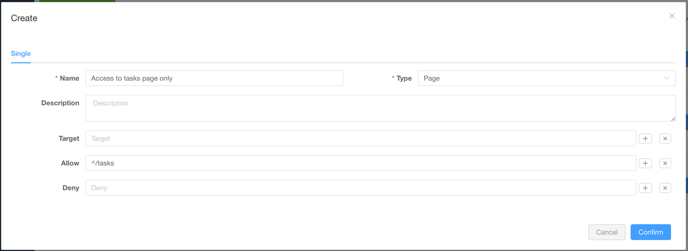
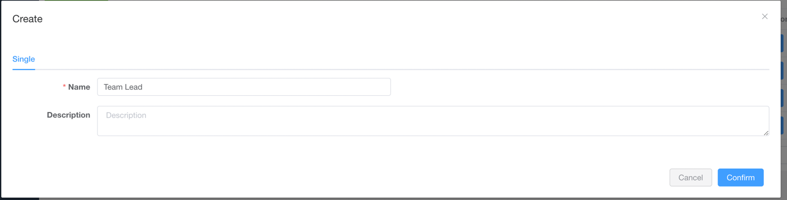
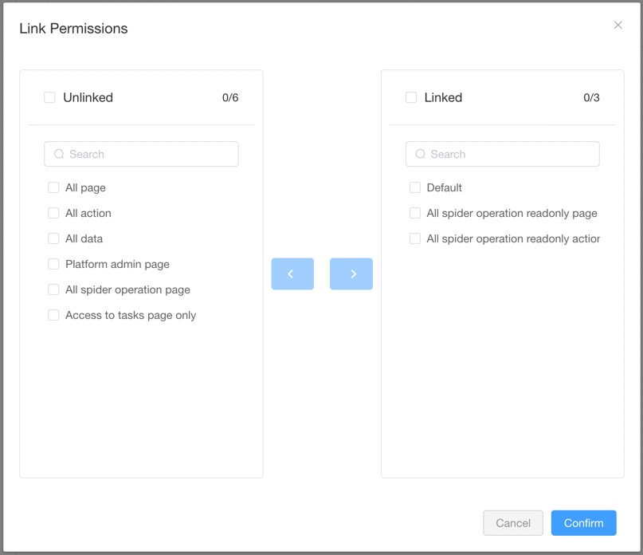
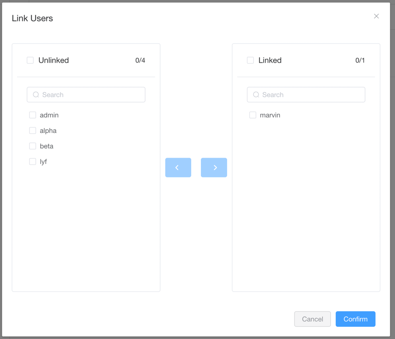

# Permissions Management

::: info NOTE
This functionality is for [Pro Edition](https://www.crawlab.cn/en/prices) only.
:::

[Crawlab Pro](https://www.crawlab.cn/en/prices) supports a [RBAC](https://www.imperva.com/learn/data-security/role-based-access-control-rbac/)
-based permissions management, which means you can use Crawlab Pro to manage the `Permissions`
of your [users](../user) via `Roles`.

## Permissions

Permissions in Crawlab Pro are the basic unit of user access control.

### Types of permissions

Types of permissions are as below:

- **Action**: Specific actions that a role can perform, such as `View`, `Edit`, `Delete`, `Create`, etc.
- **Page**: Specific pages that a role can access, such as `Spiders`, `Tasks`, `Nodes`, etc.
- **Data**: Specific data records that a role can access, such as `Spiders` attributed to a specific user.

### Permission fields

Fields of permissions are as below:

- **Type**: Type of permission, `Action`, `Page`, or `Data`.
- **Target**: Regex pattern of the targets, where the permission should operate on.
- **Allow**: Regex pattern of allowed items.
- **Deny**: Regex pattern of denied items.

### Create a permission

1. Go to the `Permissions` page by clicking the `Permissions` button in the
   sidebar.  
2. Click the `New Permission` button  
3. Enter necessary info of the new permission and click `Confirm`
   button  

### Delete a permission

1. Go to the `Permissions` page by clicking the `Permissions` button in
   the  
2. Click the `Delete` button of the permission you want to delete  

## Roles

Roles in Crawlab Pro can be defined by admin users. Roles are associated with a set of permissions, and can be assigned
to users.

### Create a Role

1. Go to the `Roles` page by clicking the navigation button on the left sidebar  
2. Click the `New Role` button  
3. Enter necessary info of the new role and click `Confirm` button  

### Delete a role

1. Go to the `Roles` page by clicking the `Roles` button in
   the  
2. Click the `Delete` button of the role you want to delete  

### Link/Unlink permissions to a role

1. Go to the `Permissions` tab in the `Role Detail` page by clicking the `View permissions`
   button.  
2. Click on `Link Permissions` button.  
3. Select the permissions you want to link/unlink to the
   role, and click `Confirm` button.  

### Link/Unlink users to a role

1. Go to the `Permissions` tab in the `Role Detail` page by clicking the `View users`
   button.  
2. Click on `Link Users` button.  
3. Select the users you want to link/unlink to the
   role, and click `Confirm` button.  
