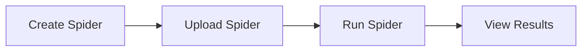
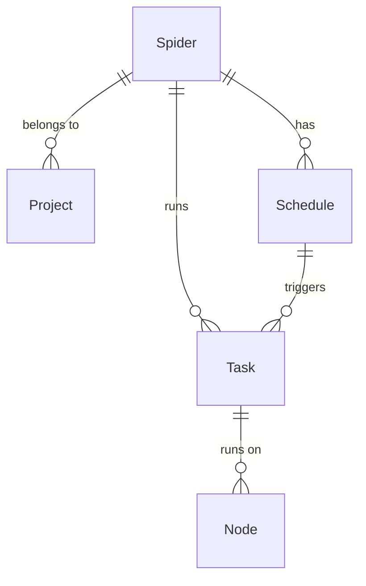

# Spider

Spider is the basic unit of web crawler programs in Crawlab. You can regard it as a web crawling software project
consisted of code and files, e.g. a Scrapy project. Please note that the term *project* mentioned here is not the same
as the basic concept [Project](../project/README.md) in Crawlab.

::: warning
The concept *Spider* is so important in Crawlab that we strongly recommend you read through this section.
:::

## Typical Process

Below is a typical process for users to play with spiders in Crawlab.

## Create Spider

1. Navigate to `Spiders` page, and click `New Spider` button on the top left.
2. Enter relevant info including `Name` and `Execute Command`.
3. Click `Confirm`.

`Execute Command` is the base command that will be executed when running the spider, e.g. `scrapy crawl myspider`, and
it's the bash/shell command that will be executed when running the spider.

`Incremental Sync` is whether to sync files incrementally when running the spider, instead of downloading all files
every time. It can save time when downloading files.

`Auto Install Dependencies` is whether to install dependencies automatically when running the spider, e.g. the
dependencies in `requirements.txt`. (This feature is only available in Crawlab Pro Edition)

## Upload Spider

There are several ways to upload spider files.

### Upload Folder

1. Navigate to spider detail page.
2. Click `Files` tab.
3. Click `Upload` button in the nav bar.
4. Choose `Folder`.
5. Click `Click to Select Folder to Upload`.
6. Choose the folder where spider files are located.
7. Click `Confirm`.

### Upload Files

1. Navigate to spider detail page.
2. Click `Files` tab.
3. Click `Upload` button in the nav bar.
4. Choose `Files`.
5. Drag and drop spider files into the drop zone, or click the drop zone and select files.
6. Click `Confirm`.

### Upload Files (Drag & Drop)

1. Navigate to spider detail page.
2. Click `Files` tab.
3. Drag and drop spider files or folders into folders on file navigator on the left.

## Run Spider

You can follow the steps below to run a spider.

1. If in spider detail page, click `Run` button with play icon in the nav bar.
2. If in `Spiders` page, click `Run` button with play icon on the right.
3. Select appropriate settings for running spider.
4. Click `Confirm`.

Here is the explanation of settings for running a spider.

- `Command`: Actual cmd/bash/shell base command that will be executed.
- `Param`: Actual parameters/arguments passed to `Command`.
- `Mode`: Task running mode. Default to `Random Node`.
- `Priority`: Task priority. Default to 5.

## Entity Relationships

