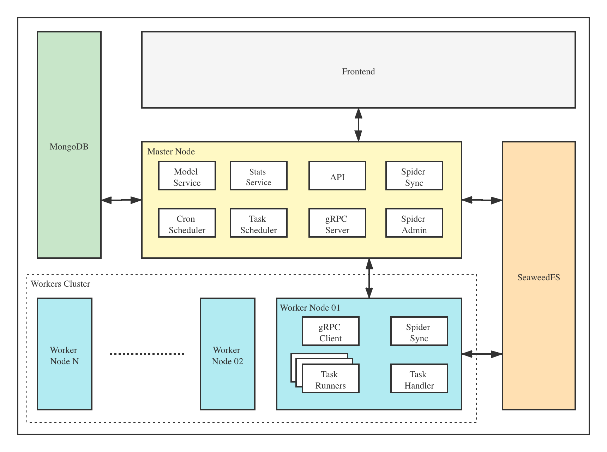

# Architecture

The architecture diagram of Crawlab is as below.

As a distributed system, Crawlab is consisted of several modules (or layers), including
[Master Node](../node/master-node), [Worker Nodes](../node/worker-node), [Database](../database)
, [File System](../filesystem) and Frontend. Each module (apart from Master Node for now) is scalable so
that the whole distributed system can be flexibly scaled in order to support high-performance requirements.

For example, crawling tasks are assigned to the Worker Node Cluster which can adjust itself with suitable number of
nodes if resources needed change.
