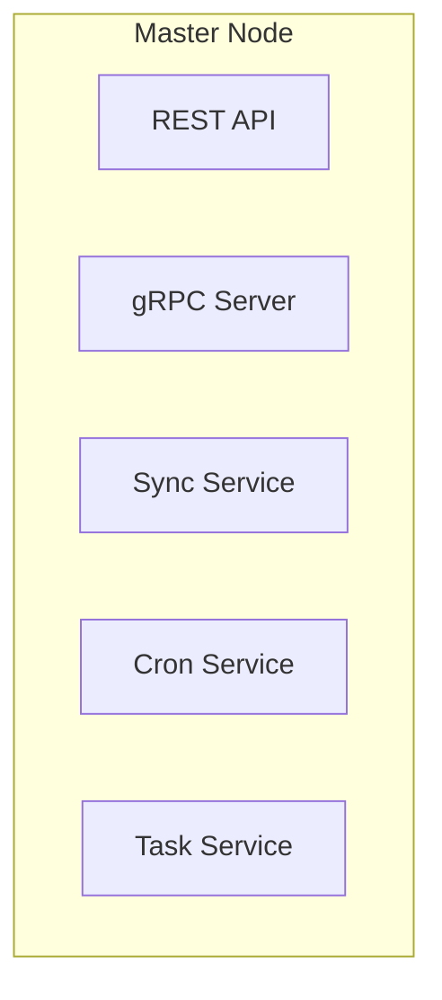

# Master Node

A master node is the central part of the distributed system in Crawlab. It manages registration
of [worker nodes](worker-node.md), assigns and schedule crawling tasks to worker nodes, and receives or transfers
messages from or to worker nodes.

A master node is consisted of many submodules and is much more complicated than worker nodes. You can refer to the
diagram below for the submodules in a master node.

