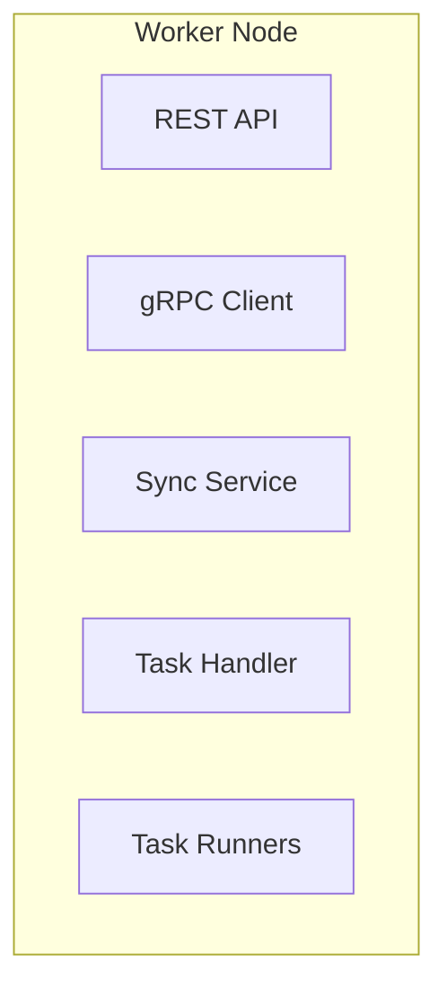

# Worker Node

A worker node is a kind of node whose main responsibility is task execution. It receives crawling tasks from
the [master node](master-node.md) and executes processes that crawl data on the target websites. Therefore, you can
think of worker nodes
as executors. They do not handle API requests, task scheduling, cron and other functionalities on a master node.

You can refer below the submodules of worker nodes.

