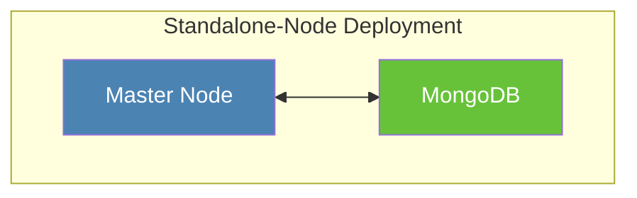
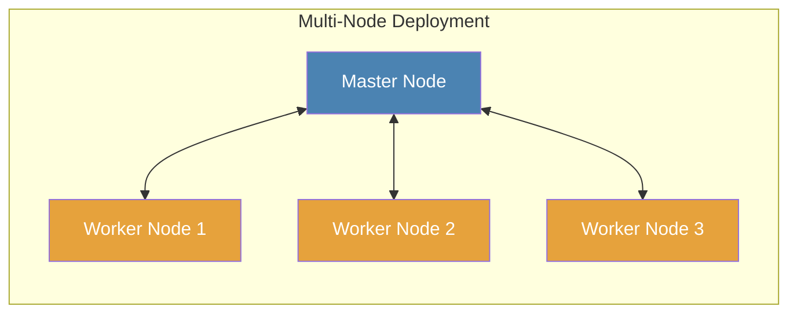
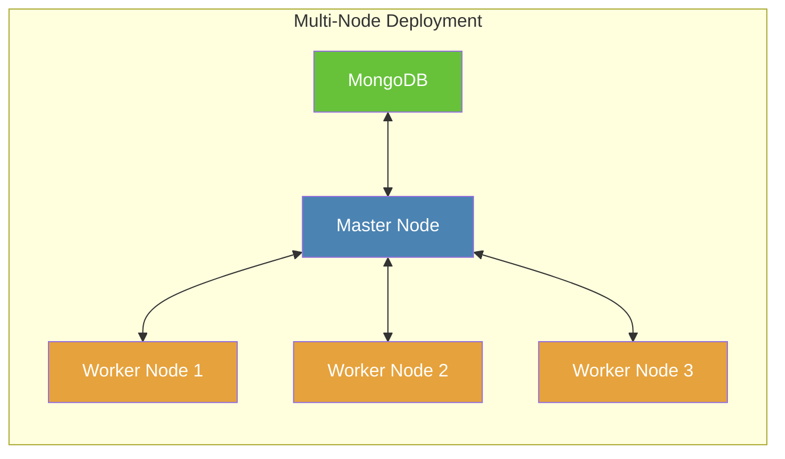

# Installation

Crawlab Pro is distributed via [Docker](https://www.docker.com/). You can install it on any platform that supports
Docker. You can pull the Crawlab Pro image directly from Docker Hub and then configure it via Docker-Compose.

::: tip
If you use Kubernetes, you can also configure it by creating Kubernetes resources. The installation process is very
similar to [Crawlab Community Edition Installation](../guide/installation/kubernetes.md). The only difference is that
you need to change the image name to `crawlabteam/crawlab-pro` and add the environment
variable `CRAWLAB_LICENSE: <your_license>`.
:::

This guide will show you how to install Crawlab Pro in a Docker environment.

## Prerequisites

::: tip
If you don't know how to set up Docker environment, please refer to
the [Installation via Docker](../guide/installation/docker) section.
:::

- **Docker Environment**. Please make sure you have installed Docker and Docker Compose on your machine.
- **License**. You need to have a valid license to initialize and start Crawlab Pro containers.

## Main Process

::: tip
If you don't know how to obtain licenses, please refer to [Crawlab Pro License](./license) for more information.
:::

The main process of installing Crawlab Pro is quite similar to that of Crawlab Community except that it requires
a [license](./license). You can refer to [Crawlab Community Installation via Docker](../guide/installation/docker) for
more
information.

1. Install [Docker](https://www.docker.com/) and [Docker-Compose](https://docs.docker.com/compose/)
2. Pull Docker image of Crawlab Pro (and MongoDB if you have no external MongoDB instance)
3. Create `docker-compose.yml` and make configurations (including [licenses](./license))
4. Start Docker containers

::: warning
For following guidance, we will assume you have installed Docker and Docker-Compose, and already pulled Docker images.
:::

## Standalone-Node Deployment



**Standalone-Node Deployment (SND)** is similar to the configuration in [Quick Start](../guide/quick-start), and it is
normally for demo purpose or managing a small number of crawlers. In SND, all Docker containers including Crawlab and
MongoDB are in only a single machine, i.e. Master Node (see diagram above).

Create `docker-compose.yml` and enter the content below.

```yaml
version: '3.3'
services:
  master:
    image: crawlabteam/crawlab-pro
    container_name: crawlab_master
    restart: always
    environment:
      CRAWLAB_LICENSE: "your license"  # your license
      CRAWLAB_NODE_MASTER: "Y"  # Y: master node
      CRAWLAB_MONGO_HOST: "mongo"  # mongo host address. In the docker compose network, directly refer to the service name
      CRAWLAB_MONGO_PORT: "27017"  # mongo port 
      CRAWLAB_MONGO_DB: "crawlab"  # mongo database 
      CRAWLAB_MONGO_USERNAME: "username"  # mongo username
      CRAWLAB_MONGO_PASSWORD: "password"  # mongo password 
      CRAWLAB_MONGO_AUTHSOURCE: "admin"  # mongo auth source 
    volumes:
      - "/opt/crawlab/.crawlab/master:/root/.crawlab"  # persistent crawlab metadata
      - "/opt/crawlab/master:/data"  # persistent crawlab data
      - "/var/crawlab/log:/var/log/crawlab" # log persistent 
    ports:
      - "8080:8080"  # exposed api port
    depends_on:
      - mongo

  mongo:
    image: mongo:4.2
    restart: always
    environment:
      MONGO_INITDB_ROOT_USERNAME: "username"  # mongo username
      MONGO_INITDB_ROOT_PASSWORD: "password"  # mongo password
    volumes:
      - "/opt/crawlab/mongo/data/db:/data/db"  # persistent mongo data
    ports:
      - "27017:27017"  # expose mongo port to host machine
```

Then, execute `docker-compose up -d` and navigate to `http://<your_ip>:8080` in the browser to start using Crawlab.

## Multi-Node Deployment



**Multi-Node Deployment (MND)** is normally used in production environment, where a cluster consisted of a Master Node
and multiple Worker Nodes is deployed. Master Node is connected by Worker Nodes, and it serves as the central control
system in the cluster.

The configuration for MND is more complex than SND, but you can follow the guidelines below to set up a small cluster,
which would be quite straightforward.

### Set up Master Node

Create `docker-compose.yml` in **Master Node** and enter the content below. Then start by
executing `docker-compose up -d`.

```yaml
# master node
version: '3.3'
services:
  master:
    image: crawlabteam/crawlab-pro
    container_name: crawlab_master
    restart: always
    environment:
      CRAWLAB_LICENSE: "your license"  # your license
      CRAWLAB_NODE_MASTER: "Y"  # Y: master node
      CRAWLAB_MONGO_HOST: "mongo"  # mongo host address. In the docker compose network, directly refer to the service name
      CRAWLAB_MONGO_PORT: "27017"  # mongo port 
      CRAWLAB_MONGO_DB: "crawlab"  # mongo database 
      CRAWLAB_MONGO_USERNAME: "username"  # mongo username
      CRAWLAB_MONGO_PASSWORD: "password"  # mongo password 
      CRAWLAB_MONGO_AUTHSOURCE: "admin"  # mongo auth source 
    volumes:
      - "/opt/crawlab/.crawlab/master:/root/.crawlab"  # persistent crawlab metadata
      - "/opt/crawlab/master:/data"  # persistent crawlab data
      - "/var/crawlab/log:/var/log/crawlab" # log persistent 
    ports:
      - "8080:8080"  # exposed api port
      - "9666:9666"  # exposed grpc port
    depends_on:
      - mongo

  mongo:
    image: mongo:4.2
    restart: always
    environment:
      MONGO_INITDB_ROOT_USERNAME: "username"  # mongo username
      MONGO_INITDB_ROOT_PASSWORD: "password"  # mongo password
    volumes:
      - "/opt/crawlab/mongo/data/db:/data/db"  # persistent mongo data
    ports:
      - "27017:27017"  # expose mongo port to host machine
```

### Set up Worker Nodes

Create `docker-compose.yml` in each **Worker Node** and enter the content below. Then start by
executing `docker-compose up -d`.

```yaml
# worker node
version: '3.3'
services:
  worker:
    image: crawlabteam/crawlab-pro
    container_name: crawlab_worker
    restart: always
    environment:
      CRAWLAB_LICENSE: "your license"  # your license
      CRAWLAB_NODE_MASTER: "N"  # N: worker node
      CRAWLAB_GRPC_ADDRESS: "<master_node_ip>:9666"  # grpc address
      CRAWLAB_FS_FILER_URL: "http://<master_node_ip>:8080/api/filer"  # seaweedfs api
    volumes:
      - "/opt/crawlab/.crawlab/worker:/root/.crawlab"  # persistent crawlab metadata
      - "/opt/crawlab/worker:/data"  # persistent crawlab data
```

Please note that you should replace `<master_node_ip>` with the IP address of Master Node and make sure it is accessible
by Worker Nodes.

After Master Node and Worker Nodes are all started, you can now navigate to `http://<master_node_ip>:8080` to start
using Crawlab.

::: warning

### Expose ports of Master Node

As Worker Nodes connect to Master Node through ports **8080** (API) and **9666** (gRPC), you should make sure they are
both opened and NOT blocked by firewall on Master Node.
:::

## External MongoDB

In MND introduced above, you may notice that MongoDB is by default deployed on Master Node. But performance wise, this
handy deployment configuration can result in problems, because MongoDB itself can be a bottleneck particularly in a
large-scale distributed system.

Fortunately, this issue can be resolved by using external MongoDB deployed in other nodes, or from cloud database
service providers, e.g. AWS, Azure, Aliyun etc. By doing so, MongoDB can be easily scaled so that the database
robustness would be ensured. Please refer to the diagram below.



The configuration file `docker-compose.yml` for Master Node is slightly different from that
of [default MND](#multi-node-deployment). Please find the content as below.

```yaml
# master node with external mongo
version: '3.3'
services:
  master:
    image: crawlabteam/crawlab-pro
    container_name: crawlab_master
    restart: always
    environment:
      CRAWLAB_LICENSE: "your license"  # your license
      CRAWLAB_NODE_MASTER: "Y"  # Y: master node
      CRAWLAB_MONGO_URI: "<mongo_uri>"  # mongo uri (set this alone)
      CRAWLAB_MONGO_HOST: "<mongo_host>"  # mongo host address
      CRAWLAB_MONGO_PORT: "<mongo_port>"  # mongo port 
      CRAWLAB_MONGO_DB: "<mongo_db>"  # mongo database 
      CRAWLAB_MONGO_USERNAME: "<mongo_username>"  # mongo username
      CRAWLAB_MONGO_PASSWORD: "<mongo_password>"  # mongo password 
      CRAWLAB_MONGO_AUTHSOURCE: "<mongo_auth_source>"  # mongo auth source 
      CRAWLAB_MONGO_AUTHMECHANISM: "<mongo_auth_mechanism>"  # mongo auth mechanism 
      CRAWLAB_MONGO_AUTHMECHANISMPROPERTIES: "<mongo_auth_mechanism_properties>"  # mongo auth mechanism properties
    volumes:
      - "/opt/crawlab/.crawlab/master:/root/.crawlab"  # persistent crawlab metadata
      - "/opt/crawlab/master:/data"  # persistent crawlab data
      - "/var/crawlab/log:/var/log/crawlab" # log persistent 
    ports:
      - "8080:8080"  # exposed api port
      - "9666:9666"  # exposed grpc port
```

As you can see, the service `mongo` is removed and MongoDB-related connection environment variables (
e.g. `CRAWLAB_MONGO_HOST`, `CRAWLAB_MONGO_PORT`) are changed to those of external MongoDB. You can leave some
environment variables empty if you don't need them. 
