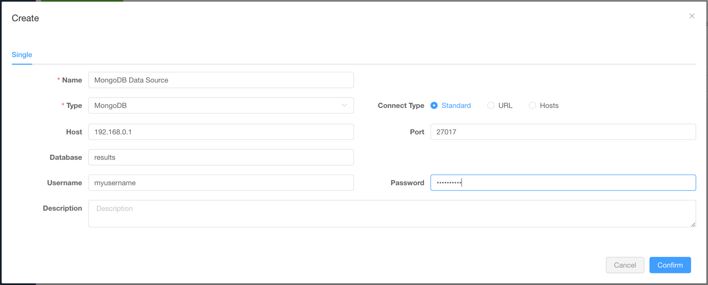
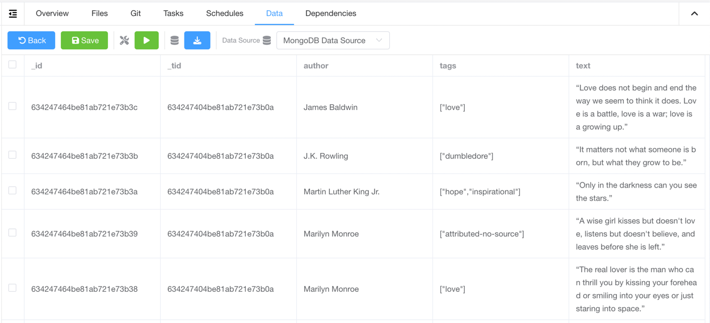

# 数据源

Crawlab 支持数据源集成，这意味着您可以使用 Crawlab 管理您的数据源，例如 MongoDB、MySQL、PostgreSQL、SQL Server 等。

## 支持的数据源

| 类别   | 数据源                                                                           | 支持                 |
|------|-------------------------------------------------------------------------------|--------------------|
| 非关系型 | [MongoDB](https://mongodb.com)                                                | :white_check_mark: |
| 非关系型 | [ElasticSearch](https://elastic.co)                                           | :white_check_mark: |
| 关系型  | [MySQL](https://mysql.com)                                                    | :white_check_mark: |
| 关系型  | [PostgreSQL](https://postgresql.org/)                                         | :white_check_mark: |
| 关系型  | [SQL Server](https://www.microsoft.com/en-us/sql-server/sql-server-downloads) | :white_check_mark: |
| 关系型  | [CockroachDB](https://www.cockroachlabs.com/)                                 | :white_check_mark: |
| 关系型  | [Sqlite](https://www.sqlite.org/index.html)                                   | :white_check_mark: |
| 流处理  | [Kafka](https://kafka.apache.org/)                                            | :white_check_mark: |

## 新建数据源

1. 导航至 `数据源` 页面 <br>
2. 点击 `新建数据源` 按钮 <br>
3. 选择 `类型` 作为数据源类型，并输入 `名称` 以及连接信息 <br>
4. 点击 `保存` 按钮 <br>

## 使用数据源

1. 导航至 `爬虫详情` 页面
2. 在 `数据源` 中选择相应的数据源 <br>
3. 点击 `保存` 按钮
4. 在保存结果数据的地方，添加相应的集成代码 (参考下面的 `爬虫代码例子`)
5. 运行爬虫，您将能在 `数据` 标签中看到结果数据 <br>

## 爬虫代码例子

### 通用 Python 爬虫

[crawlab-sdk](https://pypi.org/project/crawlab-sdk) 的方法 `save_item` 可被调用来保存数据到对应的数据源。

```python

```py
from crawlab import save_item

...
  save_item(result_item)
...
```

### Scrapy 爬虫

添加 `crawlab.CrawlabPipeline` 至 `settings.py`.

```python
ITEM_PIPELINES = {
  'crawlab.CrawlabPipeline': 300,
}
```