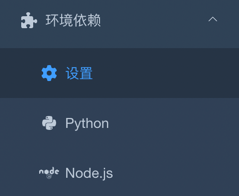
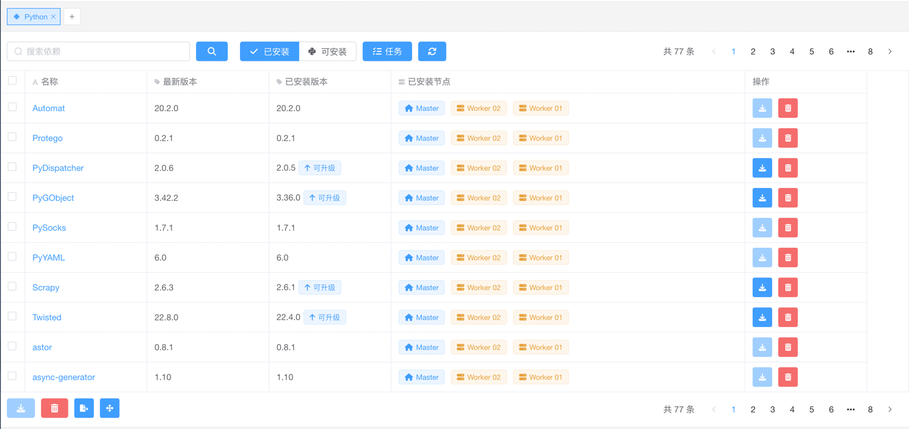
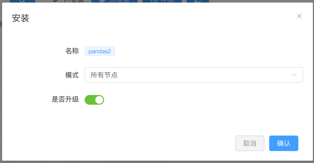
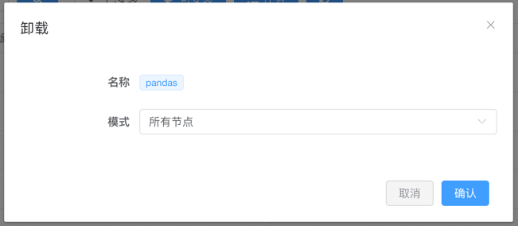
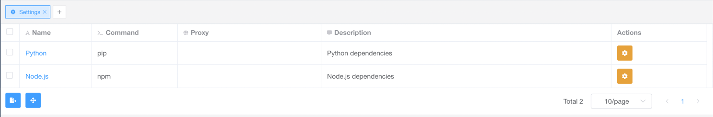
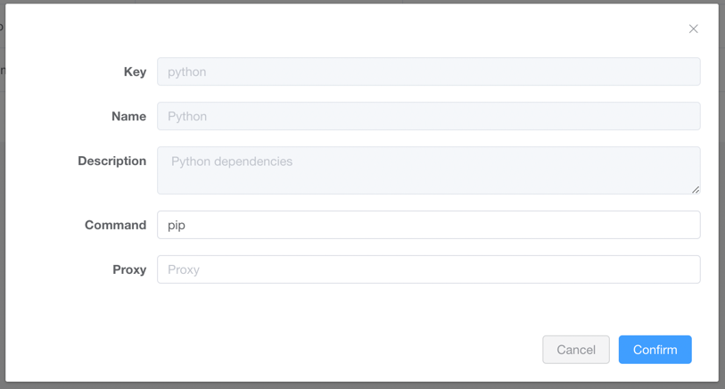
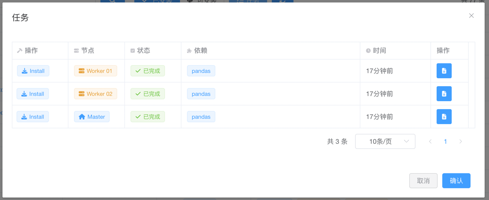
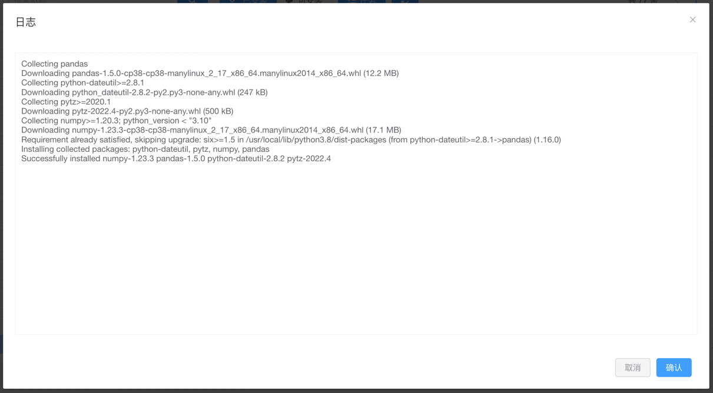

# 依赖管理

Crawlab 允许用户为爬虫和任务安装和管理依赖。

## 页面菜单

展开左侧边栏上的 `环境按钮` 按钮，然后点击以下子菜单项。

- **设置**: 全局依赖设置
- **Python**: Python 依赖管理
- **Node.js**: Node.js 依赖管理

## 安装依赖

1. 导航到依赖管理页面 (Python/Node.js)  
2. 点击 `可安装` 按钮  
3. 输入搜索关键字并点击 `搜索` 按钮  
4. 点击 `安装` 按钮  
5. 选择 `模式` (安装到哪些节点) 和 `升级` (是否升级) 并点击 `确认` 按钮  

## 卸载依赖

1. 导航到依赖管理页面 (Python/Node.js)  
2. 点击 `卸载` 按钮来卸载依赖  
3. 选择 `模式` (卸载到哪些节点) 并点击 `确认` 按钮  

## 设置

1. 导航到设置页面  
2. 点击 `配置` 按钮  
3. 编辑配置信息并点击 `确认` 按钮  

设置信息描述:

- **命令**: 安装或卸载依赖的执行命令, 例如 `pip`, `/usr/local/bin/pip39`, `npm`, `yarn`
- **代理**: 安装或卸载依赖的代理地址, 例如 `https://registry.npm.taobao.org`, `https://pypi.tuna.tsinghua.edu.cn/simple`

## 任务

1. 导航到依赖管理页面 (Python/Node.js)  
2. 点击 `任务` 按钮  
3. 您可以在任务列表中查看任务的执行状态  
4. 点击 `日志` 按钮来查看任务的执行日志  
5. 您可以在任务日志中查看任务的执行日志  