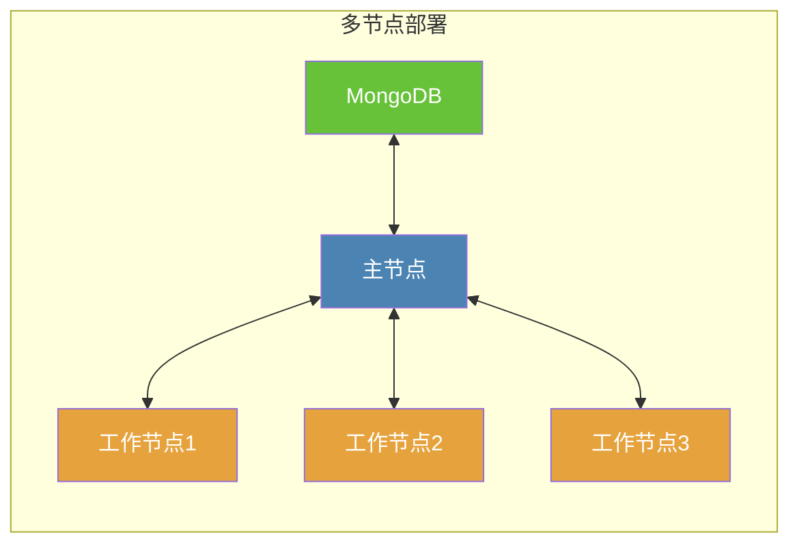

# Kubernetes

[Kubernetes](https://kubernetes.io/)
是一个开源的容器编排平台，它自动化了容器化应用程序的部署、扩展和管理。它在业界被广泛使用，并拥有庞大的社区。如果你打算部署大规模的Crawlab集群，Kubernetes是一个不错的选择。

## 主要过程

如果你熟悉Crawlab的[Docker安装](./docker.md)，你会发现Kubernetes安装的主要过程类似。唯一的区别是你需要创建Kubernetes资源，而不是Docker容器。

1. 安装[Kubernetes](https://kubernetes.io/)。
2. 创建Kubernetes资源，包括`Deployment`、`Service`、`PersistentVolumeClaim`等。
3. 启动Crawlab。

::: warning
在按照下面的指南之前，我们假设你已经安装了Kubernetes并且已经创建了Kubernetes集群。
:::

## 多节点部署

Kubernetes设计用于大规模部署，很容易将Crawlab扩展到多个节点。在下面的图中，我们有一个主节点和三个工作节点。主节点连接到一个MongoDB实例。



### 主节点持久卷声明（PVC）

在Kubernetes中，你需要创建`PersistentVolume`和`PersistentVolumeClaim`来存储Crawlab节点数据。下面是主节点的一个示例。

```yaml
kind: PersistentVolumeClaim
apiVersion: v1
metadata:
  name: crawlab-master-pvc
  namespace: crawlab
spec:
  resources:
    requests:
      storage: 10Gi
```

上述的`PersistentVolumeClaim`为主节点请求了10Gi的存储。通常你只需要为主节点创建`PersistentVolumeClaim`，因为工作节点可以随时扩展和缩减。

### 主节点部署

下面是主节点的`Deployment`示例。这里我们假设你正在连接到一个外部的MongoDB实例。

```yaml
kind: Deployment
apiVersion: apps/v1
metadata:
  name: crawlab-master
  namespace: crawlab
spec:
  replicas: 1
  selector:
    matchLabels:
      app: crawlab-master
  template:
    metadata:
      labels:
        app: crawlab-master
    spec:
      volumes:
        - name: crawlab-master-storage
          persistentVolumeClaim:
            claimName: crawlab-master-pvc
      containers:
        - name: master
          image: crawlabteam/crawlab:latest
          env:
            - name: CRAWLAB_NODE_MASTER
              value: 'Y'
            - name: CRAWLAB_MONGO_URI
              value: '<mongo_uri>'
            - name: CRAWLAB_MONGO_HOST
              value: '<mongo_host>'
            - name: CRAWLAB_MONGO_PORT
              value: '<mongo_port>'
            - name: CRAWLAB_MONGO_DB
              value: '<mongo_db>'
            - name: CRAWLAB_MONGO_USERNAME
              value: '<mongo_username>'
            - name: CRAWLAB_MONGO_PASSWORD
              value: '<mongo_password>'
            - name: CRAWLAB_MONGO_AUTHSOURCE
              value: '<mongo_auth_source>'
            - name: CRAWLAB_MONGO_AUTHMECHANISM
              value: '<mongo_auth_mechanism>'
            - name: CRAWLAB_MONGO_AUTHMECHANISMPROPERTIES
              value: '<mongo_auth_mechanism_properties>'
          volumeMounts:
            - name: crawlab-master-storage
              mountPath: /root/.crawlab
            - name: crawlab-master-storage
              mountPath: /data
            - name: crawlab-master-storage
              mountPath: /var/log/crawlab
          restartPolicy: Always
```

### 主节点服务

主节点服务用于将API和GRPC端口暴露给内部和外部环境。这对于工作节点连接到主节点至关重要。同时，对于Crawlab Web
UI连接到主节点也是必要的，这样你就可以从浏览器访问Crawlab Web UI了。

下面是主节点的`Service`示例。

```yaml
kind: Service
apiVersion: v1
metadata:
  name: crawlab-master-service
  namespace: crawlab
spec:
  ports:
    - name: api
      port: 8080
      targetPort: 8080
    - name: grpc
      port: 9666
      targetPort: 9666
  selector:
    app: crawlab-master
```

::: tip
通常一个Service有一个ClusterIP类型，这意味着它只能在Kubernetes集群内部访问。如果你想将主节点暴露给外部环境，你可以使用NodePort或LoadBalancer类型。更多信息，请参考[Kubernetes Service](https://kubernetes.io/docs/concepts/services-networking/service/)。
:::

创建好 `Service` 之后，你可以通过浏览器访问 `http://<service_ip>:8080` 来访问Crawlab Web UI。

### 工作节点部署

工作节点的`Deployment`示例与主节点类似。唯一的区别是你需要将`CRAWLAB_NODE_MASTER`设置为`N`，并将`CRAWLAB_GRPC_ADDRESS`
设置为主节点服务地址，即`crawlab-master-service:9666`。

下面是工作节点的Deployment示例。

```yaml
kind: Deployment
apiVersion: apps/v1
metadata:
  name: crawlab-worker
  namespace: crawlab
spec:
  replicas: 3
  selector:
    matchLabels:
      app: crawlab-worker
  template:
    metadata:
      labels:
        app: crawlab-worker
    spec:
      containers:
        - name: worker
          image: crawlabteam/crawlab:latest
          env:
            - name: CRAWLAB_NODE_MASTER
              value: 'N'
            - name: CRAWLAB_GRPC_ADDRESS
              value: 'crawlab-master-service:9666'
            - name: CRAWLAB_FS_FILER_URL
              value: 'http://crawlab-master-service:8080/api/filer'
      restartPolicy: Always
```

在上述示例中，我们将创建3个工作节点。你可以通过更改 `replicas` 字段来扩展或缩减工作节点。