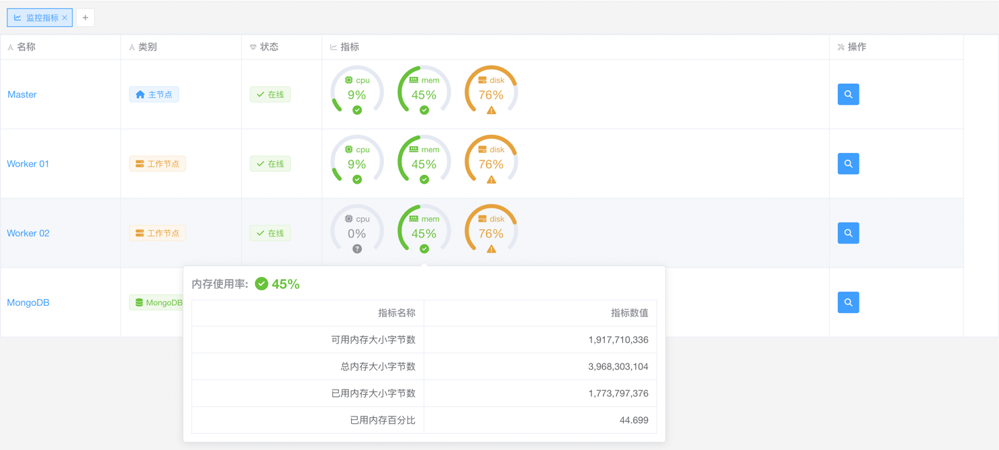
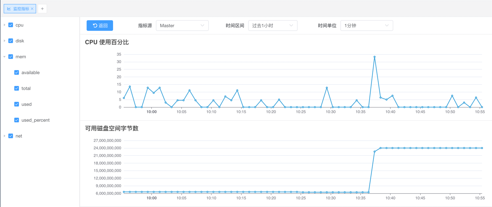
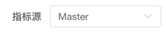
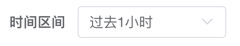
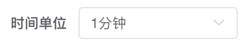
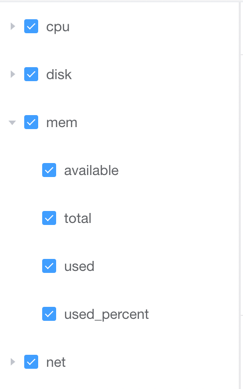

# 监控指标

::: info 注意
该功能仅适用于 [Crawlab 专业版](https://www.crawlab.cn/prices)。
:::

[Crawlab 专业版](https://www.crawlab.cn/prices) 支持性能监控，这意味着您可以使用 Crawlab 专业版监控节点的性能。

## 性能指标概览

1. 进入 `指标` 页面  
2. 您可以看到所有节点的性能指标快照  

## 性能指标详情

1. 通过点击 `指标` 页面中的 `查看` 按钮进入 `指标详情` 页面  
2. 您可以看到所选节点的性能指标  
3. 您可以通过选择 `指标来源` 下拉菜单来切换指标来源  
4. 您可以通过选择 `时间范围` 下拉菜单来选择时间范围    
   和 `时间单位`  
5. 您可以通过勾选左侧面板中的指标来显示/隐藏右侧面板中的指标  
