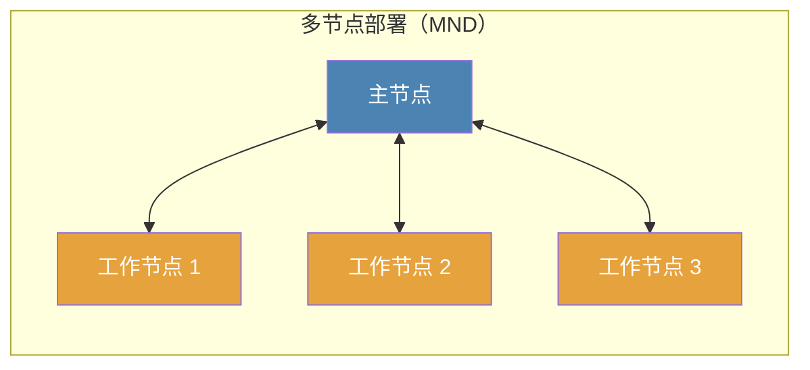

# 节点

节点其实就是一个 Crawlab 实例，用于运行 [任务](../task/README.md) 以及提供其他功能。基本上您可以将一个节点当作一台服务器。

有两类节点，它们分别提供不同的功能。

1. [主节点](#主节点)
2. [工作节点](#工作节点)

::: warning
您当然可以在一台服务器上搭建多个 Crawlab 实例（节点）。但那样做是 **不推荐的**，因为服务器上运行单实例（节点）通常已经足够了。
:::

## 主节点

主节点是 Crawlab 中分布式系统的中控模块，相当于人体中的大脑。主节点分配 [任务](../task/README.md) 给 [工作节点](#工作节点)
或它自己，并且管理它们。同时，主节点部署和分发 [爬虫](../spider/README.md) 文件至其他节点。另外，它还为前端应用提供 API，并处理节点间的通信。

::: warning
在 Crawlab 中只有 **一个** 主节点。
:::

## 工作节点

工作节点是一个 Crawlab 实例，专门用于运行抓取 [任务](../task/README.md)。通常，一个节点或服务器受限于计算能力和资源（包括 CPU、内存、网络
IO）。因此，我们可以通过调整工作节点的数量来对数据采集吞吐量进行扩容，以提高分布式系统的整体数据抓取能力。

::: tip
在 Crawlab 中可以不用工作节点（单节点部署 SND），或有多个工作节点（多节点部署 MND）。
:::

## 网络拓扑

## 查看节点状态

在 `Nodes` 页面，您可以查看节点状态，看看在线与否。

## 启用/禁用

您可以启用或禁用节点来控制它是否能运行爬虫任务。您可以在 `Nodes` 页面或详情页中点击 `Enabled` 属性中的切换按钮来控制。

## 设置最大执行器数量

一个节点能够在同一个时间运行多个任务。并发任务数量由节点的 `Max Runners` 控制，它能够在节点详情页里配置。

## 设置基础信息

诸如节点名称、IP 地址、MAC 地址等基础信息都可以在节点详情页中设置。

## 添加节点

您可以参考 Docker 安装中多节点部署章节的 [搭建工作节点](/zh/guide/installation/docker.html#set-up-worker-nodes) 来添加新节点。
