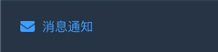
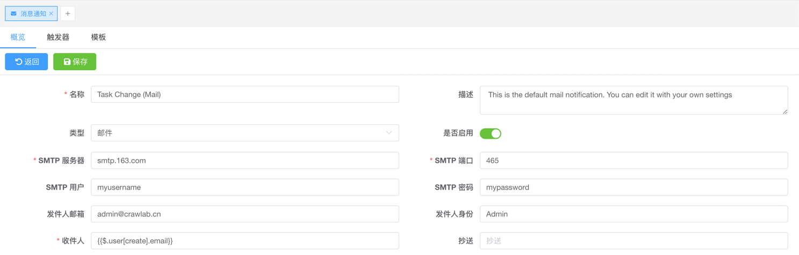
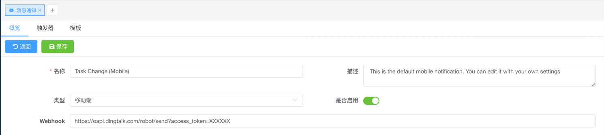
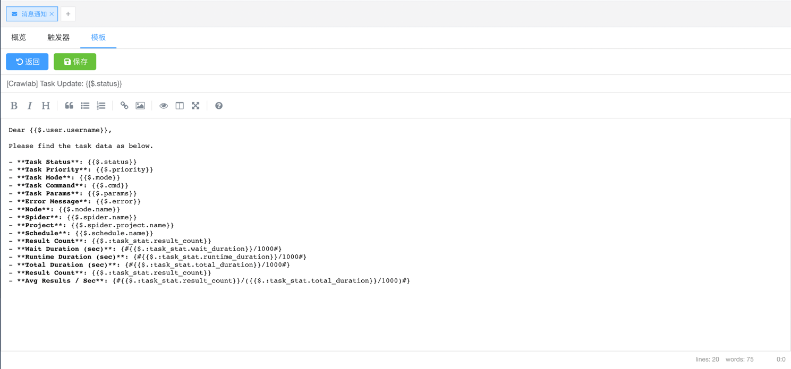

---
slides:
- title: 邮件
  content: 消息通知预览
  image: /assets/img/screenshots/screenshot-email-notifications.png
- title: 移动端
  content: 消息通知预览
  image: /assets/img/screenshots/screenshot-mobile-notifications.png
---

# 消息通知

::: info 注意
该功能仅适用于 [Crawlab 专业版](https://www.crawlab.cn/prices)。
:::

Crawlab 允许用户接收邮件或手机消息通知。

<SlideList :slides="$page.frontmatter.slides"></SlideList>

## 邮件

1. 导航到 `消息通知` 页面  
2. 点击 `邮件` 类型的消息通知配置
3. 填写配置表单  
4. 点击 `保存` 按钮

SMTP 配置:

- **SMTP Server**: SMTP 服务器地址
- **SMTP Port**: SMTP 服务器端口
- **SMTP User**: SMTP 服务器用户名
- **SMTP Password**: SMTP 服务器密码
- **Sender Email**: SMTP 服务器发送者邮箱
- **Sender Identity**: SMTP 服务器发送者身份
- **To**: 接收者邮箱
- **CC**: 抄送邮箱

## 移动端

1. 导航到 `消息通知` 页面  
2. 点击 `移动端` 类型的消息通知配置
3. 填写配置表单  
4. 点击 `保存` 按钮

::: tip
请参考相关文档了解如何获取 webhook token。

- [钉钉](https://open.dingtalk.com/document/robots/custom-robot-access)
- [企业微信](https://developer.work.weixin.qq.com/document/path/91770)

:::

## 触发

1. 导航到 `消息通知` 页面  
2. 点击 `触发` 标签
3. 选择需要触发的事件类型

## 模板

1. 导航到 `消息通知` 页面  
2. 点击任意类型的消息通知配置
3. 点击 `模板` 标签  

::: tip
如果想了解模板语法和变量，请参考 [template-parser](https://github.com/crawlab-team/template-parser)
:::
