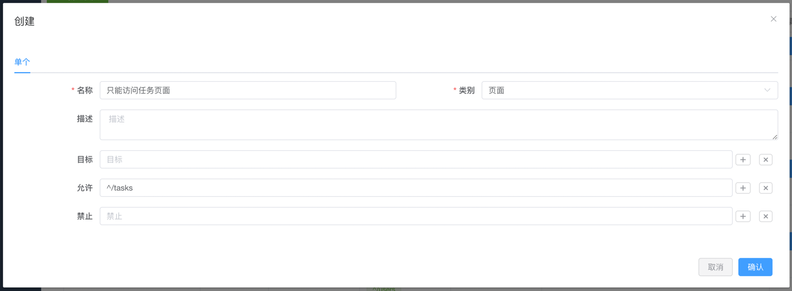
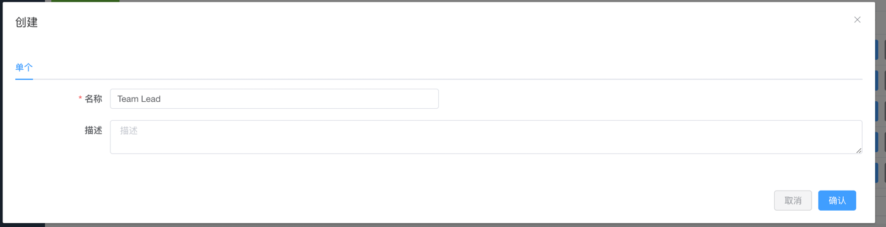
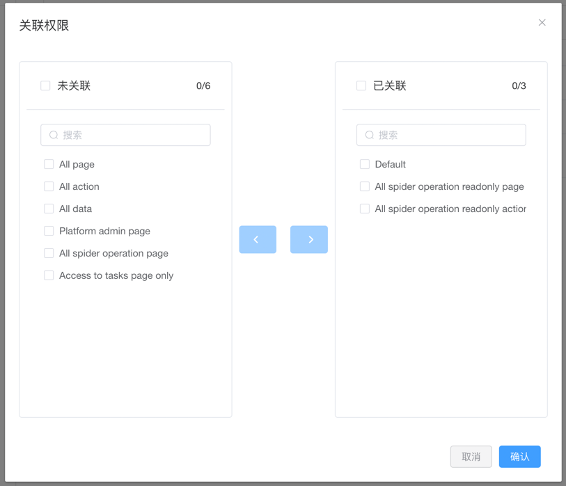
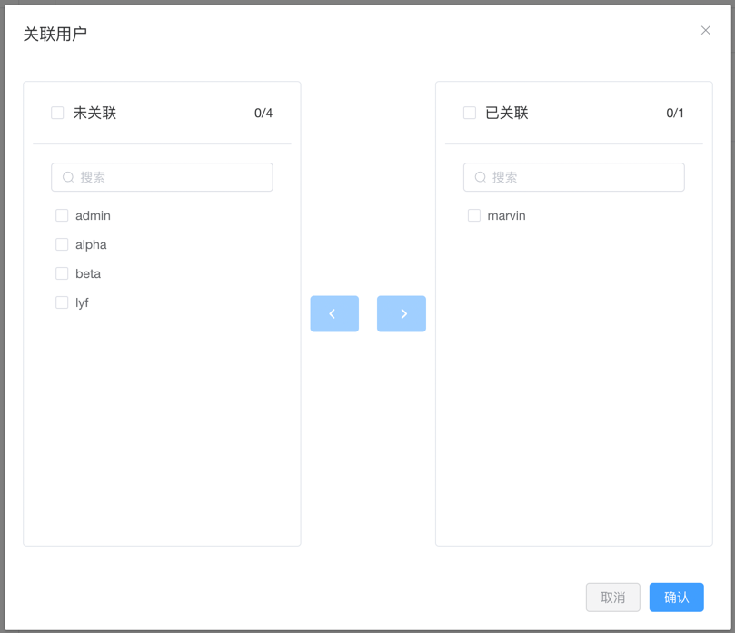

# 权限管理

::: info 注意
该功能仅适用于 [Crawlab 专业版](https://www.crawlab.cn/prices)。
:::

[Crawlab 专业版](https://www.crawlab.cn/prices) 支持基于 [RBAC](https://www.imperva.com/learn/data-security/role-based-access-control-rbac/)
的权限管理，这意味着您可以使用 Crawlab 专业版通过 `角色` 来管理您的 [用户](../user) 的 `权限`。

## 权限

Crawlab 专业版中的权限是用户访问控制的基本单位。

### 权限类型

Crawlab 专业版中的权限分为以下几种类型：

- **操作权限**：用户可以执行的操作，例如 `查看`、`编辑`、`删除` 等
- **页面权限**：用户可以访问的页面，例如 `爬虫管理`、`任务管理` 等
- **数据权限**：用户可以访问的数据，例如 某用户自己的 `爬虫`、`任务` 等

### 权限字段

Crawlab 专业版中的权限包含以下字段：

- **类型**：权限类型，例如 `操作权限`、`页面权限`、`数据权限` 等
- **目标**：作用于目标的权限的正则表达式，例如 `^/spider$`、`^/task$` 等
- **允许**: 允许范围的正则表达式
- **拒绝**: 拒绝范围的正则表达式

### 创建权限

1. 点击侧边栏的 `权限管理`，进入权限管理页面  
2. 点击 `新建权限` 按钮，进入创建权限页面  
3. 填写权限信息，点击 `确认` 按钮，即可创建权限  

### 删除权限

1. 点击侧边栏的 `权限管理`，进入权限管理页面  
2. 点击 `删除` 按钮，即可删除权限  

## 角色

Crawlab 专业版中的角色可以被管理用户定义。角色是权限的集合，用户可以通过角色来管理权限。

### 创建角色

1. 点击侧边栏的 `角色管理`，进入角色管理页面  
2. 点击 `新建角色` 按钮，进入创建角色页面  
3. 填写角色信息，点击 `确认` 按钮，即可创建角色  

### 删除角色

1. 点击侧边栏的 `角色管理`，进入角色管理页面  
2. 点击 `删除` 按钮，即可删除角色  

### 角色权限关联

1. 点击侧边栏的 `角色管理`，进入角色管理页面  
2. 点击 `关联权限` 按钮  
3. 在弹出的对话框中，勾选需要关联的权限，点击 `确认`
   按钮，即可关联或取消关联权限  

### 角色用户关联

1. 点击侧边栏的 `角色管理`，进入角色管理页面  
2. 点击 `关联用户` 按钮  
3. 在弹出的对话框中，勾选需要关联的用户，点击 `确认`
   按钮，即可关联或取消关联用户  
