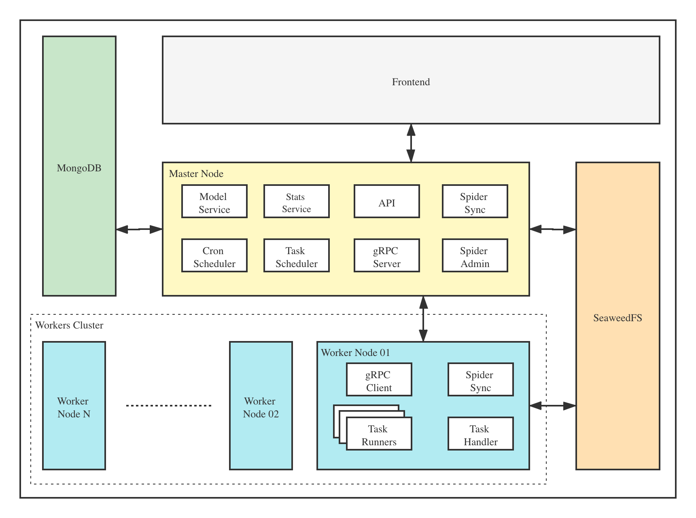

# 架构

以下是 Crawlab 的架构图。

作为分布式系统，Crawlab 由几个模块组成，其中包括 [主节点](../node/master-node)，[工作节点](../node/worker-node)，
[数据库](../database)，[文件系统](../filesystem) 以及 [前端](../frontend)。每个模块（目前除了节点）都具有可扩展性，
因此整个分布式系统能够被灵活扩展以支持高性能需求。

例如，爬虫抓取任务被分配到工作节点集群，然后工作节点集群可以根据资源需求的变化来调整节点数量。
