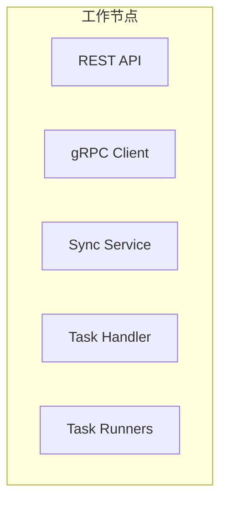

# 工作节点

工作节点的主要负责任务执行，它从[主节点](master-node.md)接收爬虫任务并执行目标网站抓取爬虫程序。因此，您可以将工作节点看作执行器。它们并不会处理
API 请求、任务派发、以及其他主节点上的功能。

您可以查看下图工作节点自模块。

```mermaid
graph TB
    subgraph 工作节点
      api[REST API]
      grpc[gRPC Client]
      sync[Sync Service]
      handler[Task Handler]
      runners[Task Runners]
    end
```
