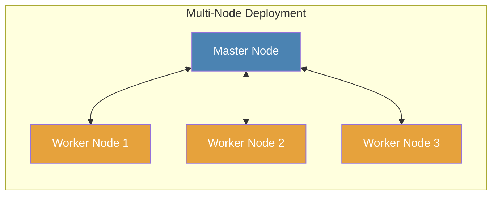

# Node

## What is a Node?

A node is a Crawlab instance that performs specific functions within your distributed web crawling system. In simple
terms, a node is a server running Crawlab software that can execute crawling [tasks](../task/index.md) or provide
management capabilities.

Nodes are the building blocks of Crawlab's distributed architecture, allowing you to scale your web crawling operations
across multiple machines to increase throughput and resilience.

## Types of Nodes

Crawlab uses a master-worker architecture with two distinct node types:

### Master Node

The Master Node serves as the **control center** of your Crawlab system. It:

- Manages and coordinates all nodes in the system
- Assigns [tasks](../task/index.md) to Worker Nodes and itself
- Deploys and distributes [spider](../spider/index.md) files across the system
- Provides APIs for the frontend application
- Handles communication between nodes
- Monitors system health and performance

:::info
There must be exactly **ONE** Master Node in a Crawlab cluster. This node is crucial as it orchestrates the entire
system.
:::

### Worker Node

Worker Nodes focus on **executing crawling tasks** assigned by the Master Node. They:

- Run crawling [tasks](../task/index.md) as directed
- Report task status and results back to the Master Node
- Can be scaled horizontally to increase crawling capacity

:::tip
Adding more Worker Nodes allows you to:

- Crawl more websites simultaneously
- Distribute load across multiple machines
- Improve fault tolerance
- Overcome rate limiting by distributing requests across different IP addresses
  :::

:::info
There can be none or multiple Worker Nodes in Crawlab. A system can function with just a Master Node, but adding Worker
Nodes allows for greater scalability.
:::

## System Architecture

### Topology

### Communication Flow

1. The Master Node assigns tasks to Worker Nodes
2. Worker Nodes execute their assigned tasks
3. Worker Nodes report task status and results back to the Master Node
4. The Master Node aggregates and stores results

## Node Management

### Viewing Node Status

In the `Nodes` page of the Crawlab UI, you can view all registered nodes and their current status (online/offline). This
helps you monitor the health of your crawling infrastructure.

### Enabling and Disabling Nodes

You can temporarily remove a node from the task scheduling pool without removing it from the system:

1. Navigate to the `Nodes` page
2. Toggle the `Enabled` switch for the desired node
3. Alternatively, you can change this setting in the node detail page

Disabled nodes will not receive new tasks but will continue to run any currently executing tasks.

### Configuring Maximum Concurrent Tasks

To control how many tasks a node can run simultaneously:

1. Navigate to the node detail page
2. Adjust the `Max Runners` setting

This setting helps you optimize resource usage based on each node's capabilities. By default, this is set to unlimited.

:::tip
For production environments, it's recommended to set `Max Runners` based on:

- Available CPU cores
- Available memory
- Network bandwidth limitations
- Target website constraints
  :::

## Node Deployment

### Hardware Recommendations

| Node Type   | CPU      | Memory | Disk Space |
|-------------|----------|--------|------------|
| Master Node | 2+ cores | 4GB+   | 20GB+      |
| Worker Node | 2+ cores | 2GB+   | 10GB+      |

Actual requirements will vary based on your specific workload and the complexity of your spiders.

### Adding a New Node

To expand your Crawlab cluster by adding Worker Nodes:

1. Install Crawlab on the new server
2. Configure it to connect to the same database as your Master Node
3. Set the node type to "Worker" in the configuration
4. Start the Crawlab service

For detailed instructions, refer to [Set up Worker Nodes](../../getting-started/installation.md#set-up-worker-nodes) in
the Multi-Node Deployment section.

## Troubleshooting

### Common Node Issues

1. **Node shows as offline**
    - Check if the Crawlab service is running
    - Verify network connectivity between nodes
    - Ensure database connection is working properly

2. **Node not receiving tasks**
    - Check if the node is enabled
    - Verify the node has not reached its `Max Runners` limit
    - Check log files for potential errors

3. **Communication issues between nodes**
    - Verify firewall settings allow necessary communication
    - Check that all nodes are connected to the same database
    - Ensure consistent Crawlab versions across all nodes

## Best Practices

1. **Start small**: Begin with a single Master Node and add Worker Nodes as needed
2. **Monitor resource usage**: Adjust `Max Runners` based on actual performance
3. **Regular maintenance**: Update all nodes simultaneously to avoid version conflicts
4. **Geographic distribution**: For global crawling, consider placing Worker Nodes in different regions
5. **Backup the Master Node**: As it's critical to the system, ensure proper backup procedures

:::info
While you can run multiple Crawlab instances (nodes) on a single physical server, it's generally **NOT** recommended. A
single instance per server is typically more efficient.
:::
