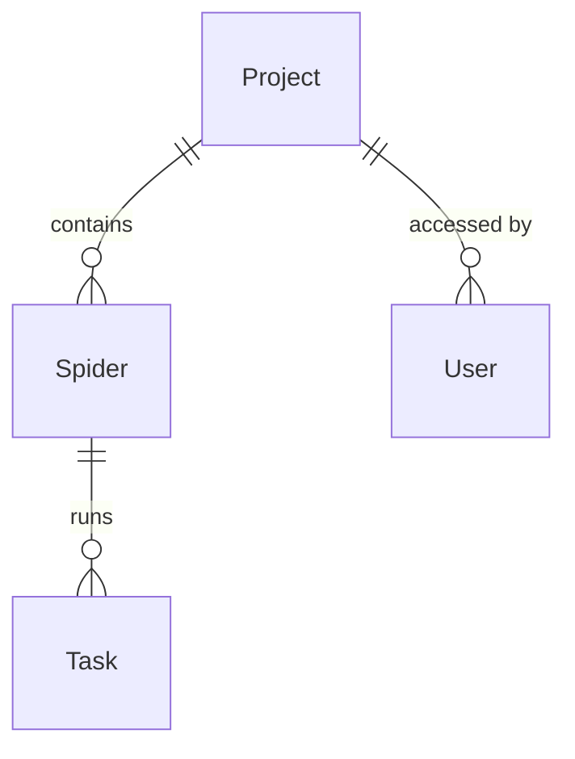

# Project

## What is a Project?

A Project in Crawlab is an organizational unit designed to group related spiders together. Projects provide a logical way to structure your web scraping operations, making it easier to manage, monitor, and maintain multiple spiders that share a common purpose or target similar websites.

Think of a Project as a container or folder that helps you organize your web scraping work by:
- Grouping functionally related spiders
- Separating different scraping initiatives
- Enabling team collaboration with clear boundaries
- Simplifying access control and permissions

:::info
Using Projects effectively is key to maintaining organization as your web scraping operations scale.
:::

## Project vs. Spider

Understanding the relationship between Projects and [Spiders](../spider/index.md) is fundamental to working effectively with Crawlab:

- **Project**: An organizational container that groups related spiders (e.g., "E-commerce Data Collection")
- **Spider**: An individual web crawler implementation (e.g., "Amazon Product Scraper")

This hierarchical structure enables:

```
Project: E-commerce Data Collection
├── Spider: Amazon Product Scraper
├── Spider: eBay Product Scraper
└── Spider: Walmart Product Scraper
Project: News Aggregation
├── Spider: CNN Articles
├── Spider: BBC News
└── Spider: Reuters Collector
```

:::tip
While Projects are optional (spiders can exist without being assigned to a project), using them will significantly improve organization as your scraping operations grow.
:::


## Creating a Project

### Basic Creation Steps

1. Navigate to the `Projects` page from the main sidebar
2. Click the `New Project` button in the top-left corner
3. Fill in the required information:
   - **Name**: A unique, descriptive name for your project
   - **Description**: (Optional) Additional information about the project's purpose
4. Configure any additional options as needed
5. Click `Confirm` to create the project

### Project Configuration Options

- **Name**: A unique identifier for your project. Choose a descriptive name that clearly indicates the purpose (e.g., "E-commerce Monitoring" or "News Aggregation").

- **Description**: A detailed explanation of the project's purpose, scope, and any other relevant information. A good description helps team members understand the project's context.

## Managing Projects

### Adding Spiders to a Project

There are two ways to add spiders to a project:

#### Method 1: When Creating a New Spider

1. Navigate to the `Spiders` page
2. Click the `New Spider` button
3. In the creation form, select your project from the `Project` dropdown menu
4. Complete the spider creation process

#### Method 2: Moving Existing Spiders

1. Navigate to the `Spiders` page
2. Select one or more spiders using the checkboxes
3. Click the `Move to Project` button in the action bar
4. Select the destination project from the dropdown
5. Click `Confirm` to move the spiders

### Project Settings

To modify a project's configuration:

1. Navigate to the `Projects` page
2. Click on the project you wish to edit
3. Update the desired fields:
   - Name
   - Description
4. Click `Save` to apply changes

## Project Organization Best Practices

### Naming Conventions

Establish consistent naming conventions for your projects:

- **Descriptive**: Names should clearly indicate the purpose (e.g., "Financial News Scraping")
- **Consistent**: Follow a pattern like "[Category]-[Function]" or "[Department]-[Purpose]"
- **Concise**: Keep names reasonably short while still being descriptive

### Logical Grouping

Group spiders into projects based on:

- **Purpose**: Spiders serving the same business need
- **Target Sites**: Spiders scraping related websites
- **Data Type**: Spiders collecting similar types of information
- **Team Ownership**: Spiders maintained by the same team

### Documentation

Maintain clear documentation for each project:

- Use the project description to explain the overall purpose
- Highlight detailed information about:
  - Project objectives
  - Common configuration across spiders
  - Deployment considerations
  - Data handling practices

## Entity Relationships

The diagram below illustrates how Projects relate to other components in the Crawlab ecosystem:



This shows that:
- A Project can contain multiple Spiders
- Projects can be accessed by multiple Users
- Each Spider can have multiple Tasks (execution instances)

## Practical Examples

### Example 1: E-commerce Monitoring Project

**Project Name**: E-commerce Price Monitoring
**Description**: Tracks product prices across multiple retailers for competitive analysis
**Spiders**:
- amazon_price_tracker: Monitors Amazon prices for specific products
- walmart_price_tracker: Monitors Walmart prices for the same products
- target_price_tracker: Monitors Target prices for comparison

**Benefit**: All price data is logically grouped, making cross-retailer comparisons straightforward.

### Example 2: News Research Project

**Project Name**: Financial News Analysis
**Description**: Collects financial news articles for sentiment analysis
**Spiders**:
- wsj_finance: Scrapes Wall Street Journal's finance section
- bloomberg_news: Collects articles from Bloomberg
- reuters_business: Gathers Reuters business news

**Benefit**: All financial news sources are organized together, simplifying data aggregation.
