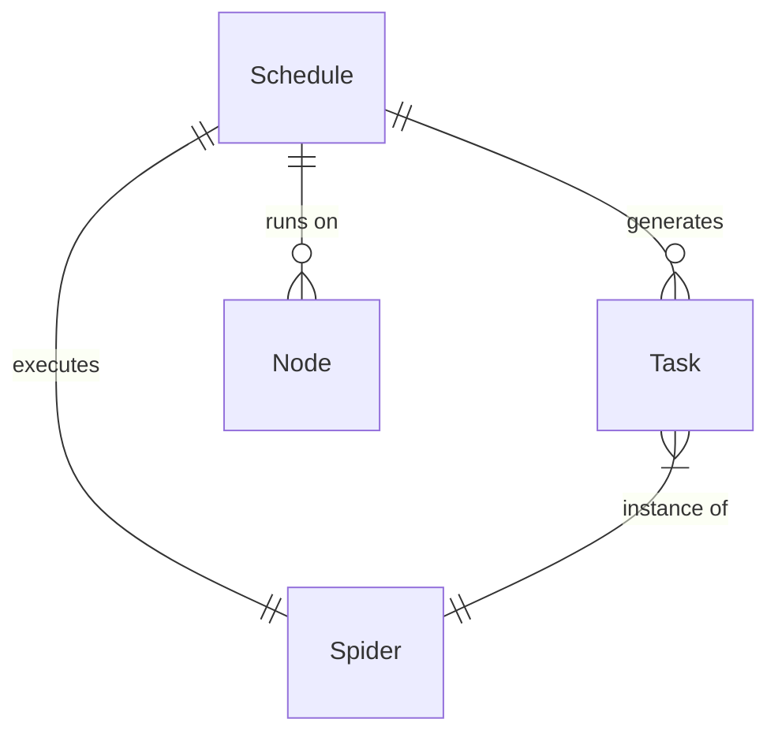

# Schedule

## What is a Schedule?

A Schedule in Crawlab is a time-based automation tool that enables spiders to run automatically at specified intervals or times. Rather than manually triggering a spider each time you need data, schedules allow you to define recurring or one-time execution patterns, ensuring your data is collected regularly and reliably without constant supervision.

Schedules in Crawlab provide:
- Automated time-based execution of spiders
- Support for complex timing patterns via cron expressions
- Options for simple interval-based recurrence
- Ability to configure one-time future executions
- Customizable parameters for each scheduled run

:::info
Effective scheduling is a key component of production-grade web scraping systems, allowing for regular data collection while minimizing manual intervention.
:::

## Schedule vs. Task

Understanding the distinction between Schedules and [Tasks](../task/index.md) is important:

- **Schedule**: A time-based trigger that determines when a spider should run (e.g., "Every day at 8:00 AM")
- **Task**: A single execution instance of a spider (e.g., "Today's 8:00 AM run of the Amazon Product Scraper")

When a schedule fires, it creates a new task automatically. This means:
- A schedule itself doesn't perform any crawling
- A schedule generates tasks at the specified times
- Each task represents one execution instance

## Creating a Schedule

### Basic Creation Steps

1. Navigate to the `Schedules` page from the main sidebar, or go to a specific spider's detail page
2. Click the `New Schedule` button
3. Fill in the required information:
   - **Name**: A descriptive name for the schedule
   - **Spider**: The spider to be executed (pre-selected if creating from spider page)
   - **Cron Expression or Interval**: The timing pattern
4. Configure additional options as needed
5. Click `Confirm` to create the schedule

### Schedule Configuration Options

#### Core Fields

- **Name**: A unique, descriptive identifier for your schedule. Choose names that indicate both the spider and timing (e.g., "Amazon Daily Morning Crawl" or "News Headlines Hourly Update").

- **Spider**: The specific spider this schedule will execute. A schedule is always associated with exactly one spider.

- **Cron Expression**: A powerful pattern format that defines when the schedule should trigger. Cron expressions provide precise control over execution timing using the format:
  ```
  * * * * *
  │ │ │ │ │
  │ │ │ │ └─── Day of week (0-6, where 0 is Sunday)
  │ │ │ └───── Month (1-12)
  │ │ └─────── Day of month (1-31)
  │ └───────── Hour (0-23)
  └─────────── Minute (0-59)
  ```

- **Enabled**: Toggle to activate or deactivate a schedule without deleting it.

- **Description**: Optional text explaining the purpose or details of this schedule.

#### Advanced Options

- **Mode**: Determines how the spider will be distributed:
  - **Random Node**: Executes on a randomly selected node
  - **All Nodes**: Runs on every available node simultaneously
  - **Selected Nodes**: Allows choosing specific nodes for execution

- **Priority**: Sets the execution priority when multiple tasks are queued. Higher priority (larger number) schedules execute first.

- **Parameters**: Additional arguments passed to the spider when executed through this schedule. These can override the spider's default parameters.

- **Tags**: Labels that help categorize and filter schedules.

## Cron Expressions Explained

### Basic Format

Cron expressions use the format: `minute hour day-of-month month day-of-week`

### Common Patterns

| Expression | Description | Example |
|------------|-------------|---------|
| `0 0 * * *` | Daily at midnight | Every day at 12:00 AM |
| `0 */2 * * *` | Every two hours | 12:00 AM, 2:00 AM, 4:00 AM, etc. |
| `0 8-17 * * 1-5` | Hourly during business hours weekdays | Every hour 8 AM to 5 PM, Monday to Friday |
| `0 8 * * 1` | Weekly on Monday morning | Every Monday at 8:00 AM |
| `0 0 1 * *` | Monthly on the 1st | First day of each month at 12:00 AM |
| `*/15 * * * *` | Every 15 minutes | 12:00, 12:15, 12:30, 12:45, etc. |

### Special Characters

- `*`: Any value (wildcard)
- `,`: Value list separator (e.g., `1,3,5`)
- `-`: Range of values (e.g., `1-5`)
- `/`: Step values (e.g., `*/15` for every 15 units)

:::tip
Use online cron expression generators or validators to help create and verify your scheduling patterns.
:::

## Managing Schedules

### Viewing Schedules

You can view schedules in multiple ways:

1. **Schedules Page**: Access all schedules system-wide
   - Navigate to the `Schedules` page from the main sidebar
   - Use filters and search to find specific schedules
   - View status, next execution time, and last run for each schedule

2. **Spider Detail**: View schedules for a specific spider
   - Navigate to a spider's detail page
   - Click the `Schedules` tab
   - See all schedules configured for this specific spider

### Enabling and Disabling Schedules

To temporarily stop a schedule without deleting it:

1. Navigate to the `Schedules` page
2. Find the schedule you want to modify
3. Toggle the `Enabled` switch off to disable the schedule
4. Toggle it back on when you want to resume scheduled execution

This is useful during maintenance periods or when you want to temporarily pause data collection.

### Editing Schedules

To modify an existing schedule:

1. Navigate to the `Schedules` page
2. Click on the schedule you want to edit
3. Click the `Edit` button in the action bar
4. Update the desired fields
5. Click `Save` to apply changes

### Deleting Schedules

To permanently remove a schedule:

1. Navigate to the `Schedules` page
2. Select one or more schedules using the checkboxes
3. Click the `Delete` button in the action bar
4. Confirm the deletion in the dialog

:::warning
Deleting a schedule is permanent and cannot be undone. Consider disabling schedules instead if you might need them later.
:::

## Schedule Execution Flow

When a schedule triggers, the following process occurs:

1. The system evaluates if the current time matches the cron expression
2. If matched, a new task is created with:
   - The associated spider
   - Any custom parameters defined in the schedule
   - The specified execution mode and nodes
3. The task is placed in the execution queue with the defined priority
4. The task executes according to normal task processing rules
5. Results are stored in the same way as manually triggered tasks
6. The schedule waits for the next matching time to repeat

## Schedule Best Practices

### Timing Considerations

- **Avoid Peak Hours**: Schedule resource-intensive spiders during off-peak hours when possible
- **Distribute Load**: Stagger schedules to avoid having multiple spiders start at exactly the same time
- **Consider Website Policies**: Schedule crawls at a frequency that respects the target website's terms of service
- **Data Freshness**: Balance the need for fresh data against server load and crawl frequency

### Performance Optimization

- **Parameter Tuning**: Use schedule parameters to optimize for different scenarios (e.g., deep crawls at night, shallow updates during the day)
- **Conditional Execution**: Consider implementing logic in your spiders to exit early if no updates are needed
- **Incremental Crawling**: Configure schedules with parameters that enable incremental rather than full crawls when appropriate

### Organization

- **Naming Convention**: Use a consistent naming pattern like `[Spider]-[Frequency]-[Purpose]`
- **Documentation**: Add clear descriptions to schedules explaining their purpose and any special considerations
- **Tagging**: Use tags to categorize schedules by frequency, importance, or department

## Common Scheduling Patterns

### Daily Data Collection

**Use Case**: Collecting daily price changes from e-commerce sites
**Cron Expression**: `0 8 * * *` (daily at 8:00 AM)
**Best For**: Data that changes approximately once per day

### Business Hours Monitoring

**Use Case**: Monitoring stock prices during trading hours
**Cron Expression**: `*/10 9-16 * * 1-5` (every 10 minutes, 9 AM to 4 PM, Monday to Friday)
**Best For**: Time-sensitive data during specific business hours

### Weekly Aggregation

**Use Case**: Collecting weekly newsletter content or summary reports
**Cron Expression**: `0 9 * * 1` (9:00 AM every Monday)
**Best For**: Weekly published content or summary data

### Monthly Reporting

**Use Case**: Gathering monthly product catalog updates
**Cron Expression**: `0 0 1 * *` (midnight on the 1st of each month)
**Best For**: Monthly refreshed data or running aggregation tasks

### Frequent Updates

**Use Case**: Monitoring breaking news or rapidly changing data
**Cron Expression**: `*/5 * * * *` (every 5 minutes, all day)
**Best For**: Time-sensitive data that changes frequently

## Advanced Scheduling Techniques

### Chained Schedules

Create sequences of data processing by scheduling spiders that depend on each other:

1. Schedule Spider A to collect raw data at 1:00 AM
2. Schedule Spider B to process that data at 3:00 AM
3. Schedule Spider C to generate reports at 5:00 AM

This creates a processing pipeline with each step running after the previous one has had time to complete.

### Dynamic Scheduling

For more complex scheduling needs:

1. Create a "controller" spider that evaluates conditions and decides what to run
2. Schedule this controller frequently
3. Have it programmatically trigger other spiders based on conditions

This allows for event-based or condition-based execution beyond what cron expressions can provide.

### Seasonal Adjustments

For data collection needs that vary by season:

1. Create multiple schedules for the same spider with different patterns
2. Enable/disable them according to seasonal needs
3. Use parameters to adjust crawling behavior for each season

## Troubleshooting Schedules

### Common Issues

- **Schedule Not Triggering**:
  - Verify the schedule is enabled
  - Check that the cron expression is valid
  - Ensure the system time is correct
  - Confirm no conflicting schedule settings

- **Tasks Created But Failing**:
  - Check if the spider runs successfully when triggered manually
  - Verify the spider has all required dependencies
  - Review task logs for error messages

- **Unexpected Execution Times**:
  - Remember that cron expressions use server time (typically UTC)
  - Account for timezone differences in your scheduling
  - Use the "Next Run" indicator to verify expected execution times

### Schedule Audit

To review and optimize your scheduling practices:

1. Periodically review all active schedules
2. Check for abandoned or redundant schedules
3. Verify that execution frequency matches current data needs
4. Consider consolidating similar schedules

## Entity Relationships

The diagram below illustrates how Schedules relate to other components in the Crawlab ecosystem:



This shows that:
- A Schedule is associated with exactly one Spider
- A Schedule generates multiple Tasks over time
- A Schedule can be configured to run on specific Nodes
- Each Task is an execution instance of a Spider

## Next Steps

After mastering schedules, consider exploring these advanced topics:

- [Task management and monitoring](../task/index.md)
- [Node distribution strategies](../node/index.md)
- [Setting up notifications for schedule results](../../guides/notifications/index.md)

