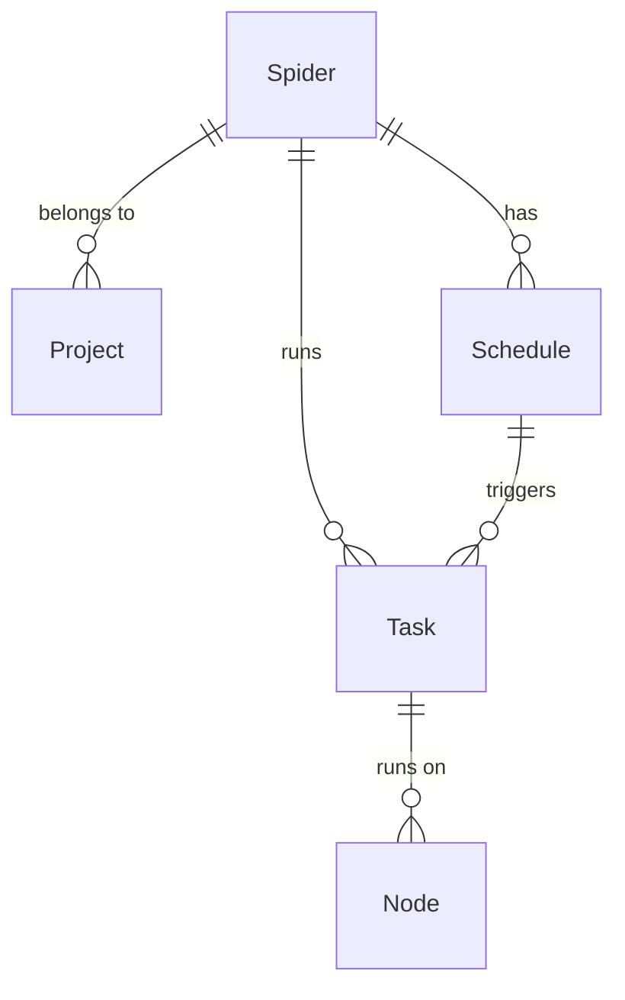

# Spider

## What is a Spider?

A Spider in Crawlab is the fundamental unit of web crawling functionality. Think of it as a complete web scraping
program or project that contains all the necessary code, configuration, and logic to extract data from specific
websites.

Spiders can be built using various technologies and frameworks:

- Scrapy projects
- Python scripts with libraries like BeautifulSoup or Selenium
- JavaScript-based crawlers using Puppeteer or Playwright
- Any executable program that can extract web data

:::info
The concept *Spider* is central to Crawlab's architecture. Understanding how to create, configure, and manage spiders is
essential for effective web scraping at scale.
:::

## Spider vs. Project

In Crawlab, a Spider represents an individual web crawler implementation, while a [Project](../project/index.md) is an
organizational unit that can contain multiple related spiders. For example:

- **Project**: E-commerce Data Collection
    - **Spider 1**: Amazon Product Scraper
    - **Spider 2**: eBay Product Scraper
    - **Spider 3**: Walmart Product Scraper

This hierarchical organization helps manage complex data collection operations with multiple crawling targets.

## Creating a Spider

### Basic Creation Steps

1. Navigate to the `Spiders` page from the main sidebar
2. Click the `New Spider` button in the top-left corner
3. Fill in the required information:
    - **Name**: A unique, descriptive name (e.g., "amazon_product_scraper")
    - **Project**: (Optional) The project this spider belongs to
    - **Execute Command**: The command to run your spider (e.g., `python spider.py` or `scrapy crawl amazon`)
4. Configure additional options as needed
5. Click `Confirm` to create the spider

### Configuration Options Explained

- **Name**: A unique identifier for your spider. Use descriptive names that indicate the purpose or target website.

- **Project**: The organizational group this spider belongs to. Grouping related spiders helps with management and
  monitoring.

- **Execute Command**: The shell command that will be executed when running the spider. Examples:
  ```
  python main.py                  # For a Python script
  scrapy crawl my_spider          # For a Scrapy spider
  node crawler.js                 # For a Node.js crawler
  ./custom_crawler                # For a compiled executable
  ```

- **Parameters**: Additional arguments passed to your execute command. These can be used to modify spider behavior
  without changing code. Examples:
  ```
  --start-url="https://example.com"
  -a category=electronics -a pages=5
  --limit=100 --output=json
  ```

- **Default Mode**: Determines how the spider will be distributed across your Crawlab nodes:
    - **Random Node**: Executes on one randomly selected node (good for testing)
    - **All Nodes**: Runs the same spider on every available node (useful for distributed crawling)
    - **Selected Nodes**: Allows you to choose specific nodes for execution (for specialized hardware requirements)

- **Priority**: Determines the execution order when multiple spiders are queued. Higher priority (larger number) spiders
  execute first.

- **Results Collection**: The MongoDB collection name where scraped data will be stored. If left blank, defaults to
  `results_<spider_name>`.

## Code Management

### Uploading Code

Crawlab provides several methods to upload your spider code:

#### Method 1: Upload Folder (Recommended for Complete Projects)

1. Navigate to the spider detail page
2. Select the `Files` tab
3. Click the `Upload` button in the navigation bar
4. Choose the `Folder` option
5. Click `Click to Select Folder to Upload`
6. Select the folder containing your spider project
7. Click `Confirm` to upload

This method preserves your project structure, making it ideal for frameworks like Scrapy that depend on specific
directory layouts.

#### Method 2: Upload Individual Files

1. Navigate to the spider detail page
2. Select the `Files` tab
3. Click the `Upload` button
4. Choose the `Files` option
5. Either drag and drop files into the upload zone or click to select files
6. Click `Confirm` to upload

Use this approach when you need to add or update specific files rather than the entire project.

#### Method 3: Drag & Drop Upload (Quick Method)

1. Navigate to the spider detail page and the `Files` tab
2. Directly drag files or folders from your local file explorer
3. Drop them onto the file navigator on the left side

This method provides a quick way to update or add files to specific directories.

### Creating and Editing Files

Crawlab includes a built-in [code editor](../../guides/code-editor/index.md) that supports:

- Syntax highlighting for multiple languages
- Code completion
- File creation and deletion
- Directory management

To edit a file:

1. Navigate to the spider's `Files` tab
2. Click on a file in the navigator to open it in the editor
3. Make your changes
4. Click the `Save` button (or use Ctrl+S/Cmd+S)

To create a new file:

1. Navigate to the spider's `Files` tab
2. Click the `New File` button in the toolbar
3. Enter the file name with appropriate extension
4. Click `Confirm`

For more details on using the code editor, see the [File Editor](../../guides/code-editor/index.md) documentation.

## Running Spiders

### Basic Execution

1. From the spider detail page, click the `Run` button (play icon) in the navigation bar
2. Alternatively, from the `Spiders` list page, click the `Run` button for the specific spider
3. In the run dialog:
    - Verify or adjust the execution parameters
    - Select the execution mode (Random Node, All Nodes, or Selected Nodes)
    - Add any custom parameters needed for this run
4. Click `Confirm` to start the execution

### Advanced Execution Options

- **Custom Parameters**: Override default parameters for specific runs
- **Priority Override**: Temporarily change the execution priority
- **Node Selection**: Choose specific nodes for execution based on capabilities

### Monitoring Execution

Once a spider is running:

1. Navigate to the `Tasks` section to see all active and completed spider runs
2. Click on a specific task to view:
    - Real-time logs
    - Execution statistics
    - Error messages (if any)

## Working with Scraped Data

### Viewing Results

After a spider completes its run:

1. Navigate to the spider detail page
2. Click the `Data` tab
3. Browse the table of collected records
4. Use filters and search to find specific entries
5. Click on any row to view the complete record details

### Data Management

Crawlab provides several tools for working with scraped data:

- **Export**: Download data as CSV, JSON, or Excel formats using the export button
- **Filtering**: Apply filters to find specific records based on field values
- **Pagination**: Navigate through large result sets with the pagination controls
- **Field Selection**: Choose which fields to display in the table view

### Database Integration

All scraped data is stored in MongoDB with these characteristics:

- The collection name follows the pattern `results_<spider_name>` unless custom configured
- Each record contains an automatic `_id` field and a `_tid` (task id) that links back to the execution
- You can access this data directly via MongoDB clients for advanced querying or processing

You can refer to the [Database Integration] section for more details.

:::info
[Database integration](../../guides/database/index.md) with other mainstream database systems (MySQL, PostgreSQL,
ElasticSearch, etc.) are supported in **Crawlab Pro**.
:::

## Best Practices

### Spider Organization

- Use meaningful, consistent naming for your spiders
- Group related spiders into projects
- Include a README.md file in your spider directory explaining its purpose and usage
- Add appropriate comments in your code to explain complex logic

### Performance Optimization

- Set appropriate request delays to avoid overloading target websites
- Implement proper error handling and retry mechanisms
- Use the scheduler for recurring tasks rather than continuous manual execution
- Consider distributing large crawling tasks across multiple nodes

### Troubleshooting Common Issues

- **Spider Fails Immediately**: Check your execute command and ensure all dependencies are installed
- **Empty Results**: Verify your selectors/extractors, the website structure may have changed
- **Timeouts**: Adjust the timeout setting or optimize your spider's performance
- **High Resource Usage**: Implement pagination or chunking for large data extraction tasks

## Entity Relationships

The diagram below illustrates how Spiders relate to other components in the Crawlab ecosystem:



This shows that:

- A Spider belongs to a Project (optional)
- A Spider can have multiple Tasks (execution instances)
- A Spider can have multiple Schedules
- Tasks run on specific Nodes
- Schedules trigger Tasks

## Next Steps

After mastering the basics of spider management, consider exploring these advanced topics:

- [Spider management](../../guides/spiders/index.md)
- [Scheduling recurring spider runs](../schedule/index.md)
- [Monitoring performance](../../guides/performance-monitoring/index.md)
- [Integrating with notification systems](../../guides/notifications/index.md)
