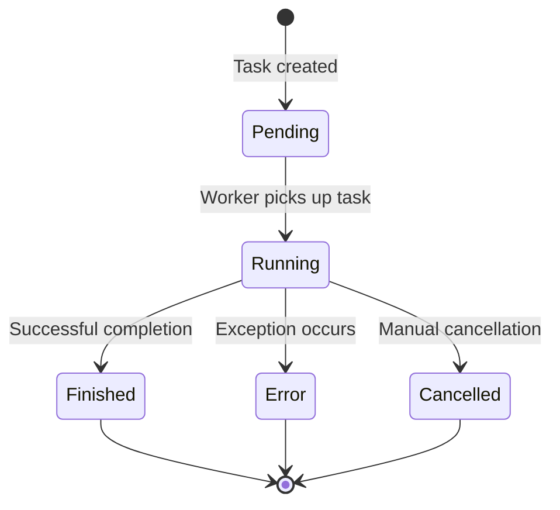
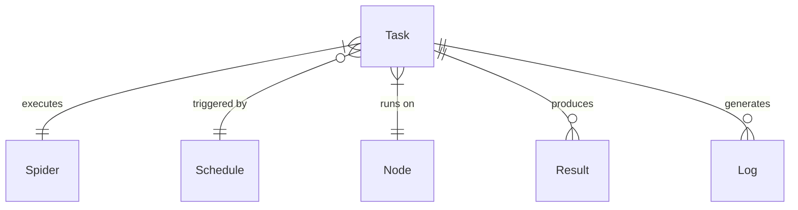

# Task

## What is a Task?

A Task in Crawlab represents a single execution instance of a spider. Whenever a spider runs—whether triggered manually, by a schedule, or through an API call—a new task is created to track that specific execution from start to finish. Tasks are the fundamental units of work in Crawlab that handle the actual data collection process.

Each task maintains its own:
- Execution log
- Status information
- Resource usage metrics
- Result data
- Error records
- Performance statistics

:::info
Tasks are the operational heartbeat of Crawlab. Understanding how they work is essential for monitoring, troubleshooting, and optimizing your web scraping operations.
:::

## Task vs. Spider vs. Schedule

Understanding how Tasks relate to other Crawlab concepts is important:

- **Spider**: The definition of a web crawler (the code, configuration, and logic)
- **Schedule**: A time-based trigger that determines when a spider should run
- **Task**: A single execution instance of a spider at a specific point in time

This relationship can be understood as:
- A Spider is the "what" (what code runs)
- A Schedule is the "when" (when it should run)
- A Task is the "instance" (one specific execution with its own results)

One spider can have many tasks (historical executions) and multiple schedules (different timing patterns).

## Task Lifecycle

Every task goes through a series of states during its lifecycle:

1. **Pending**: Task has been created but is waiting in the execution queue
2. **Running**: Task is actively executing on a node
3. **Finished**: Task completed successfully
4. **Error**: Task encountered an error and stopped execution
5. **Cancelled**: Task was manually stopped before completion

This lifecycle is visualized below:

## Creating Tasks

Tasks are typically created in one of three ways:

### Method 1: Manual Execution

1. Navigate to the `Spiders` page
2. Find the spider you want to run
3. Click the `Run` button (play icon)
4. Configure any run-time parameters in the dialog
5. Click `Confirm` to create and start the task

### Method 2: Scheduled Execution

1. A previously configured [Schedule](../schedule/index.md) triggers based on its cron expression
2. The system automatically creates a new task for the associated spider
3. The task begins execution according to the schedule's configuration

### Method 3: API Integration

1. An external system calls Crawlab's API with a request to run a specific spider
2. The API creates a new task based on the parameters provided
3. The task is queued for execution like any other task

:::tip
All three methods create identical task objects—the only difference is how they're initiated.
:::

## Task Configuration Options

When creating a task (particularly through manual execution), you can configure several parameters:

### Core Parameters

- **Mode**: Determines how the task will be distributed:
  - **Random Node**: Executes on one randomly selected node
  - **All Nodes**: Runs on every available node simultaneously
  - **Selected Nodes**: Allows choosing specific nodes for execution

- **Priority**: Sets the execution order when multiple tasks are queued. Higher priority (larger number) tasks execute first.

- **Parameters**: Custom arguments passed to the spider for this specific execution. These override the spider's default parameters.

### Advanced Options

- **Node Selection**: When using "Selected Nodes" mode, you can choose exactly which nodes will execute the task

## Monitoring Tasks

### Task List View

The `Tasks` page provides an overview of all tasks in the system:

1. Navigate to the `Tasks` page from the main sidebar
2. View the list of recent tasks with their:
   - ID
   - Spider name
   - Status
   - Node
   - Start/end times
   - Duration
   - Result count

This view supports:
- Filtering by status, spider, node, and time range
- Sorting by various columns
- Searching by task ID or spider name
- Batch operations on selected tasks

### Task Detail View

For in-depth information about a specific task:

1. Click on any task in the task list
2. Access detailed information through the following tabs:

#### Overview Tab

Provides summary information including:
- Task metadata (ID, spider, node, times)
- Status and duration
- Result statistics
- Resource utilization graphs
- Key performance metrics

#### Logs Tab

Displays the complete execution log:
- Real-time streaming of logs for active tasks
- Full console output from the spider execution
- Log filtering by severity level
- Log search functionality
- Log download option

#### Results Tab

Shows the data collected by this task:
- Tabular view of all scraped items
- Field filtering and sorting
- Record search capabilities
- Data export options (CSV, JSON, Excel)
- Relationship to MongoDB collection

## Task Management

### Cancelling Tasks

To stop a running task before completion:

1. Navigate to the `Tasks` page
2. Find the running task you want to stop
3. Click the `Cancel` button (stop icon)
4. Confirm the cancellation in the dialog

The system will attempt to gracefully terminate the execution process.

:::warning
Cancelling a task is not always instantaneous. Some operations might continue briefly before the task fully stops.
:::

### Rerunning Tasks

To execute a task again with the same parameters:

1. Navigate to the `Tasks` page
2. Find the task you want to rerun
3. Click the `Rerun` button (refresh icon)
4. The system creates a new task with identical configuration

This is useful when:
- A task failed due to temporary issues
- You need to refresh data with the same parameters
- You want to compare results over time

## Task Results and Data

Every task that successfully scrapes data stores its results in a MongoDB collection:

### Default Collection

By default, results are stored in a collection named:
- `results_<spider_name>` (e.g., `results_amazon_product_scraper`)

This means all tasks from the same spider share a collection, with each record containing a `_tid` (task id) field that links back to the specific task that created it.

### Accessing Results

Task results can be accessed in several ways:

1. **Web Interface**: 
   - Navigate to the task's detail page
   - Click the `Results` tab
   - Browse, search, and export the data

2. **MongoDB Integration**: 
   - Connect directly to the MongoDB instance
   - Query the appropriate collection
   - Filter by `_tid` (task id) to get results for a specific task

3. **API**:
   - Use Crawlab's API to programmatically retrieve results
   - Filter and format data as needed for integration with other systems

## Performance Metrics (WIP)

Tasks collect and display various performance metrics to help you understand and optimize your spiders:

### System Metrics

- **CPU Usage**: Percentage of CPU utilized by the task
- **Memory Usage**: RAM consumption over time
- **Network Traffic**: Bytes sent and received
- **Disk I/O**: Read/write operations

### Crawling Metrics

- **Request Count**: Total number of HTTP requests made
- **Success Rate**: Percentage of successful requests
- **Response Time**: Average and distribution of request times
- **Data Throughput**: Items scraped per second/minute
- **Request Frequency**: Requests per second

### Custom Metrics

Spiders can report custom metrics through the Crawlab SDK, allowing you to track domain-specific performance indicators.

## Task Logs

[Task logs](../../guides/task-logs/index.md) are crucial for monitoring execution and troubleshooting issues:

### Log Best Practices

- Enable appropriate log levels based on your needs
- Add contextual information to log messages
- Use structured logging when possible
- Implement custom logging for domain-specific events

### Log Retention

Logs are retained according to your system configuration:
- By default, logs are kept for 30 days
- Configure retention policies based on your storage capacity
- Consider exporting critical logs for longer-term storage

## Best Practices for Task Management

### Performance Optimization

- **Batch Size Control**: Configure your spiders to process data in appropriate batch sizes
- **Resource Allocation**: Assign higher priority to time-sensitive tasks
- **Concurrency Settings**: Tune parallel execution parameters based on target site capabilities
- **Node Selection**: Choose appropriate nodes based on task requirements

### Monitoring Strategy

- **Active Observation**: Keep an eye on long-running tasks to catch issues early
- **Alert Configuration**: Set up notifications for task failures
- **Performance Baseline**: Establish normal performance metrics to identify anomalies
- **Regular Review**: Periodically analyze task history to spot trends

### Troubleshooting Tips

- **Log Analysis**: Start by examining logs for error messages or warnings
- **Parameter Verification**: Confirm the task received the correct parameters
- **Node Inspection**: Check if node-specific issues might be affecting the task
- **Incremental Testing**: Modify spider parameters to isolate problematic components

## Entity Relationships

The diagram below illustrates how Tasks relate to other components in the Crawlab ecosystem:

This shows that:
- Each Task executes exactly one Spider
- A Task may be triggered by a Schedule (optional)
- Each Task runs on exactly one Node
- A Task produces multiple Result records
- A Task generates multiple Log entries

## Advanced Task Concepts

### Task Queue and Scheduling

Crawlab uses a priority queue mechanism to manage pending tasks:

1. Tasks enter the queue with a specified priority level
2. The scheduler evaluates available node resources
3. Higher priority tasks are assigned to nodes before lower priority ones
4. Tasks with equal priority are processed in FIFO (First In, First Out) order

### Distributed Execution Modes

The task distribution strategy affects how work is divided:

- **Random Node**: Simple allocation to a single node
  - Best for: Testing, simple spiders, or when node selection doesn't matter

- **All Nodes**: Replication of the same task across all nodes
  - Best for: Distributing identical crawling tasks with different starting points
  - Requires spider code to handle the distribution logic

- **Selected Nodes**: Manual assignment to specific nodes
  - Best for: Specialized tasks requiring specific capabilities
  - Useful when certain nodes have special access or resources

## Next Steps

After mastering task management, consider exploring these advanced topics:

- [Node management and scaling](../node/index.md)
- [Task notification and alerting](../../guides/notifications/index.md)
