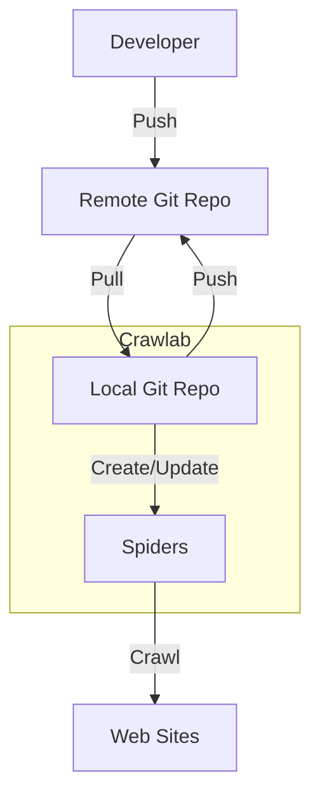

# Git

:::info
Git support is only available in **Crawlab Pro**.
:::

You can integrate Git to Crawlab for team collaboration, version control and CI/CD. With Git integration, you can manage
your Git repositories and spiders in a single place. This will be extremely helpful for team collaboration and version
control, and ultimately improve your development efficiency.

## Git Repository Management

Crawlab supports basic Git repository management. You can create, switch branches, pull code, push code and edit code in
the Git repository.

### Clone Git Repository

If you have existing Git repositories, you can clone them to Crawlab by following the steps below.

1. Navigate to the `Git Repo` list page.
2. Click the `New Git Repo` button.
   
3. Enter the URL of the Git repository, and the system will detect whether it's HTTPS or SSH.
4. Enter the username and password for the Git repository or SSH key.
5. Click the `Confirm` button.
6. The system will start cloning the Git repository.
   
7. Wait for the repository to be ready.

### Switch Branch

Sometimes you may want to use non-default branch for your spiders. You can switch to a different branch by following the
steps below.

1. Navigate to the `Git Repo` list page.
2. Navigate to Git Repo detail page once it's ready.
3. Click on the branch selection dropdown in the middle of the action bar.
   
4. Select the branch you want to switch to.
5. Wait for the branch to be switched.

### Pull Code

If your remote repository has new commits, you can pull the latest code to Crawlab by clicking the `Pull` button in the
`Changes` tab.

### Edit Code

You can edit the code in the `Files` tab. This is similar to the [code editor](../file-editor/index.md) in the spider
detail page.

### Commit/Rollback Changes

Once you have made changes to the code, you can commit/rollback the changes like you do in a Git repository.

1. Go to the `Changes` tab.
2. Check the files you want to commit/rollback.
3. Click the `Commit` or `Rollback` button and confirm.
4. The system will commit/rollback the changes in the local Git repository.
   
5. You can also view the diff of the changes by clicking the `Show Diff` button of the file you want to view.
   

### Push Code

You can push the changes to the remote repository by clicking the `Push` button in the branch selection dropdown or in
the `Changes` tab.

### View Git Commits

You can view the git commits (logs) by clicking the `Commits` tab.

## Git Integration

Crawlab Git integration allows you to create and manage spiders from Git repositories, which enables version control and
team collaboration on multi-spider projects.

### Create Spider

You can create a spider linked to a Git repository.

1. Navigate to the `Git Repo` detail page.
2. Click the `Create Spider` button.
3. Enter necessary information for the spider.
   
4. Click the `Confirm` button.
5. The created spider can be viewed in the `Spiders` tab.

Alternatively, you can create a spider from the `Files` tab.

1. Navigate to the `Git Repo` detail page.
2. Navigate to the `Files` tab.
3. Right-click the directory you want to create a spider from and select `Create Spider`.
   
4. Enter necessary information for the spider.

### Spider Sync

You don't have to manually update spiders when you make changes to the code in the Git repository. Crawlab will
automatically sync the spiders with the latest code in the Git repository.

## Typical Workflow

The typical git integration workflow with in Crawlab is as following diagram.

As you can see, the workflow is quite simple. You can create/update spiders from the local Git repository, and the
spiders will be crawled by the Crawlab server. You can also pull the latest code from the remote Git repository to the
local Git repository and push your changes to the remote Git repository from Crawlab if you have edited the code in
Crawlab.
