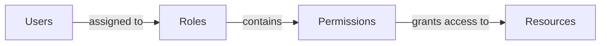

# Permission Management

:::info
Permission Management is only available in **Crawlab Pro**.
:::

Crawlab Pro implements a robust Role-Based Access Control (RBAC) system to manage user permissions within the platform.
This security model enables granular control over platform resources by assigning permissions through organizational
roles rather than individual users. The RBAC system operates on four core components: roles (collections of
permissions), permissions (pages that roles can access), users (platform accounts with assigned roles), and resources (
pages). This structured approach enhances security while simplifying access administration, allowing organizations to
maintain strict control over crawling operations, data access, and system configurations as their teams and projects
scale.

## Role-Based Access Control (RBAC)

Crawlab Pro uses Role-Based Access Control (RBAC) to manage user
permissions. [RBAC](https://en.wikipedia.org/wiki/Role-based_access_control) is a security model that enables granular
control over platform resources by assigning permissions through organizational roles rather than individual users.

This diagram illustrates the basic RBAC model components:

- **Users**: Platform accounts (individual team members)
- **Roles**: Groupings of permissions (e.g., Developer, Analyst)
- **Permissions**: Access rights to specific resources
- **Resources**: Platform entities (Spiders, Tasks, Nodes, etc.) (under development)

## Roles

Roles are a fundamental component of Crawlab Pro's access control system. You can create multiple roles to organize
permissions for different types of users and responsibilities within your organization. Each role acts as a container
for a specific set of permissions that define what pages and actions users assigned to that role can access.

For example, you might create roles like:

- Administrator: Full access to all platform features
- Developer: Access to spider development and execution features
- Viewer: Access to data viewing and reporting features

When creating roles, you can:

- Define granular permissions for each role
- Assign multiple permissions to a single role
- Modify role permissions as needed
- Remove permissions from roles
- Delete roles that are no longer needed

This flexible role system allows you to implement the principle of least privilege, ensuring users only have access to
the resources they need to perform their job functions.

## Permissions

Permissions in Crawlab Pro define what actions users can perform and what resources they can access. Currently, Crawlab
Pro implements page-level permissions, which control access to specific pages within the platform.

When creating permissions, you can:

- Define which pages users can access (
  e.g., [Spiders](../../concepts/spider/index.md), [Tasks](../../concepts/task/index.md), [Nodes](../../concepts/node/index.md), [Schedules](../../concepts/schedule/index.md))
- Control visibility of menu items in the navigation
- Restrict access to sensitive configuration areas
- Limit access to system administration functions

Each permission can be assigned to one or more roles, allowing for flexible access control configurations. This
page-level permission system ensures that users only see and access the parts of the platform relevant to their
responsibilities.

In future versions, Crawlab Pro plans to expand the permission system to include more granular controls such as:

- Action-level permissions (view, create, edit, delete)
- Resource-level permissions (access to specific spiders, tasks, or data)
- Data-level permissions (access to specific records or fields)

This modular approach to permissions allows administrators to implement the principle of least privilege across the
organization.

## Users

Users are the platform accounts that users can create and assign roles to. Each user can be assigned one or more roles,
which determine their access to platform resources and pages.

When creating users, you can:

- Assign a role to a user
- Modify user roles as needed
- Remove roles from users
- Delete users that are no longer needed

This user management system allows you to control access to platform resources and pages by assigning roles to users.

## Best Practices

- Assign roles to users based on their responsibilities and access needs.
- Use the principle of least privilege to grant only the necessary permissions.
- Regularly review and update user roles and permissions to ensure they align with the organization's access control policies.
