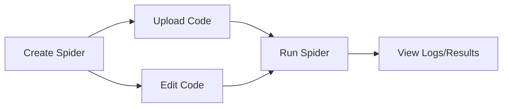
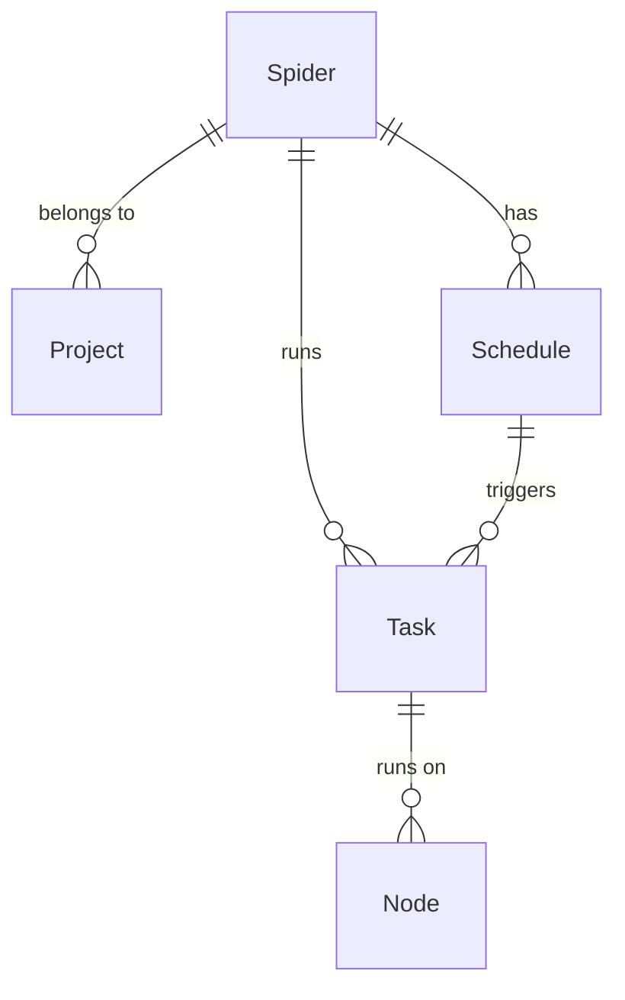

# Spider

Spider is the basic unit of web crawler programs in Crawlab. You can regard it as a web crawling software project
consisted of code and files, e.g. a Scrapy project. Please note that the term *project* mentioned here is not the same
as the basic concept [Project](../project/index.md) in Crawlab.

:::info
The concept *Spider* is so important in Crawlab that we strongly recommend you read through this section.
:::

## Typical Process

Below is a typical process for users to play with spiders in Crawlab.

## Create Spider

1. Navigate to `Spiders` page, and click `New Spider` button on the top left.
2. Enter relevant info including `Name` and `Execute Command`.
3. Click `Confirm`.

Here is the explanation of the core fields when creating a spider.

- `Project` is the project that the spider belongs to.
- `Execute Command` is a command that will be executed in the [shell](https://en.wikipedia.org/wiki/Shell_(computing))
  when running the spider, e.g. `scrapy crawl myspider`.
- `Parameters` is a list of parameters that will be passed to the `Execute Command` when running the spider, e.g.
  `-a param1=value1 -a param2=value2`.
- `Default Mode` is the default mode of running the spider.
    - `Random Node`: Run the spider on a random node.
    - `All Nodes`: Run the spider on all nodes.
    - `Selected Nodes`: Run the spider on selected nodes.
- `Priority` is the priority of the spider. Higher priority means the spider will be executed earlier.
- `Results Collection` is the collection where the results of the spider will be stored in the database.

## Upload Code

There are several ways to upload spider files.

### Upload Folder

1. Navigate to spider detail page.
2. Click `Files` tab.
3. Click `Upload` button in the nav bar.
4. Choose `Folder`.
5. Click `Click to Select Folder to Upload`.
6. Choose the folder where spider files are located.
7. Click `Confirm`.

### Upload Files

1. Navigate to spider detail page.
2. Click `Files` tab.
3. Click `Upload` button in the nav bar.
4. Choose `Files`.
5. Drag and drop spider files into the drop zone, or click the drop zone and select files.
6. Click `Confirm`.

### Upload Files (Drag & Drop)

1. Navigate to spider detail page.
2. Click `Files` tab.
3. Drag and drop spider files or folders into folders on file navigator on the left.

## Edit Code

Crawlab provides an online code editor for users to edit spider code. You can follow the steps below to edit spider
code.

1. Navigate to spider detail page.
2. Click `Files` tab.
3. Click the file you want to edit.
4. Edit the code.
5. Click `Save` button in the nav bar.

You can refer to the [File Editor](../file-editor/index.md) section for more details about the code editor.

## Run Spider

You can follow the steps below to run a spider.

1. If in spider detail page, click `Run` button with play icon in the nav bar.
2. If in `Spiders` page, click `Run` button with play icon on the right.
3. Select appropriate settings for running spider.
4. Click `Confirm`.

## Entity Relationships

The relationships between spiders and other entities are shown below.

