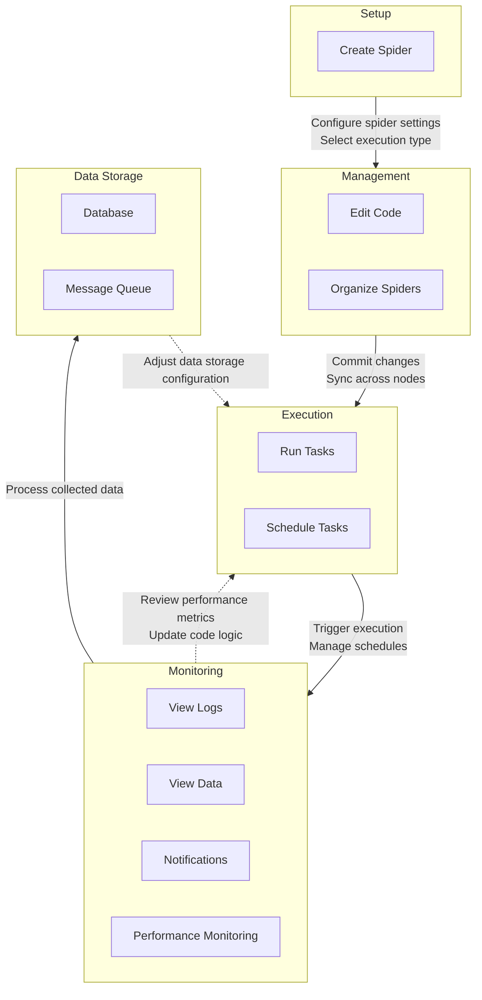

# Spiders Management

Spiders are the core execution units in Crawlab. This section covers essential operations for managing your web
crawlers, including:

- **Multi-language Support**: Develop spiders in Python, Go, Node.js, or Java
- **Framework Integration**: Native support for Scrapy, Colly, Selenium, and Puppeteer
- **Version Control**: Git integration for collaborative development and CI/CD
- **Task Orchestration**: Distributed scheduling and real-time monitoring

The management interface provides centralized control for deployment, execution, and analysis of spider activities
across your node cluster.

## Typical Workflow

Crawlab provides a streamlined lifecycle management process for spiders through five key phases. This integrated
workflow enables teams to develop, deploy, and optimize crawlers efficiently while ensuring data quality and system
reliability. The process flows from initial setup to continuous optimization, with built-in feedback loops for iterative
improvements.

Key aspects include:

- Centralized interface for all spider operations
- Git integration for collaborative development
- Real-time monitoring of distributed executions
- Flexible data storage configurations for different use cases
- Continuous optimization through data insights

## Setup

In the setup phase, you can create spiders in Crawlab by defining the spider's settings and execution logic. To start
the process, you can navigate to the `Spiders` list page and click the `Create Spider` button. Please refer to
[Spider](../../concepts/spider/index.md) for more details about spider settings.

For Crawlab Pro users, you can conveniently create spiders from [Git repositories](../version-control/index.md) by
selecting the root path of the spider project of the Git repository.

## Management

In the management phase, you can manage your spiders by editing the code, organizing spiders, and syncing changes across
nodes.

### Edit Code

Crawlab supports flexible code management through its web-based editor and version control integration. Developers
can directly modify scripts using the built-in IDE with real-time syntax validation and collaborative editing locks
(see [Code Editor](../code-editor/index.md)), ensuring changes propagate instantly across all nodes.
The platform's [Git integration](../version-control/index.md) enables seamless synchronization with repositories,
supporting branch management and commit history tracking for team-based development.

### Organize Spiders

Projects are the organizational units in Crawlab. You can easily organize spiders with projects, which will group
spiders together and make it easier to manage them. Please refer to [Projects](../../concepts/project/index.md) for
more details.

## Execution

In the execution phase, you can run tasks by triggering spider runs directly from the spider detail page or via the
centralized [Tasks](../../concepts/task/index.md) interface.

### Run Tasks

Crawlab provides flexible task execution options through both UI and API interfaces. Users can trigger spider runs
directly from the spider detail page or via the centralized [Tasks](../../concepts/task/index.md) interface, with
configurable parameters including command overrides, node selection (random or specific), and priority levels. The
platform's distributed architecture automatically routes tasks to available nodes while providing real-time execution
status updates through color-coded indicators in the task list view.

### Schedule Tasks

For recurring executions, Crawlab provides robust scheduling capabilities using cron expressions. Users can configure
periodic runs through the [Schedules](../../concepts/schedule/index.md) with options to:

- Set precise execution timings using standard [cron syntax](https://en.wikipedia.org/wiki/Cron)
- Inherit or override spider parameters per schedule
- Enable/disable schedules without deletion
- View historical executions and next run times

The scheduling system integrates with Crawlab's distributed architecture, automatically propagating schedules across
nodes. Scheduled tasks maintain full execution history while preventing node-specific schedule conflicts.

## Monitoring

In the monitoring phase, you can monitor the execution of your spiders by viewing the [task logs](../task-logs/index.md),
[data previews](../data-integration/index.mdx#data-preview), [notifications](../notifications/index.md), and
[performance monitoring](../performance-monitoring/index.md).

Crawlab provides comprehensive real-time monitoring through its unified [Tasks interface](../../concepts/task/index.md).
Key monitoring features include:

- **Realtime Task Logs**: Track execution progress with real-time task logs
- **Data Previews**: Inspect crawled data increments directly in the UI for data preview
- **Notifications**: Receive alerts for critical events such as task failures or performance issues
- **Performance Monitoring**: Track spider performance metrics and resource utilization

## Data Storage

By default, Crawlab will save the collected data to the operational database (MongoDB). Users can easily save scraped
data to the configured data collections with minimal [data integration](../data-integration/index.mdx).

For Crawlab Pro users, the platform provides flexible data storage options through its [Database](../database/index.md)
module. Users can configure different data storage targets (e.g. MongoDB, MySQL, PostgreSQL, etc.) to meet various
data processing needs.
