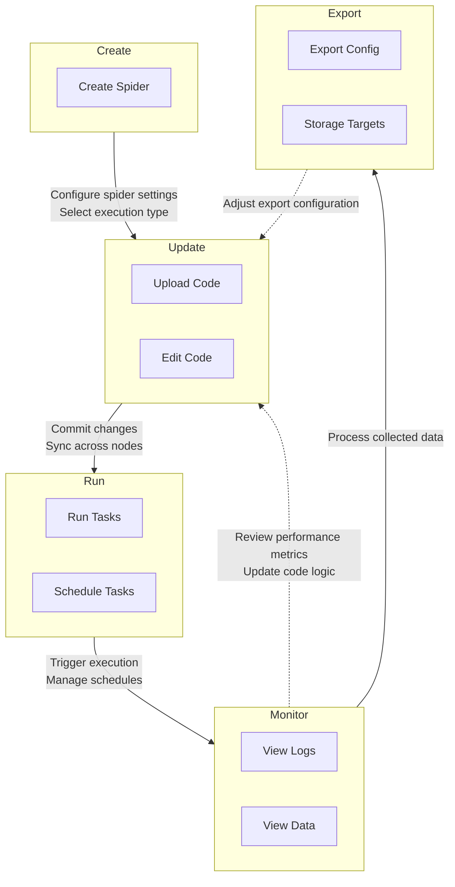

# Spiders Management

Spiders are the core execution units in Crawlab. This section covers essential operations for managing your web
crawlers, including:

- **Multi-language Support**: Develop spiders in Python, Go, Node.js, or Java
- **Framework Integration**: Native support for Scrapy, Colly, Selenium, and Puppeteer
- **Version Control**: Git integration for collaborative development and CI/CD
- **Task Orchestration**: Distributed scheduling and real-time monitoring

The management interface provides centralized control for deployment, execution, and analysis of spider activities
across your node cluster.

## Typical Workflow

Crawlab provides a streamlined lifecycle management process for spiders through five key phases. This integrated
workflow enables teams to develop, deploy, and optimize crawlers efficiently while ensuring data quality and system
reliability. The process flows from initial setup to continuous optimization, with built-in feedback loops for iterative
improvements.

Key aspects include:

- Centralized interface for all spider operations
- Git integration for collaborative development
- Real-time monitoring of distributed executions
- Flexible export configurations for different use cases
- Continuous optimization through data insights

## Create Spider

Creating spiders in Crawlab is a straightforward process that involves defining the spider's settings and execution
logic. You can navigate to the `Spiders` list page and click the `Create Spider` button to start the process.

You can refer to [Spider](../../concepts/spider/index.md) for more details about spider settings.

## Update Code

Crawlab supports flexible code management through its web-based editor and version control integration. Developers
can directly modify scripts using the built-in IDE with real-time syntax validation and collaborative editing locks
(see [Code Editor](../code-editor/index.md)), ensuring changes propagate instantly across all nodes.
The platform's [Git integration](../version-control/index.md) enables seamless synchronization with repositories, supporting branch management and
commit history tracking for team-based development.

## Run Tasks

## Schedule Tasks

## Monitor Tasks

## Export Data