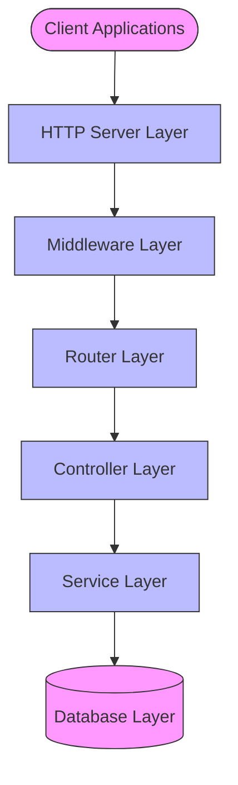
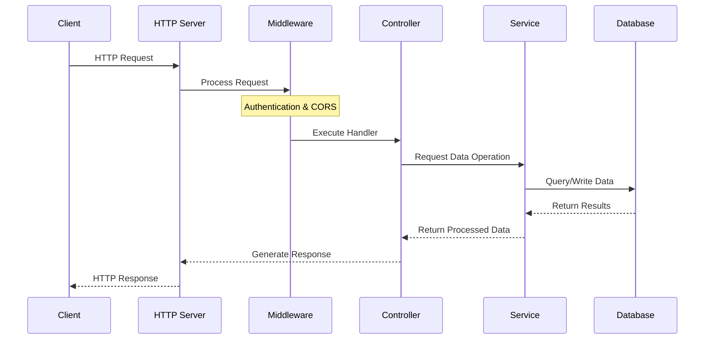
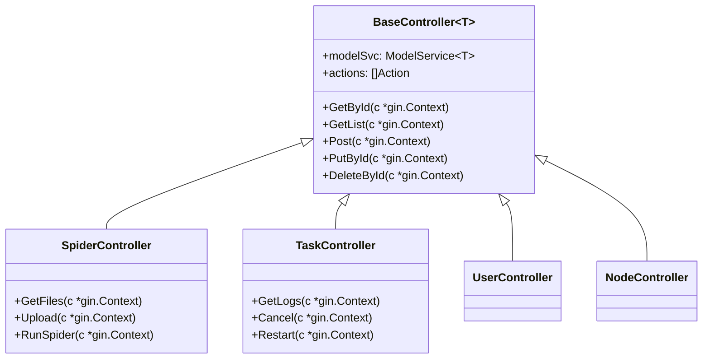
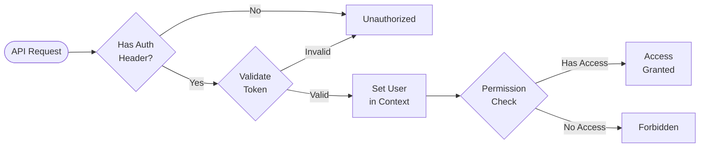

## API Engine

The Crawlab API Engine provides a RESTful interface for managing and interacting with the Crawlab platform's components. Built on top of the Gin web framework, it follows a structured design with controllers, middlewares, and utilities that facilitate clean, maintainable, and extensible API endpoints.

## Architecture

The API Engine follows a layered architecture with clear separation of concerns:



### Key Components

1. **HTTP Server Layer**:
   - Handles HTTP connections, request routing, and middleware integration
   - Implemented in the `Api` struct within the `apps` package
   - Manages lifecycle events (initialization, start/stop)

2. **Middleware Layer**:
   - Processes requests before they reach controllers
   - Handles cross-cutting concerns like authentication, CORS, and logging
   - Defined in the `middlewares` package

3. **Router Layer**:
   - Maps HTTP routes to controller handlers
   - Organizes endpoints by authentication requirements
   - Implemented in the `controllers/router.go` file

4. **Controller Layer**:
   - Implements API endpoint handlers and business logic
   - Uses generic Base Controller for common operations
   - Specialized controllers for specific resources (Spider, Task, etc.)

5. **Service Layer**:
   - Provides data access and domain logic operations
   - Abstracts database operations
   - Implements business rules

6. **Database Layer**:
   - MongoDB storage for persistent data
   - File system for spider code and related assets

## Request Processing Flow

The following sequence diagram illustrates how requests flow through the system:



### Processing Steps

1. **Request Reception**: The server receives an incoming HTTP request
2. **Middleware Processing**:
   - CORS headers are applied
   - Authentication tokens are validated
   - User information is attached to request context
3. **Controller Execution**:
   - Parameters are extracted and validated
   - Business logic is executed through service layer
   - Appropriate response is prepared
4. **Response Generation**:
   - Standardized JSON format is used
   - Success/error status is determined
   - Data payload is formatted consistently

## Controller System

Crawlab uses a generic controller system that provides standardized CRUD operations for all resources:

### Base Controller

The `BaseController` is a generic type that handles common operations:

```go
type BaseController[T any] struct {
    modelSvc *service.ModelService[T]  // Data service
    actions  []Action                  // Custom actions
}
```

It provides implementations for:
- `GetById`: Retrieve a specific resource by ID
- `GetList`: Retrieve a paginated list of resources
- `Post`: Create a new resource
- `PutById`: Update a specific resource
- `PatchList`: Batch update resources
- `DeleteById`: Delete a specific resource
- `DeleteList`: Batch delete resources

### Controller Hierarchy

Specialized controllers extend the base controller with resource-specific operations:



## Authentication System

Authentication is a critical component of the API engine, providing security for protected resources:

### Authentication Flow



### Implementation Details

The authentication system supports:

1. **Bearer Token Authentication**:
   - JWT-style tokens in Authorization header
   - Tokens carry user identity and claims
   - Implementation in `middlewares.AuthorizationMiddleware()`

2. **Sync Authentication**:
   - Special authentication for node synchronization
   - Uses an application auth key
   - Implementation in `middlewares.SyncAuthorizationMiddleware()`

3. **Role-Based Access**:
   - Users have assigned roles (admin, regular user)
   - Permissions are determined by role
   - Resource access is controlled by permissions

## Router System and API Structure

The router system organizes endpoints by authentication requirement and resource type:

### Router Groups

```go
type RouterGroups struct {
    AuthGroup      *gin.RouterGroup // Requires authentication
    SyncAuthGroup  *gin.RouterGroup // Special sync authentication
    AnonymousGroup *gin.RouterGroup // No authentication required
}
```

### API Resource Categories

Crawlab's API is organized into several logical resource categories:

1. **Authentication**:
   - `POST /login`: User authentication
   - `GET /me`: Current user information

2. **Users & Projects**:
   - `GET/POST/PUT/DELETE /users`: User management
   - `GET/POST/PUT/DELETE /projects`: Project organization

3. **Spiders**:
   - `GET/POST/PUT/DELETE /spiders`: Spider management
   - `GET /spiders/:id/files`: Spider file listing
   - `POST /spiders/:id/run`: Run a spider

4. **Tasks**:
   - `GET/POST /tasks`: Task management
   - `GET /tasks/:id/logs`: Task log retrieval
   - `POST /tasks/:id/cancel`: Cancel a running task

5. **Schedules**:
   - `GET/POST/PUT/DELETE /schedules`: Schedule management
   - `POST /schedules/:id/enable`: Enable a schedule

6. **Nodes**:
   - `GET /nodes`: Node listing
   - `POST /nodes/:id/enable`: Enable a node

## Response Handling

The API uses standardized response formats for consistency:

### Response Structure

```go
type Response struct {
    Status  string      `json:"status"`   // "ok" for all responses
    Message string      `json:"message"`  // "success" or "error"
    Data    interface{} `json:"data"`     // Payload for success
    Error   string      `json:"error"`    // Error message
}

type ListResponse struct {
    Status  string      `json:"status"`
    Message string      `json:"message"`
    Total   int         `json:"total"`    // Total count for pagination
    Data    interface{} `json:"data"`     // Array of items
    Error   string      `json:"error"`
}
```

### Response Generation

Helper functions ensure consistent response formatting:
- `HandleSuccess`: General success response
- `HandleSuccessWithData`: Success with data payload
- `HandleSuccessWithListData`: Success with paginated list
- `HandleErrorBadRequest`: 400 Bad Request response
- `HandleErrorUnauthorized`: 401 Unauthorized response
- `HandleErrorForbidden`: 403 Forbidden response
- `HandleErrorNotFound`: 404 Not Found response
- `HandleErrorInternalServerError`: 500 Internal Server Error response

## Error Handling

The API implements a comprehensive error handling strategy:

1. **Validation Errors**:
   - Return 400 Bad Request with validation details
   - Example: Missing required fields, invalid format

2. **Authentication Errors**:
   - Return 401 Unauthorized with error message
   - Example: Invalid or expired token

3. **Permission Errors**:
   - Return 403 Forbidden with error message
   - Example: Insufficient privileges for operation

4. **Not Found Errors**:
   - Return 404 Not Found with error message
   - Example: Resource with specified ID doesn't exist

5. **Server Errors**:
   - Return 500 Internal Server Error with details
   - Debug information only in development mode

## Extensibility

The API engine is designed for extensibility:

1. **Generic Controllers**:
   - Easy creation of new resource endpoints
   - Type-safe operations with Go generics

2. **Custom Actions**:
   - Addition of non-standard operations to controllers
   - Registered via the `actions` parameter:
   ```go
   RegisterController(groups.AuthGroup, "/spiders", NewController[models.Spider]([]Action{
       {
           Method:      http.MethodGet,
           Path:        "/:id/files",
           HandlerFunc: GetSpiderFiles,
       },
       // more custom actions...
   }...))
   ```

3. **Middleware Registration**:
   - Custom request processing
   - Cross-cutting concerns

## Server Configuration

The HTTP server is configured with sensible defaults and can be customized:

- **Address**: Configurable host and port (default: 0.0.0.0:8000)
- **TLS**: Optional TLS configuration for HTTPS
- **Timeouts**:
   - Read timeout: 30 seconds
   - Write timeout: 30 seconds
   - Idle timeout: 120 seconds

## Performance Considerations

The API engine includes several optimizations:

1. **Request Pagination**:
   - Limits large result sets
   - Configurable page size and number

2. **Database Query Optimization**:
   - Efficient MongoDB query building
   - Index utilization

3. **Context Cancellation**:
   - Proper handling of client disconnects
   - Resource cleanup

## Security Considerations

Security is a primary concern for the API engine:

1. **Token-based Authentication**:
   - JWT or similar token validation
   - Stateless design

2. **Role-based Access Control**:
   - Permission verification for operations
   - Principle of least privilege

3. **Input Validation**:
   - Strict request validation
   - Prevention of injection attacks

4. **Error Information Limitation**:
   - Detailed errors only in development mode
   - Generic error messages in production

## Conclusion

The Crawlab API Engine provides a robust, consistent, and extensible interface for interacting with the Crawlab platform. Its well-structured design facilitates maintenance and evolution, while its security features ensure that resources are properly protected. The standardized response format and error handling provide a consistent experience for API consumers.
