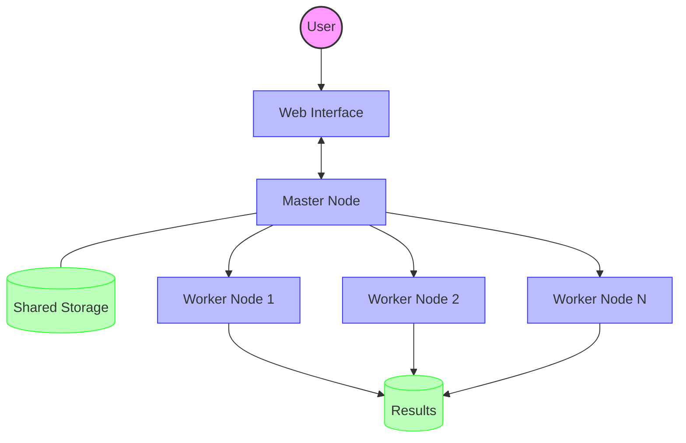
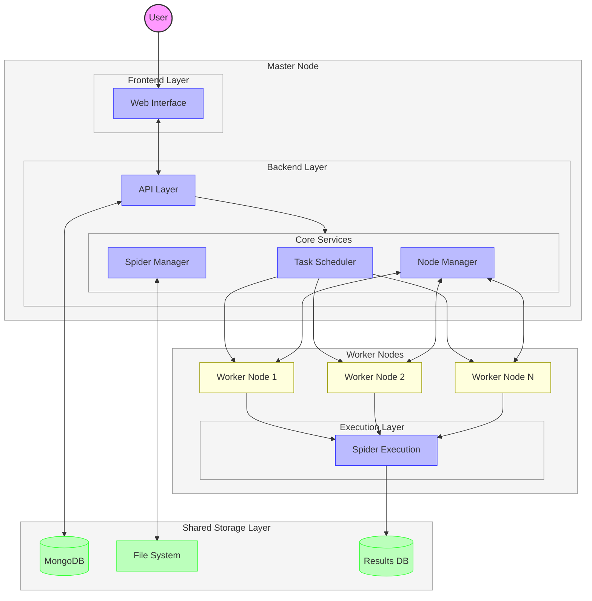

# Architecture

## Introduction

Crawlab is a distributed web crawler management platform designed to help users manage and execute web crawlers at scale. This document provides an overview of the Crawlab architecture, detailing its core components, data flow, and execution processes.

## Conceptual Overview

Before diving into the detailed architecture, it's a good idea to take a high-level conceptual view of how Crawlab works. Crawlab follows a master-worker distributed architecture pattern (traditionally known as the [master-slave pattern](https://en.wikipedia.org/wiki/Master%E2%80%93slave_(technology))).

Below is the conceptual architecture diagram.

In this simplified view:
1. Users interact with the system through the web interface
2. The master node coordinates all activities and communicates with workers
3. Worker nodes execute the actual crawling tasks
4. A shared storage layer maintains configuration, code, and results
5. Crawled data is stored in a results database

## System Architecture

The Crawlab architecture consists of:

- **Master Node**: Coordinates and schedules tasks across the worker nodes
- **Worker Nodes**: Execute crawling tasks and report results back to the master

## Core Components

### 1. Web Interface
- User-friendly dashboard for managing all aspects of the system
- Built with Vue.js (based on directory structure)
- Provides visualizations of task status, results, and system metrics

### 2. API Layer
- RESTful API endpoints that handle requests from the frontend
- Implemented in Go (Golang)
- Manages authentication and authorization

### 3. Core Services

#### Spider Manager
- Handles spider (crawler) configurations and code management
- Supports various spider types and languages
- Manages spider versioning and deployments

#### Task Scheduler
- Schedules and coordinates crawling tasks
- Supports manual and cron-based scheduling
- Handles task prioritization and queue management

#### Node Manager
- Manages worker nodes in the distributed system
- Handles node registration, monitoring, and health checks
- Balances task load across available nodes

### 4. Data Models

- **Spider**: Defines crawler configurations, including command, parameters, and data storage
- **Task**: Represents execution instances of spiders with status tracking
- **Node**: Represents worker machines in the distributed system
- **User**: Manages access control and authentication
- **Schedule**: Defines timing for automated task execution
- **Project**: Organizes spiders into logical groups

### 5. Storage

- **MongoDB**: Primary database for system configuration and metadata
- **Results Database**: Configurable database for storing crawled data
- **File System**: Stores spider code, logs, and related files

## Workflow

### Basic Workflow

1. User creates/configures a spider through the web interface
2. User schedules a task for the spider (manually or via cron scheduling)
3. Task scheduler assigns the task to an available worker node
4. Worker node executes the spider and stores results in the configured database
5. User views task status and results through the web interface

### Detailed Execution Flow

1. **Spider Creation**: Users define crawlers with execution parameters
2. **Task Scheduling**: Tasks are scheduled manually or through cron jobs
3. **Task Distribution**: Master node assigns tasks to available worker nodes
4. **Task Execution**: Worker nodes run crawler processes
5. **Result Collection**: Crawled data is stored in the configured database
6. **Monitoring**: Real-time monitoring of task status and performance

## Scalability Features

- **Distributed Architecture**: Master-worker model allows horizontal scaling
- **Dynamic Node Management**: Nodes can be added or removed without system downtime
- **Task Prioritization**: Priority-based task execution
- **Resource Control**: Controls runner count per node to manage resource utilization

## Technologies Used

- **Backend**: Go (Golang)
- **Database**: MongoDB for metadata and configuration
- **API Communication**: REST and gRPC
- **Frontend**: Vue.js
- **Deployment**: Docker support for containerized deployment

## Conclusion

Crawlab provides a robust platform for managing web crawlers with distributed execution capabilities. Its modular design allows for scaling and flexibility in deployment, while the comprehensive management features enable effective monitoring and control of crawling operations. This architecture makes Crawlab suitable for both small-scale personal projects and large-scale enterprise crawling needs.
