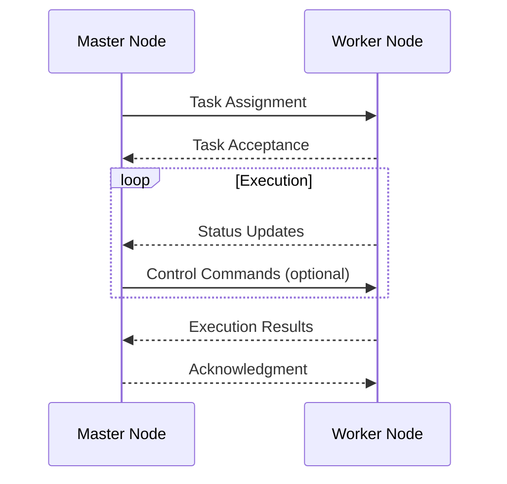
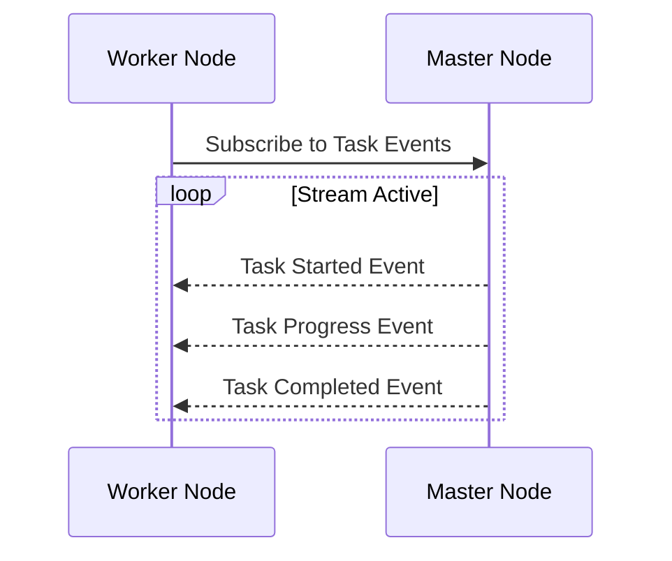
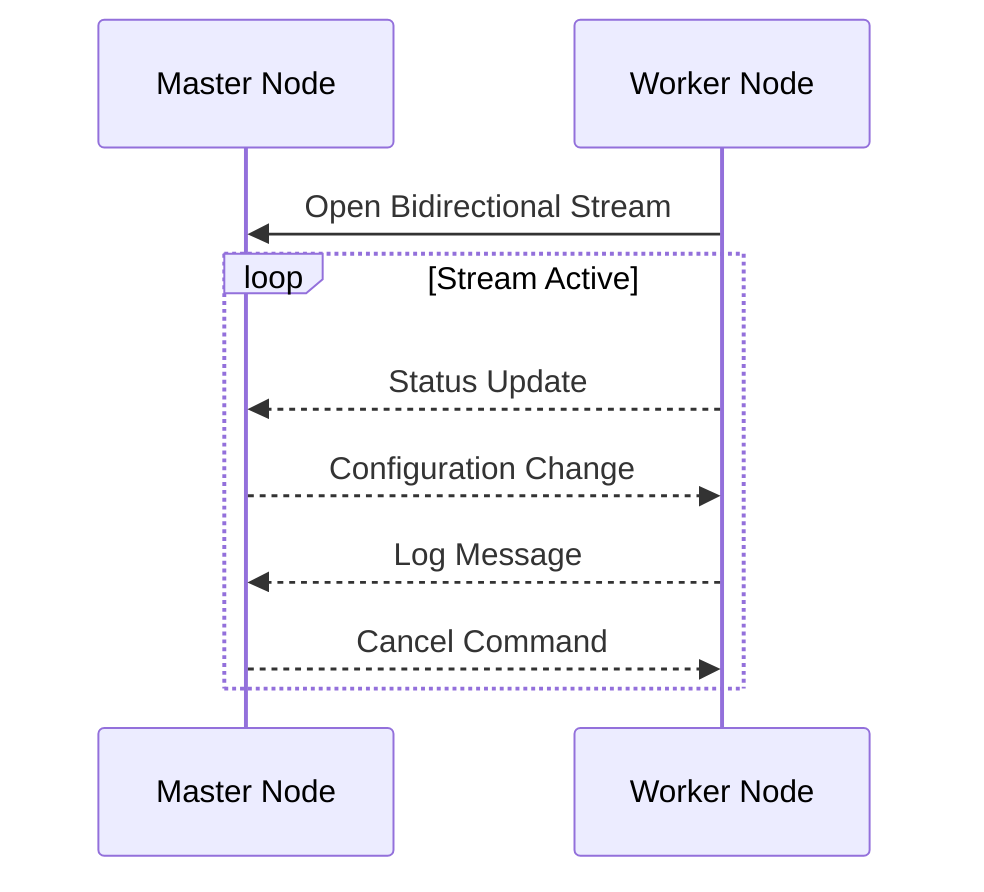

# Node Communication

## Introduction

This document details the communication mechanisms used within Crawlab's distributed architecture. Understanding these
protocols is essential for developers who want to extend Crawlab, troubleshoot communication issues, or implement custom
integrations.

## Master-Worker Communication Overview

Crawlab employs a bidirectional communication model between the master node and worker nodes. This communication is
critical for:

- Task assignment and coordination
- Worker health monitoring and management
- System state synchronization
- Results collection and aggregation



## gRPC Implementation

### Why gRPC?

Crawlab uses gRPC as the primary communication protocol between master and worker nodes for several reasons:

- **Performance**: Binary serialization provides better performance than JSON/REST
- **Strong typing**: Protocol Buffers enforce message structure
- **Bidirectional streaming**: Enables real-time updates and command streaming
- **Language agnosticism**: Supports multiple programming languages

### Service Definitions

Crawlab's core services are defined using Protocol Buffers (.proto files):

#### Task gRPC service:

```protobuf
service TaskService {
  rpc Subscribe(TaskServiceSubscribeRequest) returns (stream TaskServiceSubscribeResponse){};
  rpc Connect(stream TaskServiceConnectRequest) returns (Response){};
  rpc FetchTask(TaskServiceFetchTaskRequest) returns (TaskServiceFetchTaskResponse){};
  rpc SendNotification(TaskServiceSendNotificationRequest) returns (Response){};
}
```

#### Node gRPC service:

```protobuf
service NodeService {
  rpc Register(NodeServiceRegisterRequest) returns (Response){};
  rpc SendHeartbeat(NodeServiceSendHeartbeatRequest) returns (Response){};
  rpc Subscribe(NodeServiceSubscribeRequest) returns (stream NodeServiceSubscribeResponse){};
}
```

### Connection Management

Worker nodes establish persistent gRPC connections to the master node with the following characteristics:

- **Connection pooling**: Workers maintain connection pools to optimize resource usage
- **Automatic reconnection**: Workers attempt to reconnect when connections fail
- **TLS security**: All connections are secured with TLS (when configured)
- **Connection metadata**: Each connection includes authentication tokens and node identification

## Stream Management

Crawlab extensively uses gRPC streaming for real-time updates:

### Unidirectional Streaming

Used for event notifications like task status updates:



### Bidirectional Streaming

Used for scenarios requiring two-way continuous communication:



## Error Handling and Recovery

### Communication Failures

The system implements several error handling mechanisms:

1. **Automatic Retry**: Failed communication attempts are automatically retried with exponential backoff
2. **Circuit Breaking**: Repeated failures trigger circuit breakers to prevent cascading failures
3. **State Recovery**: After reconnection, state is synchronized to recover from communication gaps

## Conclusion

Crawlab's communication protocols provide a robust foundation for distributed crawler management. The gRPC
implementation delivers performance and reliability advantages, while carefully designed message patterns ensure system
resilience and scalability.

Developers extending Crawlab should follow these established patterns to maintain system integrity and performance
characteristics.
