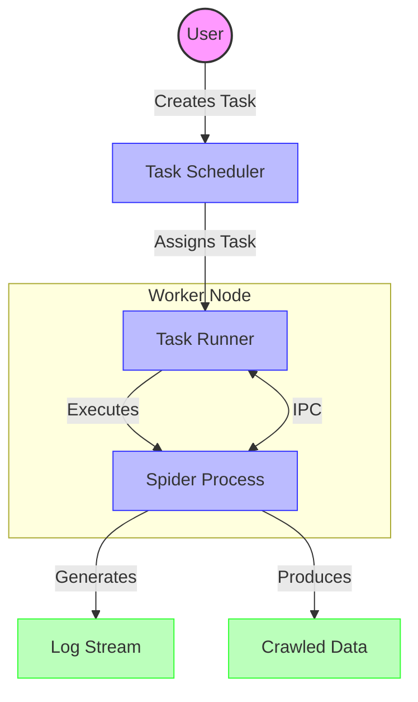

# Task Execution

## Introduction

The Task Execution Engine is the core component of Crawlab responsible for executing web crawlers (spiders) efficiently and reliably across a distributed system. This document explains how tasks move from creation to completion and the technical mechanisms that power this process.

## Visual Overview



## Task Lifecycle

A crawler task in Crawlab progresses through these key states:

1. **Created** → Task is initialized with configuration parameters
2. **Pending** → Task is scheduled and waiting for execution
3. **Running** → Task is actively executing on a worker node
4. **Finished** → Task completed successfully
5. **Error** → Task failed due to an error
6. **Cancelled** → Task was manually stopped by a user
7. **Abnormal** → Task entered an unexpected state requiring recovery

## Core Components

### 1. Task Scheduler

The Task Scheduler manages task creation, prioritization, and distribution across the Crawlab cluster.

#### Key Responsibilities:
- **Task Creation** - Generates tasks from spider configurations
- **Queue Management** - Prioritizes tasks based on importance
- **Node Selection** - Assigns tasks to appropriate worker nodes
- **Task Tracking** - Maintains the state of all tasks in the system

#### Execution Modes:
- **On-Demand**: Manually triggered by users
- **Scheduled**: Automatically triggered using cron expressions
- **Cluster Mode**: Executed simultaneously across multiple nodes for distributed crawling

#### Task Distribution Strategies:
- **Random**: Assigns tasks to a randomly selected available node
- **Specified Nodes**: Assigns tasks to user-selected nodes
- **All Nodes**: Executes the task on every available node in parallel

### 2. Task Runner

Task Runners execute individual spider tasks on worker nodes. Each runner manages a single task process and handles its complete lifecycle.

#### Runner Lifecycle:
1. **Setup Phase**
   - Retrieves task and spider details from the database
   - Establishes communication channels with the master node
   - Synchronizes spider files if running on a worker node
   - Installs dependencies if required

2. **Execution Phase**
   - Updates task status to "Running"
   - Builds the execution command with proper parameters
   - Sets up environment variables
   - Creates I/O pipes for communication with the process
   - Starts the process and monitors execution

3. **Monitoring Phase**
   - Captures stdout/stderr output for logging
   - Processes Inter-Process Communication (IPC) messages
   - Updates task statistics in real-time
   - Handles cancellation requests

4. **Completion Phase**
   - Determines final task status
   - Updates task statistics
   - Sends completion notification
   - Releases resources

### 3. Inter-Process Communication (IPC)

The Task Runner communicates with the spider process through a bidirectional JSON-based messaging system:

#### Communication Channels:
- **stdin**: Commands sent to the spider process
- **stdout**: Output and structured messages from the spider
- **stderr**: Error messages and debugging information

#### Message Structure:
```json
{
  "type": "MESSAGE_TYPE",
  "payload": { /* message data */ }
}
```

#### Key Message Types:
- **INSERT_DATA**: Spider sends crawled data to be stored
- **STATUS**: Process reports status information
- **ERROR**: Process reports error conditions
- **CANCEL**: Runner requests process termination

### 4. Log Management

The Engine captures and processes logs for monitoring and debugging:

- **Real-time Streaming**: Logs are available through the UI as they're produced
- **Persistent Storage**: Logs are stored for historical analysis
- **Structured Logging**: Log entries can include metadata for better filtering
- **Log Rotation**: Prevents excessive disk usage from long-running tasks

### 5. File Synchronization

For distributed deployments, spider files must be available on worker nodes:

- **On-Demand Sync**: Files are transferred when a task is assigned
- **Differential Sync**: Only changed files are transferred
- **Versioning**: Support for multiple versions of the same spider

## Performance Optimizations

### Resource Management
- **Concurrency Control**: Each node has configurable max concurrent runners
- **Memory Limits**: Tasks can have memory usage restrictions
- **Runtime Limits**: Maximum execution time can be enforced

### Efficiency Features
- **Result Batching**: Results are sent in batches to reduce overhead
- **Log Buffering**: Logs are buffered before writing to storage
- **File Caching**: Frequently used files are cached on worker nodes

## Error Handling and Recovery

### Robust Error Processing
- **Error Classification**: Distinguishes between system, network, and spider errors
- **Retry Mechanism**: Automatically retries failed tasks with configurable policies
- **Graceful Degradation**: System remains operational even when components fail

### Recovery Strategies
- **Process Monitoring**: Detects and handles crashed processes
- **Node Failure Recovery**: Reschedules tasks from failed nodes
- **Orphaned Task Detection**: Identifies and recovers stuck tasks

## Implementation Details

The Task Execution Engine is built with:
- **Go Language**: For performance and concurrency
- **gRPC**: For efficient master-worker communication
- **MongoDB**: For task state persistence
- **Docker Support**: For isolated execution environments

## Troubleshooting

### Common Issues
- **Task Stuck in "Running"**: Usually indicates a process crash or communication failure
- **File Sync Failures**: Check network connectivity between master and worker
- **High Resource Usage**: Consider adjusting concurrency settings

### Diagnostic Tools
- **Task Logs**: Primary source for debugging spider issues
- **System Logs**: For diagnosing system-level problems
- **Node Status**: Indicates health of worker nodes

## Conclusion

The Task Execution Engine provides a robust, scalable foundation for running web crawlers at scale. Its modular design allows for flexibility in deployment while maintaining reliability and performance.
