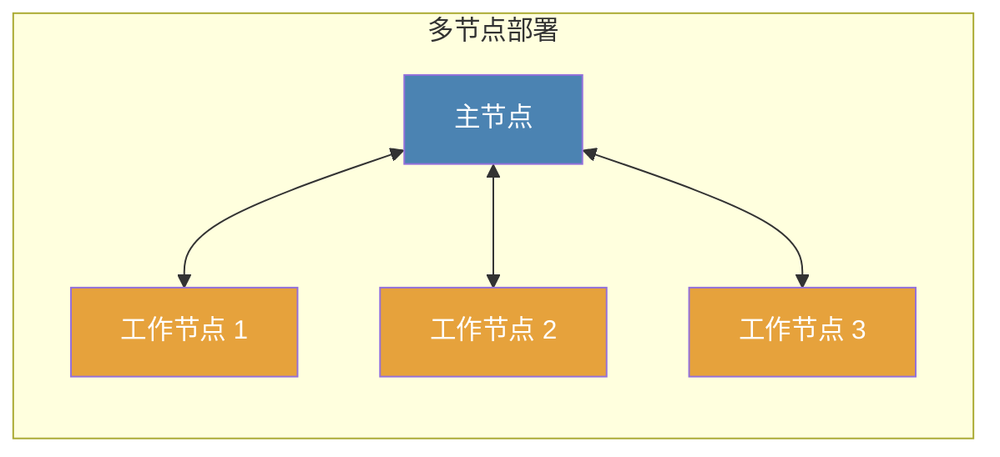

# 节点

## 什么是节点？

节点是运行在分布式网络爬取系统中的Crawlab实例，执行特定功能。简单来说，节点是运行Crawlab软件的服务器，可以执行爬虫[任务](../task/index.md)或提供管理功能。

节点是Crawlab分布式架构的基本构建块，允许您跨多台机器扩展网络爬取操作，以增加吞吐量和弹性。

## 节点类型

Crawlab使用主从架构，具有两种不同的节点类型：

### 主节点

主节点作为您的Crawlab系统的**控制中心**。它：

- 管理和协调系统中的所有节点
- 分配[任务](../task/index.md)给工作节点和自身
- 部署和分发[爬虫](../spider/index.md)文件到整个系统
- 为前端应用程序提供API
- 处理节点之间的通信
- 监控系统健康和性能

:::info
在一个Crawlab集群中必须有且仅有一个主节点。这个节点至关重要，因为它协调整个系统。
:::

### 工作节点

工作节点专注于执行由主节点分配的爬取任务。它们：

- 根据指示运行爬取[任务](../task/index.md)
- 将任务状态和结果报告回主节点
- 可以水平扩展以增加爬取容量

:::tip
添加更多工作节点可以让您：
- 同时爬取更多的网站
- 在多台机器上分散负载
- 提高容错性
- 通过将请求分布在不同的IP地址上来克服速率限制
:::

:::info
在Crawlab中可以没有或有多个工作节点。一个系统可以用仅有的主节点运行，但添加工作节点可以实现更大的可扩展性。
:::

## 系统架构

### 拓扑结构

### 通信流程

1. 主节点将任务分配给工作节点
2. 工作节点执行其分配的任务
3. 工作节点将任务状态和结果报告回主节点
4. 主节点聚合并存储结果

## 节点管理

### 查看节点状态

在Crawlab UI的`节点`页面中，您可以查看所有已注册的节点及其当前状态（在线/离线）。这有助于您监控爬取基础设施的健康状况。

### 启用和禁用节点

您可以暂时将节点从任务调度池中移除而不将其从系统中移除：

1. 导航到`节点`页面
2. 切换所需节点的`启用`开关
3. 或者，您可以在节点详细页面中更改此设置

禁用的节点不会接收新任务，但会继续运行任何正在执行的任务。

### 配置最大并发任务数

要控制节点可以同时运行的任务数量：

1. 导航到节点详细页面
2. 调整`最大运行程序`设置

此设置帮助您根据每个节点的能力优化资源使用。默认情况下，此设置为无限制。

:::tip
对于生产环境，建议根据以下内容设置`最大运行程序`：
- 可用CPU核心数
- 可用内存
- 网络带宽限制
- 目标网站约束
:::

## 节点部署

### 硬件推荐

| 节点类型 | CPU | 内存 | 磁盘空间 |
|----------|-----|------|----------|
| 主节点 | 2+ 核心 | 4GB+ | 20GB+ |
| 工作节点 | 2+ 核心 | 2GB+ | 10GB+ |

实际需求将根据您的具体工作负载和爬虫的复杂度而变化。

### 添加新节点

要通过添加工作节点来扩展您的Crawlab集群：

1. 在新的服务器上安装Crawlab
2. 配置它连接到与主节点相同的数据库
3. 在配置中将节点类型设置为“工作”
4. 启动Crawlab服务

有关详细说明，请参阅[设置工作节点](../../getting-started/installation.md#设置工作节点)部分中的多节点部署章节。

## 故障排除

### 常见节点问题

1. **节点显示为离线**
   - 检查Crawlab服务是否正在运行
   - 验证节点之间的网络连通性
   - 确保数据库连接正常工作

2. **节点未接收任务**
   - 检查节点是否已启用
   - 验证节点是否未达到其`最大运行程序`限制
   - 检查日志文件以查找潜在错误

3. **节点间通信问题**
   - 验证防火墙设置允许必要的通信
   - 确认所有节点都连接到同一数据库
   - 确保所有节点上的Crawlab版本一致

## 最佳实践

1. **从小开始**：从单个主节点开始，并根据需要添加工作节点
2. **监控资源使用情况**：根据实际性能调整`最大运行程序`
3. **定期维护**：同时更新所有节点以避免版本冲突
4. **地理分布**：对于全球爬取，考虑在不同地区放置工作节点
5. **备份主节点**：由于其对系统至关重要，请确保有适当的备份程序

:::info
虽然可以在单个物理服务器上运行多个Crawlab实例（节点），但通常**不推荐**这样做。每台服务器一个实例通常更高效。
:::