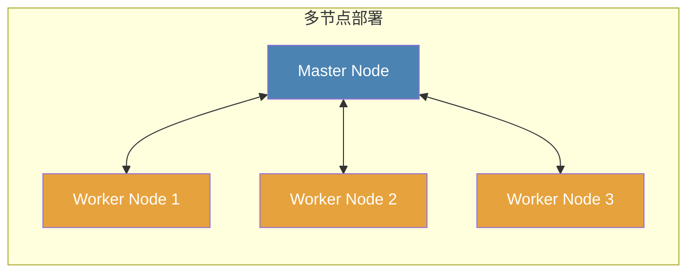

# 节点

节点是运行爬取任务或提供其他功能的 Crawlab 实例。基本上可以将节点视为服务器。

有两种类型的节点，每种节点提供不同的功能。

1. [主节点](#master-node)
2. [工作节点](#worker-node)

:::info
当然可以在单个服务器上设置多个 Crawlab 实例（节点），但这**不推荐**，因为通常一个实例（节点）就足够了。
:::

## 主节点

主节点是 Crawlab 分布式系统的控制中心。它就像人体的大脑。主节点分配[任务](../task/index.md)给[工作节点](#worker-node)或自身，并管理它们。它还部署和分发[爬虫](../spider/index.md)文件到其他节点。此外，它为前端应用程序提供 API 并处理各节点之间的通信。

:::info
Crawlab 中只有**一个**主节点。
:::

## 工作节点

工作节点是专门用于运行爬取[任务](../task/index.md)的 Crawlab 实例。通常，单个节点或服务器可能受限于其计算能力和资源，包括 CPU、内存和网络 IO。因此，可以通过增加工作节点的数量来扩大数据收集的吞吐量并提高分布式系统的整体爬取性能。

:::info
Crawlab 中可以有零个或多个工作节点。
:::

## 拓扑结构

## 查看节点状态

在`节点`页面，您可以查看节点是否在线或离线。

## 启用/禁用

您可以通过切换`节点`页面和节点详情页面中`启用`属性的开关按钮来启用或禁用节点以运行任务。

## 设置最大运行器

一个节点可以同时运行多个任务。并发任务的数量由节点的`最大运行器`控制，默认情况下设置为无限制。可以在节点详情页面进行配置。

## 添加节点

您可以参考 Docker 安装中的多节点部署部分的[设置工作节点](../../getting-started/installation.md#set-up-worker-nodes)来添加新节点。