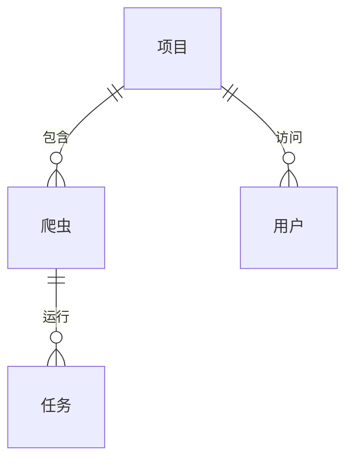

# 项目

## 什么是项目？

在 Crawlab 中，项目是一个组织单元，旨在将相关的爬虫组合在一起。项目提供了一种逻辑方式来构建您的网络抓取操作，使管理、监控和维护多个共享共同目标或针对相似网站的爬虫变得更加容易。

将项目视为一个容器或文件夹，它通过以下方式帮助您组织网络抓取工作：
- 组合功能相关的爬虫
- 分离不同的抓取计划
- 通过明确的边界实现团队协作
- 简化访问控制和权限

:::info
有效地使用项目是随着网络抓取操作规模扩大而保持组织结构的关键。
:::

## 项目与爬虫

理解项目和[爬虫](../spider/index.md)之间的关系对于有效使用 Crawlab 至关重要：

- **项目**：一个组织容器，用于分组相关的爬虫（例如，“电子商务数据收集”）
- **爬虫**：一个独立的网页爬虫实现（例如，“亚马逊产品抓取器”）

这种层次结构可以实现：

```
项目：电子商务数据收集
├── 爬虫：亚马逊产品抓取器
├── 爬虫：eBay 产品抓取器
└── 爬虫：Walmart 产品抓取器
项目：新闻聚合
├── 爬虫：CNN 文章
├── 爬虫：BBC 新闻
└── 爬虫：路透社采集器
```

:::tip
虽然项目是可选的（爬虫可以在不分配到项目的情况下存在），但随着抓取操作的增长，使用它们将显著提高组织效率。
:::

## 创建项目

### 基本创建步骤

1. 导航到主侧边栏中的 `项目` 页面
2. 点击左上角的 `新建项目` 按钮
3. 填写所需信息：
   - **名称**：为您的项目提供一个唯一且描述性的名称
   - **描述**：（可选）关于项目目的的附加信息
4. 根据需要配置任何其他选项
5. 点击 `确认` 创建项目

### 项目配置选项

- **名称**：项目的唯一标识符。选择一个描述性强的名称，明确表示其用途（例如，“电子商务监控”或“新闻聚合”）。

- **描述**：对项目目的、范围和其他相关信息的详细说明。一个好的描述有助于团队成员理解项目的背景。

## 管理项目

### 将爬虫添加到项目

有两种方法可以将爬虫添加到项目中：

#### 方法 1：在创建新爬虫时

1. 导航到 `爬虫` 页面
2. 点击 `新建爬虫` 按钮
3. 在创建表单中，从 `项目` 下拉菜单中选择您的项目
4. 完成爬虫创建过程

#### 方法 2：移动现有爬虫

1. 导航到 `爬虫` 页面
2. 使用复选框选择一个或多个爬虫
3. 点击操作栏中的 `移至项目` 按钮
4. 从下拉菜单中选择目标项目
5. 点击 `确认` 移动爬虫

### 项目设置

要修改项目的配置：

1. 导航到 `项目` 页面
2. 点击您要编辑的项目
3. 更新所需的字段：
   - 名称
   - 描述
4. 点击 `保存` 应用更改

## 项目组织最佳实践

### 命名约定

为您的项目建立一致的命名约定：

- **描述性**：名称应清楚地表明其用途（例如，“金融新闻抓取”）
- **一致性**：遵循类似 “[类别]-[功能]” 或 “[部门]-[用途]” 的模式
- **简洁性**：在保持描述性的同时，尽量保持名称简短

### 逻辑分组

根据以下内容将爬虫分组到项目中：

- **用途**：服务于相同业务需求的爬虫
- **目标站点**：抓取相关网站的爬虫
- **数据类型**：收集相似类型信息的爬虫
- **团队所有权**：由同一团队维护的爬虫

### 文档

为每个项目维护清晰的文档：

- 使用项目描述来解释总体目的
- 强调关于以下方面的详细信息：
  - 项目目标
  - 爬虫之间常见的配置
  - 部署考虑因素
  - 数据处理实践

## 实体关系

下面的图表说明了项目与其他组件在 Crawlab 生态系统中的关系：



这表明：
- 一个项目可以包含多个爬虫
- 项目可以被多个用户访问
- 每个爬虫可以有多个任务（执行实例）

## 实际示例

### 示例 1：电子商务监控项目

**项目名称**：电子商务价格监控
**描述**：跨多个零售商跟踪产品价格以进行竞争分析
**爬虫**：
- amazon_price_tracker：监控特定产品的亚马逊价格
- walmart_price_tracker：监控同一产品的沃尔玛价格
- target_price_tracker：监控目标的价格进行比较

**好处**：所有价格数据逻辑分组，便于跨零售商比较。

### 示例 2：新闻研究项目

**项目名称**：金融新闻分析
**描述**：收集金融新闻文章以进行情感分析
**爬虫**：
- wsj_finance：抓取华尔街日报的金融部分
- bloomberg_news：收集彭博的文章
- reuters_business：收集路透社的商业新闻

**好处**：所有金融新闻来源组织在一起，简化数据聚合。