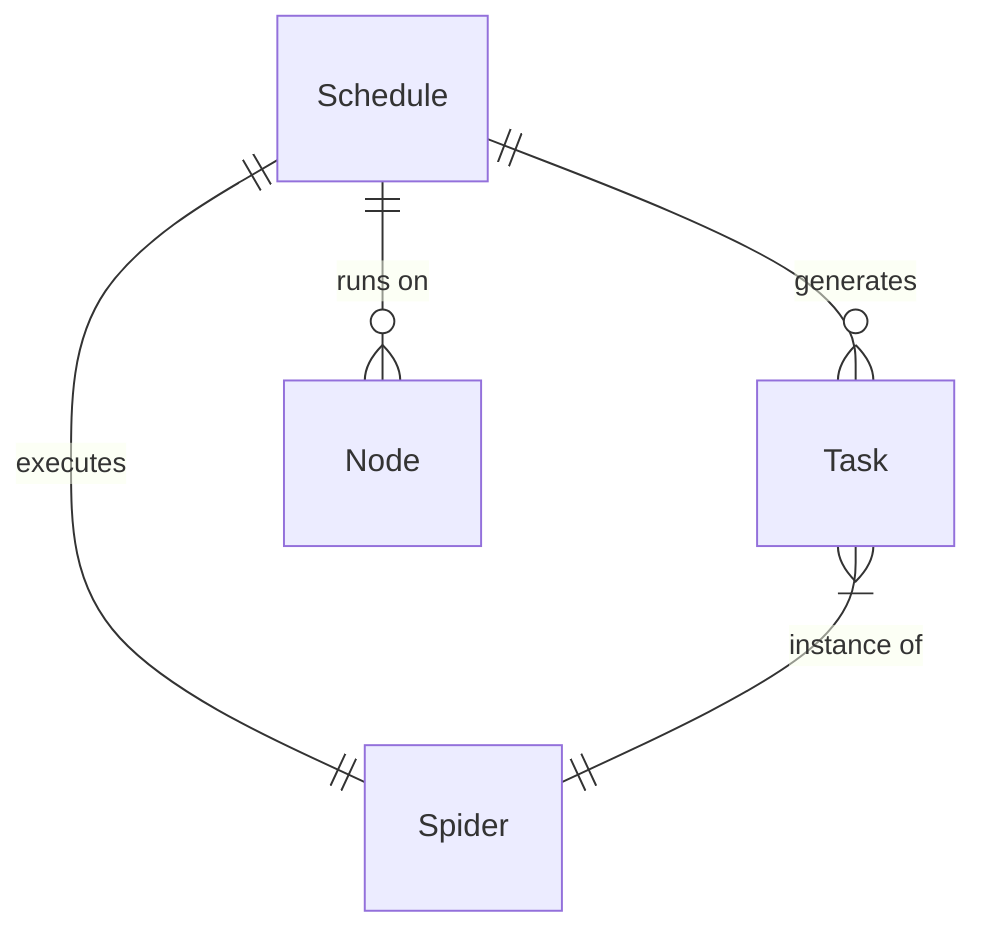

# 定时任务

## 什么是定时任务？

Crawlab 中的定时任务是一种基于时间的自动化工具，使爬虫能够在指定的时间间隔或时间自动运行。与每次需要数据时手动触发爬虫不同，定时任务允许您定义重复或一次性执行模式，确保您的数据能够定期且可靠地收集，而无需持续监督。

Crawlab 中的定时任务提供：
- 基于时间的爬虫自动化执行
- 通过 cron 表达式支持复杂的计时模式
- 简单的基于间隔的重复选项
- 配置一次性未来执行的能力
- 为每次计划运行自定义参数

:::info
有效的调度是生产级网络抓取系统的关键组成部分，它允许在最小化人工干预的情况下进行定期数据收集。
:::

## 定时任务与任务的区别

了解定时任务和 [任务](../task/index.md) 之间的区别很重要：

- **定时任务**：确定爬虫何时应运行的时间触发器（例如，“每天上午 8:00”）
- **任务**：爬虫的单次执行实例（例如，“今天上午 8:00 运行的亚马逊产品抓取器”）

当定时任务触发时，它会自动创建一个新任务。这意味着：
- 定时任务本身不执行任何抓取
- 定时任务在指定时间生成任务
- 每个任务代表一次执行实例

## 创建定时任务

### 基本创建步骤

1. 从主侧边栏导航到 `定时任务` 页面，或者进入特定爬虫的详细页面
2. 点击 `新建定时任务` 按钮
3. 填写所需信息：
   - **名称**：描述性名称
   - **爬虫**：要执行的爬虫（如果从爬虫页面创建，则预选）
   - **cron 表达式或间隔**：计时模式
4. 根据需要配置其他选项
5. 点击 `确认` 创建定时任务

### 定时任务配置选项

#### 核心字段

- **名称**：唯一且描述性的标识符。选择指示爬虫和计时模式的名称（例如，“每日早晨亚马逊爬取”或“新闻头条每小时更新”）。

- **爬虫**：此定时任务将执行的具体爬虫。一个定时任务始终关联一个爬虫。

- **cron 表达式**：一种强大的模式格式，定义定时任务何时触发。cron 表达式使用以下格式提供对执行时间的精确控制：
  ```
  * * * * *
  │ │ │ │ │
  │ │ │ │ └─── 星期几（0-6，其中 0 是星期日）
  │ │ │ └───── 月份（1-12）
  │ │ └─────── 日期（1-31）
  │ └───────── 小时（0-23）
  └─────────── 分钟（0-59）
  ```

- **启用**：切换以激活或停用定时任务而不删除它。

- **描述**：可选文本，解释此定时任务的目的或详细信息。

#### 高级选项

- **模式**：确定爬虫将如何分布：
  - **随机节点**：在随机选择的节点上执行
  - **所有节点**：同时在每个可用节点上运行
  - **选定节点**：允许选择特定节点进行执行

- **优先级**：设置多个任务排队时的执行优先级。优先级越高（数字越大），任务越先执行。

- **参数**：通过此定时任务执行爬虫时传递的附加参数。这些参数可以覆盖爬虫的默认参数。

- **标签**：帮助分类和过滤定时任务的标签。

## cron 表达式解析

### 基本格式

cron 表达式使用格式：`分钟 小时 日 月 星期几`

### 常见模式

| 表达式 | 描述 | 示例 |
|--------|------|------|
| `0 0 * * *` | 每天午夜 | 每天凌晨 12:00 |
| `0 */2 * * *` | 每两小时 | 凌晨 12:00、凌晨 2:00、凌晨 4:00 等 |
| `0 8-17 * * 1-5` | 工作日的每小时 | 每小时 8 AM 到 5 PM，周一至周五 |
| `0 8 * * 1` | 每周一早上 | 每周一上午 8:00 |
| `0 0 1 * *` | 每月 1 日 | 每个月 1 日凌晨 12:00 |
| `*/15 * * * *` | 每 15 分钟 | 12:00、12:15、12:30、12:45 等 |

### 特殊字符

- `*`：任何值（通配符）
- `,`：值列表分隔符（例如，`1,3,5`）
- `-`：值范围（例如，`1-5`）
- `/`：步进值（例如，`*/15` 表示每 15 个单位）

:::tip
使用在线 cron 表达式生成器或验证器来帮助创建和验证您的调度模式。
:::

## 管理定时任务

### 查看定时任务

您可以以多种方式查看定时任务：

1. **定时任务页面**：访问整个系统的所有定时任务
   - 从主侧边栏导航到 `定时任务` 页面
   - 使用筛选器和搜索查找特定的定时任务
   - 查看每个定时任务的状态、下次执行时间和上次运行时间

2. **爬虫详情**：查看特定爬虫的定时任务
   - 导航到爬虫的详情页面
   - 点击 `定时任务` 标签
   - 查看为此特定爬虫配置的所有定时任务

### 启用和禁用定时任务

要临时停止定时任务而不删除它：

1. 导航到 `定时任务` 页面
2. 找到要修改的定时任务
3. 关闭 `启用` 开关以禁用定时任务
4. 当需要恢复定时任务执行时，再次打开开关

这在维护期间或暂时暂停数据收集时非常有用。

### 编辑定时任务

要修改现有定时任务：

1. 导航到 `定时任务` 页面
2. 单击要编辑的定时任务
3. 在操作栏中点击 `编辑` 按钮
4. 更新所需的字段
5. 点击 `保存` 应用更改

### 删除定时任务

要永久删除定时任务：

1. 导航到 `定时任务` 页面
2. 使用复选框选择一个或多个定时任务
3. 在操作栏中点击 `删除` 按钮
4. 在对话框中确认删除

:::warning
删除定时任务是永久性的，无法撤销。如果您以后可能需要它们，请考虑禁用定时任务。
:::

## 定时任务执行流程

当定时任务触发时，会发生以下过程：

1. 系统评估当前时间是否匹配 cron 表达式
2. 如果匹配，则创建一个新的任务，包括：
   - 关联的爬虫
   - 计划中定义的任何自定义参数
   - 指定的执行模式和节点
3. 任务按照定义的优先级放入执行队列
4. 任务根据正常的任务处理规则执行
5. 结果以与手动触发的任务相同的方式存储
6. 定时任务等待下一次匹配时间以重复执行

## 定时任务最佳实践

### 时间考虑因素

- **避免高峰时段**：尽可能在非高峰时段安排资源密集型爬虫
- **负载分配**：错开定时任务以避免多个爬虫在同一时间开始
- **考虑网站政策**：安排爬取频率以尊重目标网站的服务条款
- **数据新鲜度**：平衡数据的新鲜度需求与服务器负载和爬取频率

### 性能优化

- **参数调整**：使用定时任务参数针对不同场景进行优化（例如，夜间深度爬取，白天浅层更新）
- **条件执行**：考虑在爬虫中实现逻辑，以便在不需要更新时提前退出
- **增量爬取**：配置定时任务参数，使爬取能够增量而不是全量，当合适时

### 组织

- **命名约定**：使用一致的命名模式，如 `[爬虫]-[频率]-[用途]`
- **文档**：为定时任务添加清晰的描述，说明其目的和任何特殊注意事项
- **标签**：使用标签按频率、重要性或部门对定时任务进行分类

## 常见的调度模式

### 每日数据收集

**使用案例**：从电子商务网站收集每日价格变化
**cron 表达式**：`0 8 * * *`（每天上午 8:00）
**适用场景**：数据大约每天变化一次

### 工作时间监控

**使用案例**：交易时间内监控股票价格
**cron 表达式**：`*/10 9-16 * * 1-5`（每 10 分钟，上午 9:00 至下午 4:00，周一至周五）
**适用场景**：特定工作时间内的敏感数据

### 每周汇总

**使用案例**：收集每周通讯内容或总结报告
**cron 表达式**：`0 9 * * 1`（每周一上午 9:00）
**适用场景**：每周发布的数据或总结数据

### 每月报告

**使用案例**：收集每月产品目录更新
**cron 表达式**：`0 0 1 * *`（每月 1 日凌晨 12:00）
**适用场景**：每月刷新的数据或运行聚合任务

### 频繁更新

**使用案例**：监控突发新闻或快速变化的数据
**cron 表达式**：`*/5 * * * *`（每 5 分钟，全天）
**适用场景**：频繁变化的敏感数据

## 高级调度技术

### 链式调度

通过安排相互依赖的爬虫创建数据处理序列：

1. 安排爬虫 A 在凌晨 1:00 收集原始数据
2. 安排爬虫 B 在凌晨 3:00 处理该数据
3. 安排爬虫 C 在凌晨 5:00 生成报告

这创建了一个处理管道，每个步骤在前一步完成后运行。

### 动态调度

对于更复杂的调度需求：

1. 创建一个“控制器”爬虫，评估条件并决定运行什么
2. 频繁调度这个控制器
3. 根据条件编程触发其他爬虫

这允许事件驱动或条件驱动的执行，超越了 cron 表达式所能提供的功能。

### 季节性调整

对于随季节变化的数据收集需求：

1. 为同一爬虫创建多个具有不同模式的调度
2. 根据季节需求启用或禁用它们
3. 使用参数调整每个季节的爬取行为

## 排查调度问题

### 常见问题

- **调度未触发**：
  - 验证调度是否已启用
  - 检查 cron 表达式是否有效
  - 确保系统时间正确
  - 确认没有冲突的调度设置

- **任务创建但失败**：
  - 检查爬虫在手动触发时是否成功运行
  - 验证爬虫是否有所有必需的依赖项
  - 查看任务日志中的错误消息

- **意外的执行时间**：
  - 记住 cron 表达式使用服务器时间（通常是 UTC）
  - 在调度时考虑时区差异
  - 使用“下次运行”指示器验证预期的执行时间

### 调度审核

为了审查和优化您的调度实践：

1. 定期审查所有活动的调度
2. 检查废弃或冗余的调度
3. 验证执行频率是否符合当前数据需求
4. 考虑合并相似的调度

## 实体关系

下面的图表说明了定时任务与其他组件在 Crawlab 生态系统中的关系：



这表明：
- 一个定时任务关联一个爬虫
- 一个定时任务随着时间推移生成多个任务
- 一个定时任务可以配置在特定节点上运行
- 每个任务是一个爬虫的执行实例

## 下一步

掌握调度后，可以探索这些高级主题：

- [任务管理和监控](../task/index.md)
- [节点分配策略](../node/index.md)
- [设置调度结果的通知](../../guides/notifications/index.md)