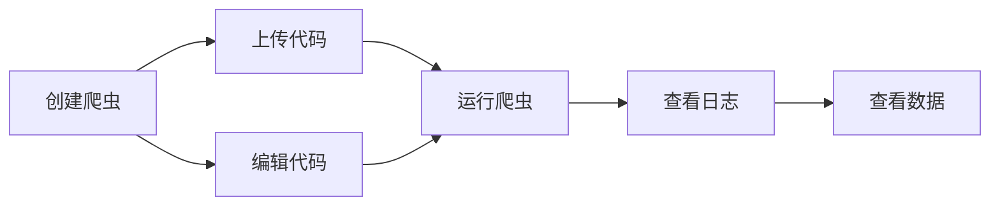
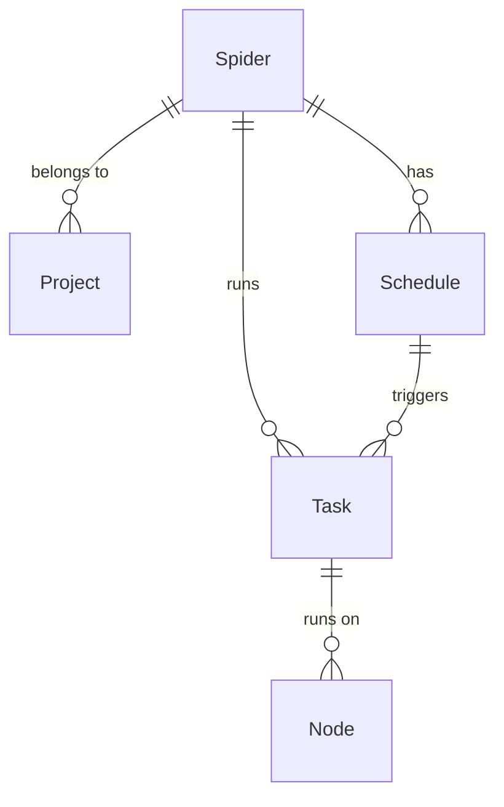

# 爬虫

爬虫是Crawlab中网页抓取程序的基本单元。你可以将其视为由代码和文件组成的网页抓取软件项目，例如一个Scrapy项目。请注意，这里提到的*项目*与Crawlab中的基本概念[项目](../project/index.md)不同。

:::info
爬虫的概念在Crawlab中非常重要，我们强烈建议您通读本节。
:::

## 典型流程

以下是用户在Crawlab中操作爬虫的典型流程。

## 创建爬虫

1. 导航到`爬虫`页面，并点击左上角的`新建爬虫`按钮。
2. 输入相关信息，包括`名称`和`执行命令`。
3. 点击`确认`。

以下是创建爬虫时核心字段的解释。

- `Project` 是爬虫所属的项目。
- `Execute Command` 是在运行爬虫时将在[shell](https://en.wikipedia.org/wiki/Shell_(computing))中执行的命令，例如 `scrapy crawl myspider`。
- `Parameters` 是在运行爬虫时传递给`Execute Command`的一系列参数，例如 `-a param1=value1 -a param2=value2`。
- `Default Mode` 是爬虫的默认运行模式。
    - `Random Node`: 在随机节点上运行爬虫。
    - `All Nodes`: 在所有节点上运行爬虫。
    - `Selected Nodes`: 在选定节点上运行爬虫。
- `Priority` 是爬虫的优先级。优先级越高，爬虫将越早执行。
- `Results Collection` 是爬虫结果存储在数据库中的集合。

## 上传代码

有几种方式可以上传爬虫文件。

### 上传文件夹

1. 导航到爬虫详情页面。
2. 点击`文件`选项卡。
3. 点击导航栏中的`上传`按钮。
4. 选择`文件夹`。
5. 点击`点击选择要上传的文件夹`。
6. 选择包含爬虫文件的文件夹。
7. 点击`确认`。

### 上传文件

1. 导航到爬虫详情页面。
2. 点击`文件`选项卡。
3. 点击导航栏中的`上传`按钮。
4. 选择`文件`。
5. 将爬虫文件拖放到拖放区域，或点击拖放区域并选择文件。
6. 点击`确认`。

### 上传文件（拖放）

1. 导航到爬虫详情页面。
2. 点击`文件`选项卡。
3. 将爬虫文件或文件夹拖放到左侧文件导航器中的文件夹。

## 编辑代码

Crawlab提供了一个在线代码编辑器，供用户编辑爬虫代码。您可以按照以下步骤编辑爬虫代码。

1. 导航到爬虫详情页面。
2. 点击`文件`选项卡。
3. 点击要编辑的文件。
4. 编辑代码。
5. 点击导航栏中的`保存`按钮。

您可以参考[文件编辑器](../../guides/code-editor/index.md)部分以了解更多关于代码编辑器的详细信息。

## 运行爬虫

您可以按照以下步骤运行爬虫。

1. 如果在爬虫详情页面，点击导航栏中的带有播放图标的`运行`按钮。
2. 如果在`爬虫`页面，点击右侧带有播放图标的`运行`按钮。
3. 选择适当的设置来运行爬虫。
4. 点击`确认`。

## 查看数据

爬虫执行后，您可以通过以下步骤查看收集的数据：

1. 导航到爬虫详情页面。
2. 点击导航栏中的`数据`选项卡。
3. 在表格视图中浏览收集的记录。
4. 使用分页控件浏览结果。

此处显示的数据来自在创建爬虫时指定的MongoDB集合`Results Collection`。您可以：
- 使用导出数据按钮将数据导出为CSV/JSON格式

:::tip
如果未明确配置，集合名称遵循`results_<spider_name>`模式。使用此名称可以直接通过MongoDB客户端查询数据。
:::

## 实体关系

爬虫与其他实体之间的关系如下所示。

