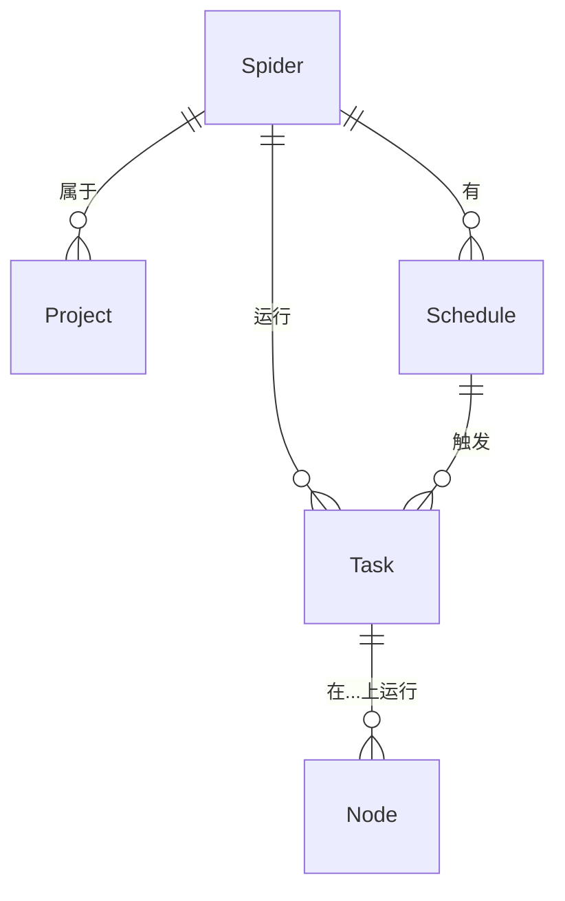

# 爬虫

## 什么是爬虫？

在 Crawlab 中，爬虫是网络抓取功能的基本单元。可以将其视为一个完整的网络抓取程序或项目，包含从特定网站提取数据所需的所有必要代码、配置和逻辑。

爬虫可以使用各种技术和框架构建：

- Scrapy 项目
- 使用 BeautifulSoup 或 Selenium 等库的 Python 脚本
- 使用 Puppeteer 或 Playwright 的基于 JavaScript 的爬虫
- 任何可以从网页提取数据的可执行程序

:::info
概念 *爬虫* 是 Crawlab 架构的核心。了解如何创建、配置和管理爬虫对于大规模有效网络抓取至关重要。
:::

## 爬虫与项目

在 Crawlab 中，爬虫代表一个单独的网络爬虫实现，而 [项目](../project/index.md) 是一个可以包含多个相关爬虫的组织单元。例如：

- **项目**: 电子商务数据收集
    - **爬虫 1**: Amazon 产品抓取器
    - **爬虫 2**: eBay 产品抓取器
    - **爬虫 3**: Walmart 产品抓取器

这种层次结构化组织有助于管理具有多个爬取目标的复杂数据收集操作。

## 创建爬虫

### 基本创建步骤

1. 从主侧边栏导航到 `爬虫` 页面
2. 点击左上角的 `新建爬虫` 按钮
3. 填写所需信息：
    - **名称**: 一个唯一且描述性的名称（例如 "amazon_product_scraper"）
    - **项目**: （可选）此爬虫所属的项目
    - **执行命令**: 运行爬虫的命令（例如 `python spider.py` 或 `scrapy crawl amazon`）
4. 根据需要配置其他选项
5. 点击 `确认` 创建爬虫

### 配置选项说明

- **名称**: 爬虫的唯一标识符。使用描述性名称，指示其用途或目标网站。

- **项目**: 此爬虫所属的组织组。分组相关的爬虫有助于管理和监控。

- **执行命令**: 运行爬虫时将执行的 shell 命令。示例：
  ```
  python main.py                  # 对于 Python 脚本
  scrapy crawl my_spider          # 对于 Scrapy 爬虫
  node crawler.js                 # 对于 Node.js 爬虫
  ./custom_crawler                # 对于编译后的可执行文件
  ```

- **参数**: 传递给执行命令的附加参数。这些参数可以在不更改代码的情况下修改爬虫行为。示例：
  ```
  --start-url="https://example.com"
  -a category=electronics -a pages=5
  --limit=100 --output=json
  ```

- **默认模式**: 确定爬虫将在您的 Crawlab 节点之间如何分布：
    - **随机节点**: 在一个随机选择的节点上执行（适用于测试）
    - **所有节点**: 在每个可用节点上运行相同的爬虫（适用于分布式爬取）
    - **选定节点**: 允许您选择特定节点进行执行（适用于特殊硬件要求）

- **优先级**: 当多个爬虫排队时确定执行顺序。优先级较高的爬虫（数字越大）先执行。

- **结果收集**: 抓取数据存储的 MongoDB 集合名称。如果留空，则默认为 `results_<spider_name>`。

## 代码管理

### 上传代码

Crawlab 提供了几种上传爬虫代码的方法：

#### 方法 1: 上传文件夹（推荐用于完整项目）

1. 导航到爬虫详情页面
2. 选择 `文件` 标签
3. 点击导航栏中的 `上传` 按钮
4. 选择 `文件夹` 选项
5. 点击 `点击选择要上传的文件夹`
6. 选择包含您的爬虫项目的文件夹
7. 点击 `确认` 上传

此方法保留了您的项目结构，使其成为依赖特定目录布局的框架（如 Scrapy）的理想选择。

#### 方法 2: 上传单个文件

1. 导航到爬虫详情页面
2. 选择 `文件` 标签
3. 点击 `上传` 按钮
4. 选择 `文件` 选项
5. 将文件拖放到上传区域或点击选择文件
6. 点击 `确认` 上传

当您需要添加或更新特定文件而不是整个项目时，请使用这种方法。

#### 方法 3: 拖放上传（快速方法）

1. 导航到爬虫详情页面并选择 `文件` 标签
2. 直接从本地文件浏览器拖动文件或文件夹
3. 将它们拖放到左侧的文件导航器中

此方法提供了一种快速更新或添加特定目录中文件的方式。

### 创建和编辑文件

Crawlab 包含一个内置的 [代码编辑器](../../guides/code-editor/index.md)，支持：

- 多种语言的语法高亮显示
- 代码补全
- 文件创建和删除
- 目录管理

要编辑文件：

1. 导航到爬虫的 `文件` 标签
2. 单击导航器中的文件以在编辑器中打开它
3. 进行更改
4. 点击 `保存` 按钮（或使用 Ctrl+S/Cmd+S）

要创建新文件：

1. 导航到爬虫的 `文件` 标签
2. 单击工具栏中的 `新建文件` 按钮
3. 输入带适当扩展名的文件名
4. 点击 `确认`

有关使用代码编辑器的更多详细信息，请参阅 [文件编辑器](../../guides/code-editor/index.md) 文档。

## 运行爬虫

### 基本执行

1. 从爬虫详情页面，点击导航栏中的 `运行` 按钮（播放图标）
2. 另外，从 `爬虫` 列表页面，点击特定爬虫的 `运行` 按钮
3. 在运行对话框中：
    - 核实或调整执行参数
    - 选择执行模式（随机节点、所有节点或选定节点）
    - 添加本次运行所需的任何自定义参数
4. 点击 `确认` 开始执行

### 高级执行选项

- **自定义参数**: 覆盖特定运行的默认参数
- **优先级覆盖**: 临时更改执行优先级
- **节点选择**: 根据能力选择特定节点进行执行

### 监控执行

爬虫运行后：

1. 导航到 `任务` 部分查看所有活动和已完成的爬虫运行
2. 单击特定任务以查看：
    - 实时日志
    - 执行统计信息
    - 错误消息（如果有）

## 处理抓取的数据

### 查看结果

爬虫完成运行后：

1. 导航到爬虫详情页面
2. 点击 `数据` 标签
3. 浏览收集记录的表格
4. 使用过滤器和搜索查找特定条目
5. 单击任意行以查看完整的记录详情

### 数据管理

Crawlab 提供了几种处理抓取数据的工具：

- **导出**: 使用导出按钮下载数据为 CSV、JSON 或 Excel 格式
- **过滤**: 根据字段值应用过滤器查找特定记录
- **分页**: 使用分页控制导航大型结果集
- **字段选择**: 选择要在表格视图中显示的字段

### 数据库集成

所有抓取的数据都存储在 MongoDB 中，具有以下特性：

- 集合名称遵循 `results_<spider_name>` 模式（除非自定义配置）
- 每条记录包含自动的 `_id` 字段和 `_tid`（任务 ID），链接回执行
- 您可以通过 MongoDB 客户端直接访问这些数据，以便进行高级查询或处理

您可以参考 [数据库集成] 部分了解更多详细信息。

:::info
[Crawlab 专业版](../../guides/database/index.md) 支持与其他主流数据库系统（MySQL、PostgreSQL、ElasticSearch 等）的集成。
:::

## 最佳实践

### 爬虫组织

- 为您的爬虫使用有意义且一致的命名
- 将相关爬虫分组到项目中
- 在您的爬虫目录中包含一个 README.md 文件，解释其用途和用法
- 在代码中添加适当的注释，解释复杂的逻辑

### 性能优化

- 设置适当的请求延迟，避免过度加载目标网站
- 实现适当的错误处理和重试机制
- 使用调度器进行重复任务，而不是连续手动执行
- 考虑将大型爬取任务分布在多个节点上

### 解决常见问题

- **爬虫立即失败**: 检查您的执行命令，并确保安装了所有依赖项
- **空结果**: 验证您的选择器/提取器，网站结构可能已更改
- **超时**: 调整超时设置或优化爬虫性能
- **资源使用率高**: 对于大数据提取任务，实施分页或分块

## 实体关系

下图说明了爬虫与其他组件在 Crawlab 生态系统中的关系：



这表明：

- 一个爬虫属于一个项目（可选）
- 一个爬虫可以有多个任务（执行实例）
- 一个爬虫可以有多个调度
- 任务在特定节点上运行
- 调度触发任务

## 下一步

掌握爬虫管理的基础知识后，考虑探索这些高级主题：

- [爬虫管理](../../guides/spiders/index.md)
- [安排重复爬虫运行](../schedule/index.md)
- [监控性能](../../guides/performance-monitoring/index.md)
- [与通知系统集成](../../guides/notifications/index.md)