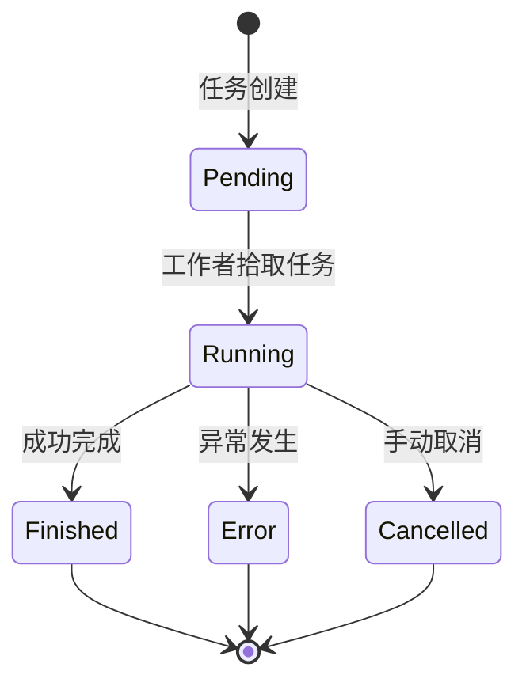
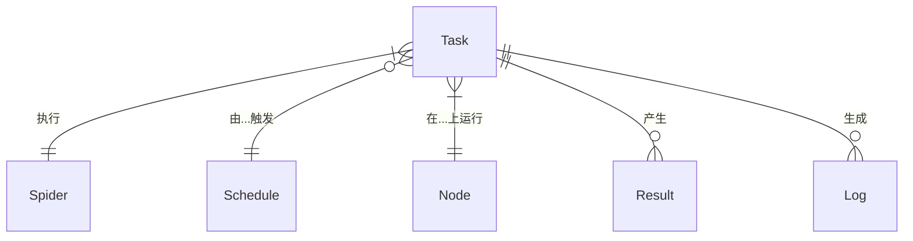

# 任务

## 什么是任务？

在 Crawlab 中，任务代表爬虫的单次执行实例。每当爬虫运行——无论是手动触发、由定时任务触发还是通过 API 调用——都会创建一个新的任务来跟踪该特定执行过程，从开始到结束。任务是 Crawlab 中的基本工作单元，负责实际的数据收集过程。

每个任务都维护自己的：
- 执行日志
- 状态信息
- 资源使用指标
- 结果数据
- 错误记录
- 性能统计

:::info
任务是 Crawlab 的操作心跳。理解它们的工作原理对于监控、故障排除和优化您的网络抓取操作至关重要。
:::

## 任务与爬虫及定时任务的区别

理解任务与其他 Crawlab 概念之间的关系很重要：

- **爬虫**：网络爬虫的定义（代码、配置和逻辑）
- **定时任务**：基于时间的触发器，确定爬虫何时运行
- **任务**：爬虫在特定时间点的单次执行实例

这种关系可以理解为：
- 爬虫是“什么”（运行什么代码）
- 定时任务是“何时”（何时运行）
- 任务是“实例”（一次具体的执行及其自己的结果）

一个爬虫可以有多个任务（历史执行）和多个定时任务（不同的时间模式）。

## 任务生命周期

每个任务在其生命周期中会经历一系列状态：

1. **待处理**：任务已创建但正在执行队列中等待
2. **运行中**：任务正在节点上积极执行
3. **已完成**：任务成功完成
4. **错误**：任务遇到错误并停止执行
5. **已取消**：任务在完成前被手动停止

下图可视化了这个生命周期：

## 创建任务

任务通常通过以下三种方式之一创建：

### 方法 1：手动执行

1. 导航到 `爬虫` 页面
2. 查找要运行的爬虫
3. 点击 `运行` 按钮（播放图标）
4. 在对话框中配置任何运行时参数
5. 点击 `确认` 以创建并启动任务

### 方法 2：定时执行

1. 之前配置的 [定时任务](../schedule/index.md) 根据其 cron 表达式触发
2. 系统自动为关联的爬虫创建一个新的任务
3. 任务根据定时任务的配置开始执行

### 方法 3：API 集成

1. 外部系统调用 Crawlab 的 API 请求运行特定的爬虫
2. API 根据提供的参数创建一个新的任务
3. 任务像其他任务一样排队等待执行

:::tip
这三种方法创建的任务对象是相同的——唯一的区别在于它们是如何发起的。
:::

## 任务配置选项

在创建任务（特别是通过手动执行）时，您可以配置多个参数：

### 核心参数

- **模式**：确定任务将如何分布：
  - **随机节点**：在随机选择的一个节点上执行
  - **所有节点**：同时在每个可用节点上运行
  - **选定节点**：允许选择特定节点进行执行

- **优先级**：设置当多个任务排队时的执行顺序。优先级越高（数字越大）的任务先执行。

- **参数**：为本次特定执行传递给爬虫的自定义参数。这些参数覆盖爬虫的默认参数。

### 高级选项

- **节点选择**：当使用“选定节点”模式时，您可以选择哪些节点将执行任务

## 监控任务

### 任务列表视图

`任务` 页面提供了系统中所有任务的概览：

1. 从主侧边栏导航到 `任务` 页面
2. 查看最近任务的列表，包括：
   - ID
   - 爬虫名称
   - 状态
   - 节点
   - 开始/结束时间
   - 持续时间
   - 结果数量

此视图支持：
- 按状态、爬虫、节点和时间范围过滤
- 按各种列排序
- 按任务 ID 或爬虫名称搜索
- 对选中的任务进行批量操作

### 任务详细视图

要深入了解某个特定任务的信息：

1. 在任务列表中点击任意任务
2. 通过以下标签访问详细信息：

#### 概览标签

提供摘要信息，包括：
- 任务元数据（ID、爬虫、节点、时间）
- 状态和持续时间
- 结果统计
- 资源利用率图表
- 关键性能指标

#### 日志标签

显示完整的执行日志：
- 活动任务的日志实时流
- 爬虫执行的完整控制台输出
- 按严重级别筛选日志
- 日志搜索功能
- 日志下载选项

#### 结果标签

显示此任务收集的数据：
- 列表视图显示所有抓取项
- 字段筛选和排序
- 记录搜索功能
- 数据导出选项（CSV、JSON、Excel）
- 与 MongoDB 集合的关系

## 任务管理

### 取消任务

要在任务完成前停止它：

1. 导航到 `任务` 页面
2. 查找要停止的运行中的任务
3. 点击 `取消` 按钮（停止图标）
4. 在对话框中确认取消

系统将尝试优雅地终止执行过程。

:::warning
取消任务并不总是即时的。某些操作可能会在任务完全停止前继续一段时间。
:::

### 重新运行任务

要使用相同参数再次执行任务：

1. 导航到 `任务` 页面
2. 查找要重新运行的任务
3. 点击 `重新运行` 按钮（刷新图标）
4. 系统将创建一个具有相同配置的新任务

这在以下情况下很有用：
- 由于临时问题导致任务失败
- 需要使用相同参数刷新数据
- 希望比较不同时期的结果

## 任务结果和数据

每个成功抓取数据的任务将其结果存储在 MongoDB 集合中：

### 默认集合

默认情况下，结果存储在名为：
- `results_<爬虫名称>`（例如 `results_amazon_product_scraper`）的集合中

这意味着来自同一爬虫的所有任务共享一个集合，每个记录包含一个 `_tid`（任务 ID）字段，链接回创建它的特定任务。

### 访问结果

可以通过多种方式访问任务结果：

1. **网页界面**：
   - 导航到任务的详细页面
   - 点击 `结果` 标签
   - 浏览、搜索和导出数据

2. **MongoDB 集成**：
   - 直接连接到 MongoDB 实例
   - 查询适当的集合
   - 通过 `_tid`（任务 ID）过滤以获取特定任务的结果

3. **API**：
   - 使用 Crawlab 的 API 程序化检索结果
   - 根据需要过滤和格式化数据，以便与其他系统集成

## 性能指标（开发中）

任务收集并显示各种性能指标，帮助您理解和优化您的爬虫：

### 系统指标

- **CPU 使用率**：任务使用的 CPU 百分比
- **内存使用率**：随时间变化的 RAM 消耗
- **网络流量**：发送和接收的字节数
- **磁盘 I/O**：读写操作

### 抓取指标

- **请求次数**：发出的 HTTP 请求总数
- **成功率**：成功的请求百分比
- **响应时间**：请求时间的平均值和分布
- **数据吞吐量**：每秒/分钟抓取的项目数
- **请求频率**：每秒请求次数

### 自定义指标

爬虫可以通过 Crawlab SDK 报告自定义指标，使您能够跟踪特定领域的性能指标。

## 任务日志

[任务日志](../../guides/task-logs/index.md) 对于监控执行和排查问题至关重要：

### 日志最佳实践

- 根据需要启用适当的日志级别
- 向日志消息添加上下文信息
- 尽可能使用结构化日志
- 为特定领域事件实现自定义日志

### 日志保留

日志根据系统配置保留：
- 默认情况下，日志保留 30 天
- 根据存储容量配置保留策略
- 考虑导出关键日志以进行长期存储

## 任务管理的最佳实践

### 性能优化

- **批次大小控制**：配置您的爬虫以适当批次大小处理数据
- **资源分配**：为时间敏感任务分配更高的优先级
- **并发设置**：根据目标站点的能力调整并行执行参数
- **节点选择**：根据任务需求选择合适的节点

### 监控策略

- **主动观察**：密切关注长时间运行的任务，及时发现问题
- **警报配置**：为任务失败设置通知
- **性能基线**：建立正常性能指标以识别异常
- **定期审查**：定期分析任务历史以发现趋势

### 故障排除技巧

- **日志分析**：首先检查日志中的错误消息或警告
- **参数验证**：确认任务收到正确的参数
- **节点检查**：检查节点特定问题是否影响任务
- **增量测试**：修改爬虫参数以隔离有问题的组件

## 实体关系

下图说明了任务与其他组件在 Crawlab 生态系统中的关系：

这表明：
- 每个任务执行一个爬虫
- 任务可能由定时任务触发（可选）
- 每个任务在单个节点上运行
- 任务产生多个结果记录
- 任务生成多个日志条目

## 高级任务概念

### 任务队列和调度

Crawlab 使用优先级队列机制管理待处理任务：

1. 任务进入队列时指定优先级级别
2. 调度程序评估可用节点资源
3. 优先级较高的任务在优先级较低的任务之前分配给节点
4. 优先级相同的任务按先进先出（FIFO）顺序处理

### 分布式执行模式

任务分布策略影响工作分配的方式：

- **随机节点**：简单分配到一个节点
  - 最适合：测试、简单的爬虫或当节点选择无关紧要时

- **所有节点**：在所有节点上复制相同的任务
  - 最适合：分布相同抓取任务的不同起点
  - 需要爬虫代码处理分布逻辑

- **选定节点**：手动分配到特定节点
  - 最适合：需要特定能力的特殊任务
  - 当某些节点具有特殊访问权限或资源时非常有用

## 下一步

掌握任务管理后，考虑探索这些高级主题：

- [节点管理和扩展](../node/index.md)
- [任务通知和警报](../../guides/notifications/index.md)