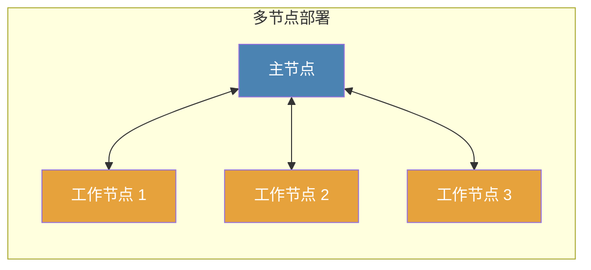
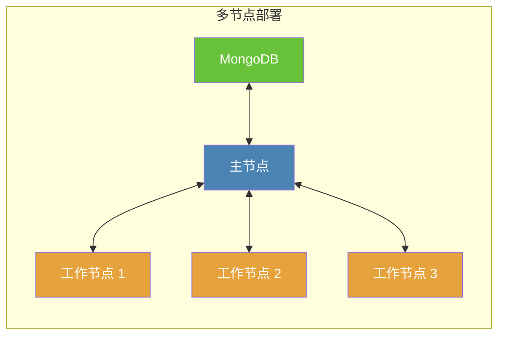

# 安装

Docker 是安装和部署 Crawlab 最方便和最简单的方式。如果你不熟悉 Docker，你可以参考 [Docker 官方网站](https://www.docker.com/) 并在本地机器上安装它。确保你已经安装了 Docker 再继续进行下一步。

## 主过程

Docker 安装有几种部署模式，但主要过程是相似的。

1. 安装 [Docker](https://www.docker.com/)
2. 拉取 Crawlab 的 Docker 镜像（如果没有外部 MongoDB 实例，还需要拉取 [MongoDB](https://www.mongodb.com/)）
3. 创建 `docker-compose.yml` 并进行配置
4. 启动 Docker 容器

:::warning
为了遵循指导，我们将假设你已经安装了 Docker，并且已经拉取了 Docker 镜像。
:::

## 单节点部署


**单节点部署** 类似于 [快速开始](./quick-start.md) 中的配置，通常用于演示目的或管理少量爬虫。在单节点部署中，所有 Docker 容器（包括 Crawlab 和 MongoDB）都在一台机器上，即主节点（见上图）。

创建 `docker-compose.yml` 并输入以下内容。

```yaml
services:
  master:
    image: crawlabteam/crawlab
    container_name: crawlab_master
    restart: always
    environment:
      CRAWLAB_NODE_MASTER: "Y"  # Y: 主节点
      CRAWLAB_MONGO_HOST: "mongo"  # mongo 主机地址。在 docker compose 网络中，直接引用服务名称
      CRAWLAB_MONGO_PORT: "27017"  # mongo 端口 
      CRAWLAB_MONGO_DB: "crawlab"  # mongo 数据库 
      CRAWLAB_MONGO_USERNAME: "username"  # mongo 用户名
      CRAWLAB_MONGO_PASSWORD: "password"  # mongo 密码 
      CRAWLAB_MONGO_AUTHSOURCE: "admin"  # mongo 认证源 
    volumes:
      - "/opt/.crawlab/master:/root/.crawlab"  # 持久化 Crawlab 元数据
      # - "/var/crawlab/log:/var/log/crawlab" # 可选日志持久化
    ports:
      - "8080:8080"  # 暴露 API 端口
    depends_on:
      - mongo

  mongo:
    image: mongo:5
    container_name: mongo
    restart: always
    environment:
      MONGO_INITDB_ROOT_USERNAME: "username"  # mongo 用户名
      MONGO_INITDB_ROOT_PASSWORD: "password"  # mongo 密码
    volumes:
      - "/opt/crawlab/mongo/data/db:/data/db"  # 持久化 MongoDB 数据
    ports:
      - "27017:27017"  # 将 MongoDB 端口暴露给主机
```

然后，执行 `docker compose up -d` 并在浏览器中导航到 `http://<your_ip>:8080` 开始使用 Crawlab。

## 多节点部署



**多节点部署** 通常用于生产环境，在这种环境中，由一个主节点和多个工作节点组成的集群会被部署。主节点通过工作节点连接，并作为集群中的中央控制系统。

多节点部署的配置比单节点部署更复杂，但你可以按照下面的指南设置一个小集群，这将非常简单。

### 设置主节点

在 **主节点** 中创建 `docker-compose.yml` 并输入以下内容。然后通过执行 `docker compose up -d` 开始。

```yaml
# 主节点
services:
  master:
    image: crawlabteam/crawlab
    container_name: crawlab_master
    restart: always
    environment:
      CRAWLAB_NODE_MASTER: "Y"  # Y: 主节点
      CRAWLAB_MONGO_HOST: "mongo"  # mongo 主机地址。在 docker compose 网络中，直接引用服务名称
      CRAWLAB_MONGO_PORT: "27017"  # mongo 端口 
      CRAWLAB_MONGO_DB: "crawlab"  # mongo 数据库 
      CRAWLAB_MONGO_USERNAME: "username"  # mongo 用户名
      CRAWLAB_MONGO_PASSWORD: "password"  # mongo 密码 
      CRAWLAB_MONGO_AUTHSOURCE: "admin"  # mongo 认证源 
    volumes:
      - "/opt/.crawlab/master:/root/.crawlab"  # 持久化 Crawlab 元数据
      # - "/var/crawlab/log:/var/log/crawlab" # 可选日志持久化
    ports:
      - "8080:8080"  # 暴露 API 端口
      - "9666:9666"  # 暴露 gRPC 端口
    depends_on:
      - mongo

  mongo:
    image: mongo:5
    container_name: mongo
    restart: always
    environment:
      MONGO_INITDB_ROOT_USERNAME: "username"  # mongo 用户名
      MONGO_INITDB_ROOT_PASSWORD: "password"  # mongo 密码
    volumes:
      - "/opt/crawlab/mongo/data/db:/data/db"  # 持久化 MongoDB 数据
    ports:
      - "27017:27017"  # 将 MongoDB 端口暴露给主机
```

### 设置工作节点

在每个 **工作节点** 中创建 `docker-compose.yml` 并输入以下内容。然后通过执行 `docker compose up -d` 开始。

```yaml
# 工作节点
services:
  worker:
    image: crawlabteam/crawlab
    container_name: crawlab_worker
    restart: always
    environment:
      CRAWLAB_NODE_MASTER: "N"  # N: 工作节点
      CRAWLAB_MASTER_HOST: "<master_node_ip>"  # 主节点 IP 地址
    volumes:
      - "/opt/.crawlab/worker:/root/.crawlab"  # 持久化 Crawlab 元数据
```

请注意，你应该将 `<master_node_ip>` 替换为实际的主节点 IP 地址，并确保工作节点可以访问该 IP 地址。

在主节点和工作节点都启动后，你现在可以导航到 `http://<master_node_ip>:8080` 开始使用 Crawlab。

:::warning

### 暴露主节点端口

由于工作节点通过端口 **8080**（API）和 **9666**（gRPC）连接到主节点，你需要确保它们都被打开并且不受主节点防火墙的阻止。
:::

## 外部 MongoDB

在上面介绍的多节点部署中，你可能会注意到 MongoDB 默认部署在主节点上。但从性能角度来看，这种便捷的部署配置可能会导致问题，因为 MongoDB 本身可能成为瓶颈，特别是在大规模分布式系统中。

幸运的是，这个问题可以通过使用部署在其他节点上的外部 MongoDB 或从云数据库服务提供商（例如 AWS、Azure、阿里云等）来解决。这样，MongoDB 可以轻松扩展，从而确保数据库的稳定性。请参阅下图。



主节点的配置文件 `docker-compose.yml` 与默认的多节点部署略有不同。请找到以下内容。

```yaml
# 带外部 MongoDB 的主节点
services:
  master:
    image: crawlabteam/crawlab
    container_name: crawlab_master
    restart: always
    environment:
      CRAWLAB_NODE_MASTER: "Y"  # Y: 主节点
      CRAWLAB_MONGO_URI: "<mongo_uri>"  # mongo URI（单独设置）
      CRAWLAB_MONGO_HOST: "<mongo_host>"  # mongo 主机地址
      CRAWLAB_MONGO_PORT: "<mongo_port>"  # mongo 端口 
      CRAWLAB_MONGO_DB: "<mongo_db>"  # mongo 数据库 
      CRAWLAB_MONGO_USERNAME: "<mongo_username>"  # mongo 用户名
      CRAWLAB_MONGO_PASSWORD: "<mongo_password>"  # mongo 密码 
      CRAWLAB_MONGO_AUTHSOURCE: "<mongo_auth_source>"  # mongo 认证源 
      CRAWLAB_MONGO_AUTHMECHANISM: "<mongo_auth_mechanism>"  # mongo 认证机制 
      CRAWLAB_MONGO_AUTHMECHANISMPROPERTIES: "<mongo_auth_mechanism_properties>"  # mongo 认证机制属性
    volumes:
      - "/opt/.crawlab/master:/root/.crawlab"  # 持久化 Crawlab 元数据
      # - "/var/crawlab/log:/var/log/crawlab" # 可选日志持久化
    ports:
      - "8080:8080"  # 暴露 API 端口
      - "9666:9666"  # 暴露 gRPC 端口
```