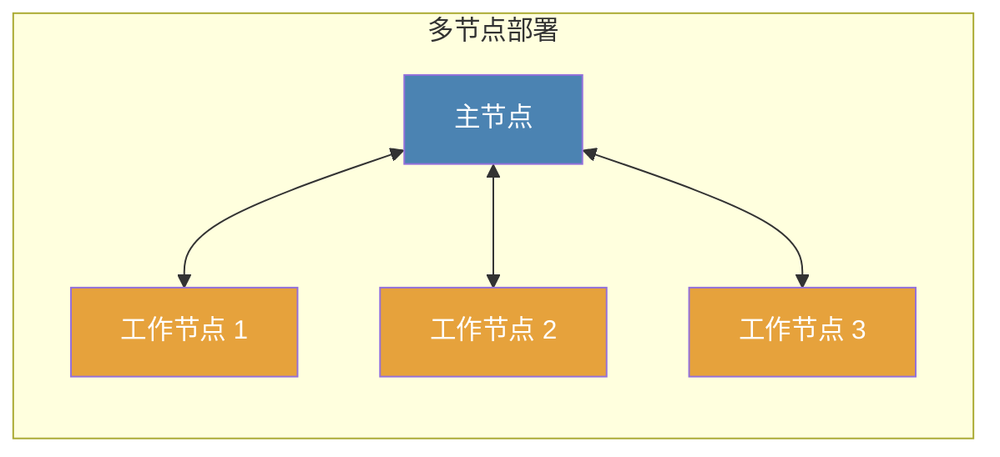

# 节点

节点是运行爬虫[任务](../task/index.md)或提供其他功能的Crawlab实例。您可以基本上将节点视为一台服务器。

有两种类型的节点，每种节点服务于不同的功能。

1. [主节点](#主节点)
2. [工作节点](#工作节点)

:::warning
当然，您可以在一台服务器上设置多个Crawlab实例（节点），但这**不被推荐**，因为通常情况下，一台服务器上的单个实例（节点）就足够了。
:::

## 主节点

主节点是Crawlab中整个分布式系统的核心控制中心。它就像人体的大脑。主节点分配[任务](../task/index.md)给[工作节点](#工作节点)或自身，并管理它们。它还部署和分发[爬虫](../spider/index.md)文件到其他节点。此外，它为前端应用程序提供API并处理各节点之间的通信。

:::warning
在Crawlab中只存在**一个**主节点。
:::

## 工作节点

工作节点是专门用于运行爬虫[任务](../task/index.md)的Crawlab实例。通常，单个节点或服务器可能受限于其计算能力和资源，包括CPU、内存和网络IO。因此，可以通过增加工作节点的数量来扩大数据收集的吞吐量并提高分布式系统的整体爬取性能。

:::tip
在Crawlab中可以没有或有多个工作节点。
:::

## 拓扑结构

## 查看节点状态

在`节点`页面，您可以查看节点是否在线。

## 启用/禁用

您可以通过切换`节点`页面和节点详情页面中的`启用`属性开关按钮来启用或禁用节点以运行任务。

## 设置最大运行程序数量

节点可以同时运行多个任务。并发任务的数量由节点的`最大运行程序数量`控制。该配置可以在节点详情页面进行。

## 设置基本信息

节点名称、IP地址、MAC地址等基本信息可以在节点详情页面设置。

## 添加节点

您可以参考[Docker安装中的多节点部署：设置工作节点](../../getting-started/installation.md#设置工作节点)来添加新节点。