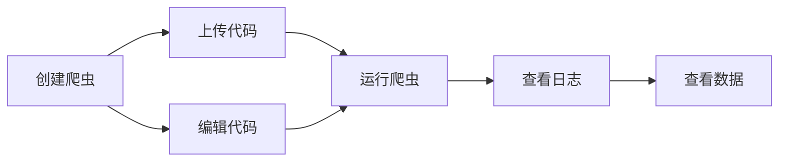
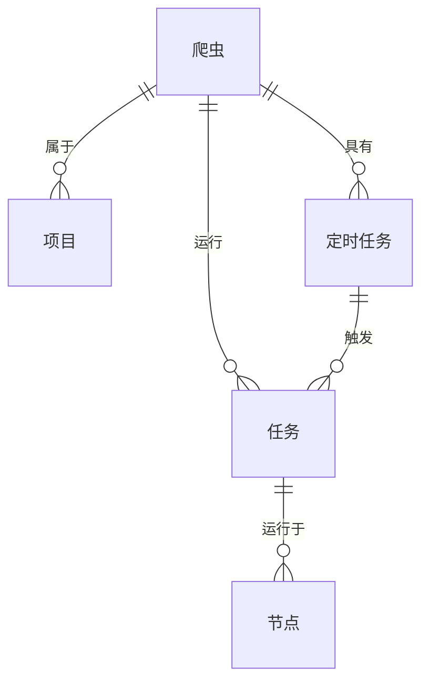

# 爬虫

爬虫是Crawlab中网络爬虫程序的基本单元。您可以将其视为由代码和文件组成的网络爬取软件项目，例如Scrapy项目。请注意，这里提到的术语*项目*与Crawlab中的基本概念[项目](../project/index.md)不同。

:::info
在Crawlab中，*爬虫*的概念非常重要，我们强烈建议您通读本部分。
:::

## 典型流程

以下是用户在Crawlab中使用爬虫的典型流程。

## 创建爬虫

1. 导航到`爬虫`页面，并点击左上角的`新建爬虫`按钮。
2. 输入相关信息，包括`名称`和`执行命令`。
3. 点击`确认`。

以下是创建爬虫时的核心字段说明：

- `项目`：爬虫所属的项目
- `执行命令`：运行爬虫时将在[shell](https://en.wikipedia.org/wiki/Shell_(computing))中执行的基础命令，例如`scrapy crawl myspider`
- `参数`：运行爬虫时传递给`执行命令`的参数列表，例如`-a param1=value1 -a param2=value2`
- `默认模式`：运行爬虫的默认模式
    - `随机节点`：在随机节点上运行爬虫
    - `所有节点`：在所有节点上运行爬虫
    - `选定节点`：在选定节点上运行爬虫
- `优先级`：爬虫的优先级，数值越大优先级越高
- `结果集合`：爬虫结果在数据库中存储的集合名称

## 上传代码

有几种方法可以上传爬虫文件。

### 上传文件夹

1. 导航到爬虫详情页面。
2. 点击`文件`标签。
3. 点击导航栏中的`上传`按钮。
4. 选择`文件夹`。
5. 点击`点击选择要上传的文件夹`。
6. 选择包含爬虫文件的文件夹。
7. 点击`确认`。

### 上传文件

1. 导航到爬虫详情页面。
2. 点击`文件`标签。
3. 点击导航栏中的`上传`按钮。
4. 选择`文件`。
5. 将爬虫文件拖放到拖放区域，或点击拖放区域并选择文件。
6. 点击`确认`。

### 上传文件（拖放）

1. 导航到爬虫详情页面。
2. 点击`文件`标签。
3. 将爬虫文件或文件夹拖放到左侧文件导航器中的文件夹内。

## 编辑代码

Crawlab提供在线代码编辑器供用户编辑爬虫代码。您可以按照以下步骤编辑爬虫代码：

1. 导航到爬虫详情页面
2. 点击`文件`标签
3. 点击要编辑的文件
4. 修改代码内容
5. 点击导航栏中的`保存`按钮

更多关于代码编辑器的详细信息，请参考[文件编辑器](../file-editor/index.md)章节。

## 运行爬虫

您可以按照以下步骤运行爬虫：

1. 在爬虫详情页面：点击导航栏中的播放图标`运行`按钮
2. 在爬虫列表页面：点击右侧的播放图标`运行`按钮
3. 选择适当的运行设置
4. 点击`确认`

## 查看数据

爬虫执行完成后，您可以通过以下步骤查看采集到的数据：

1. 导航到爬虫详情页面
2. 点击导航栏中的`数据`标签
3. 在表格视图中浏览采集到的记录
4. 使用分页控件浏览结果

这里显示的数据来自创建爬虫时指定的`结果集合`。您可以：
- 使用导出数据按钮将数据导出为CSV/JSON格式

:::tip
如果未显式配置，集合名称遵循`results_<爬虫名称>`模式。您可以直接通过MongoDB客户端使用此名称查询数据。
:::

## 实体关系

爬虫与其他实体之间的关系如下所示：

