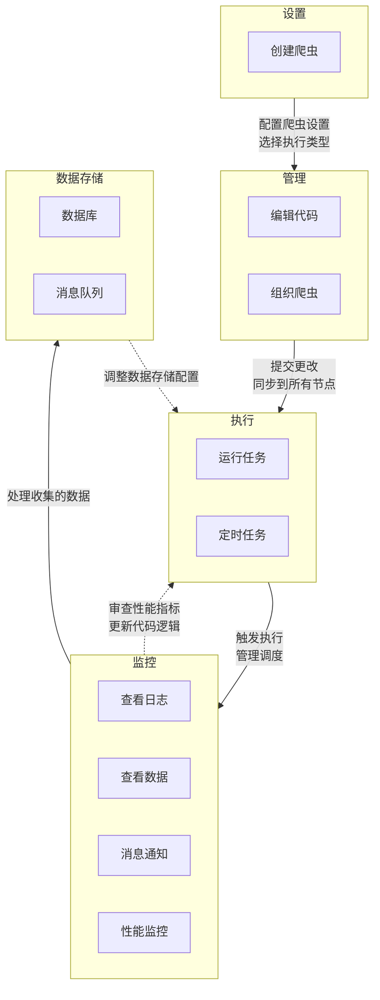

# 爬虫管理

爬虫是 Crawlab 的核心执行单元。本节涵盖了管理您的网络爬虫的基本操作，包括：

- **多语言支持**：使用 Python、Go、Node.js 或 Java 开发爬虫
- **框架集成**：原生支持 Scrapy、Colly、Selenium和 Puppeteer
- **版本控制**：Git 集成用于协作开发和 CI/CD
- **任务编排**：分布式调度和实时监控

管理界面提供了集中控制，用于部署、执行和分析节点集群中的爬虫活动。

## 典型工作流程

Crawlab 通过五个关键阶段提供了一个简化的生命周期管理过程。这个集成的工作流程使团队能够高效地开发、部署和优化爬虫，同时确保数据质量和系统可靠性。该过程从初始设置到持续优化，内置反馈循环以进行迭代改进。

主要方面包括：

- 集中界面用于所有爬虫操作
- Git集成用于协作开发
- 分布式执行的实时监控
- 灵活的数据存储配置以适应不同的用例
- 通过数据洞察进行持续优化

## 设置

在设置阶段，您可以通过定义爬虫的设置和执行逻辑来在Crawlab中创建爬虫。要开始此过程，请导航到`爬虫`列表页面并点击`新建爬虫`按钮。有关爬虫设置的更多详细信息，请参阅[爬虫](../../concepts/spider/index.md)。

对于**Crawlab 专业版**用户，您可以方便地从[Git仓库](../version-control/index.md)创建爬虫，只需选择Git仓库的爬虫项目的根路径即可。

## 管理

在管理阶段，您可以通过编辑代码、组织爬虫并在各个节点之间同步更改来管理您的爬虫。

### 编辑代码

Crawlab通过其基于Web的编辑器和版本控制集成支持灵活的代码管理。开发人员可以直接使用内置IDE修改脚本，并具有实时语法验证和协作编辑锁（请参阅[代码编辑器](../code-editor/index.md)），确保更改立即传播到所有节点。平台的[Git集成](../version-control/index.md)可以与仓库无缝同步，支持分支管理和提交历史跟踪，以支持基于团队的开发。

### 组织爬虫

项目是Crawlab中的组织单元。您可以轻松地使用项目来组织爬虫，这将把爬虫分组在一起，使其更易于管理。有关更多详细信息，请参阅[项目](../../concepts/project/index.md)。

## 执行

在执行阶段，您可以通过从爬虫详情页面直接触发爬虫运行或通过中央[任务](../../concepts/task/index.md)界面来运行任务。

### 运行任务

Crawlab通过UI和API接口提供灵活的任务执行选项。用户可以从爬虫详情页面直接触发爬虫运行，也可以通过中央[任务](../../concepts/task/index.md)界面触发，可配置参数包括命令覆盖、节点选择（随机或特定）和优先级级别。平台的分布式架构会自动将任务路由到可用节点，并通过任务列表视图中的彩色指示器提供实时执行状态更新。

### 定时任务

对于重复执行，Crawlab 使用 cron 表达式提供强大的调度功能。用户可以通过[定时任务](../../concepts/schedule/index.md)配置周期性运行，选项包括：

- 使用标准[cron语法](https://en.wikipedia.org/wiki/Cron)设置精确的执行时间
- 每个调度继承或覆盖爬虫参数
- 启用/禁用调度而不删除
- 查看历史执行和下次运行时间

调度系统与 Crawlab 的分布式架构集成，自动将调度传播到各个节点。已调度的任务保留完整的执行历史，同时防止节点特定的调度冲突。

## 监控

在监控阶段，您可以通过查看[任务日志](../task-logs/index.md)、[数据预览](../data-integration/index.mdx#数据预览)、[消息通知](../notifications/index.md)和[性能监控](../performance-monitoring/index.md)来监控爬虫的执行情况。

Crawlab通过统一的[任务界面](../../concepts/task/index.md)提供全面的实时监控。关键监控功能包括：

- **实时任务日志**：通过实时任务日志跟踪执行进度
- **数据预览**：直接在UI中检查爬取数据的增量以进行数据预览
- **消息通知**：接收关键事件（如任务失败或性能问题）的警报
- **性能监控**：跟踪爬虫性能指标和资源利用率

## 数据存储

默认情况下，Crawlab 将收集的数据保存到操作数据库（MongoDB）。用户可以轻松地将抓取的数据保存到配置的数据集合中，只需少量的[数据集成](../data-integration/index.mdx)。

对于**Crawlab 专业版**用户，平台通过其[数据库](../database/index.md)模块提供灵活的数据存储选项。用户可以配置不同的数据存储目标（例如 MongoDB、MySQL、PostgreSQL 等）以满足各种数据处理需求。